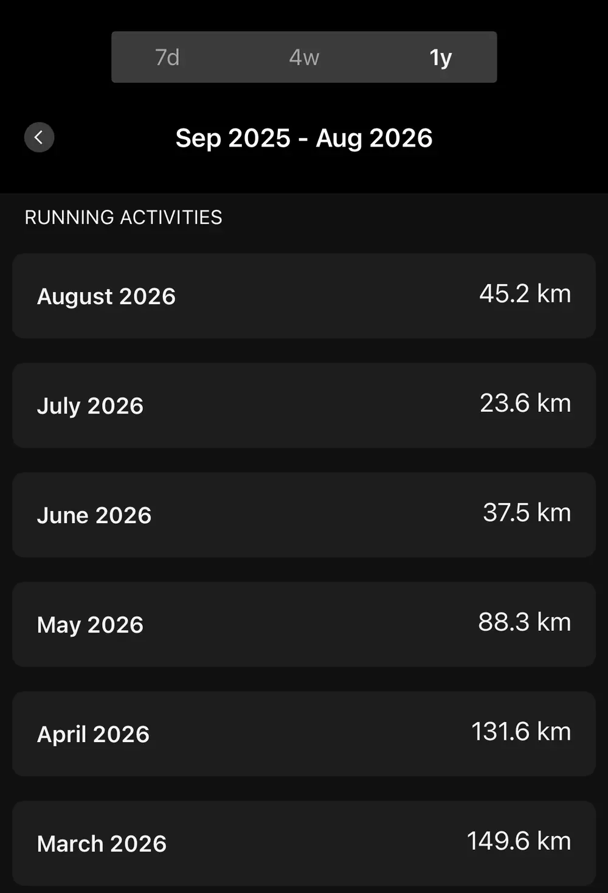

After Miyakojima I came back to Tokyo planning to stack up a solid summer training block. Instead I broke a toe, and for about a month and a half I could barely run at all. At the end of July I went back to Taiwan for a bit, and somehow every trip back to Taiwan comes with weight gain. Work got especially busy after I returned, so the whole training rhythm has been stop-and-go. Cycling held up reasonably well, but running was basically on pause. My weight has been very honest about all of this. It went up. Harsh but true.

So I'm heading into Lake Toya with a B-race mindset. No hard targets, just finish, enjoy some cool Hokkaido air and good food, and treat it as a low-pressure outing after Miyakojima.

When I registered I went back and forth between the A Type and B Type, and ended up picking the shorter B Type. The main reason is that the 99T (70.3 distance) in October is this season's A race, and I don't want an August race to eat into that build. If I forced the A Type's 137 km bike here, the recovery would drag on and cost me training time. So this one is purely about showing up, experiencing the Hokkaido course and scenery, and getting back on the training plan right after with no damage.

---

## Race overview

The [Hokkaido Triathlon](https://hokkaido-triathlon.jp/) starts at 7:00 AM on Sunday, August 23, around Lake Toya, with the course extending toward the foot of Mount Yotei. I'm in the B Type:

| Leg | Distance |
|------|------|
| Swim | 2 km (Lake Toya, freshwater) |
| Bike | 91.7 km |
| Run | 23.1 km |
| Total | 116.8 km |

, [CC BY-SA 3.0](https://creativecommons.org/licenses/by-sa/3.0/), cropped and compressed)](hero.webp)

The swim is in Lake Toya itself, starting from Zenkojima Beach. Freshwater feels quite different from ocean swims. There's less buoyancy, but no waves or salt water to deal with, so it's a trade-off. The run follows the lakeshore and is reportedly almost flat with plenty of shade, so August in Hokkaido shouldn't be too hot.

Compared to Miyakojima, the distance is quite a bit shorter (116.8 km vs 168 km): 1 km less swimming, about 30 km less on the bike, and the run drops from a full marathon to 23 km.

### Bike course

I plotted the route first to take a look. The B Type comes out to 91.95 km with 904 m of climbing:

The elevation profile is easy to read: the first section follows Lake Toya, which sits at around 84 m, so it's essentially flat. Around the 25 km mark the course heads into the hills to the north, with three consecutive climbs around the 40 km mark topping out near 300 m, and then the last 20-plus km return to the flat lakeside road.

The 904 m of climbing is spread across three segments, each gaining roughly 200 m, so there's no single hard climb, but the constant rollers disrupt pacing more than a pure flat course would. Miyakojima was 976 m spread across 123 km of small hills; here it's 904 m concentrated in that middle 40 km, so the character is different.

---

## Where my fitness actually is (honestly)

The biggest variable is the broken toe. Pulling up my monthly run volume for the past half year, the drop is obvious:

| Month | Run volume |
|------|------|
| March | 149.6 km |
| April | 131.6 km (Miyakojima race month) |
| May | 88.3 km |
| June | 37.5 km |
| July | 23.6 km |
| August (through 8/13) | 45.2 km |

During the Miyakojima build in March and April I was running 130 to 150 km a month. It started dropping in May, and after the fracture in June and July it fell to 20 to 30 km, which means a solid month and a half of essentially no real running. The bone healed in August and I've been slowly building back, sitting at 45.2 km so far.

That said, none of this is surprising given the fracture. The volume drop was entirely expected. My coach adjusted the plan around the injury: running paused, focus shifted to swimming and cycling, all the right things were done, and the rest was just waiting for it to heal. Bike volume held up, so FTP shouldn't have dropped much. I haven't done any brick runs either, but I normally only schedule those in the final weeks before a race anyway, so the impact there is smaller than it sounds. What I'm genuinely unsure about is plain running endurance.

There's a new variable on the swim side: during this period I took a one-on-one swim lesson here in Japan, and my stroke is mid-adjustment, not yet automatic. Losing a bit of speed during a technique transition is normal, and I do look slightly slower right now. This race should tell me where the rework actually stands.

The Taiwan trip at the end of July wasn't a total zero either. I still got the key sessions in, just at reduced volume, and the food in Taiwan is simply too good. It took a while to get back into rhythm afterward. Weight is up a bit and I feel a step below where I was before Miyakojima.

Summing up where things stand:

- **Swim**: training consistently, but the stroke is mid-rework and speed is temporarily down
- **Bike**: the strongest of the three, at least the riding never stopped
- **Run**: just back from a month and a half off, with zero long-run work

---

## Coach's pacing guidance

I talked it through with my coach before the race, and this is the guidance:

| Leg | Guidance |
|------|------|
| Swim 2 km | 70 to 80% effort, swim it steady |
| Bike 91.7 km | HR 155-165, power 70-75% FTP |
| Run 23.1 km | Lap 1 HR 155-160, lap 2 160-165, pace 5:00-5:30/km |

### Swim (2 km)

70 to 80% effort, no fighting for position at the start. With the stroke still in transition there's no point forcing speed. The goal is to run the new mechanics through a real race and see how long I can hold them. At Miyakojima my heart rate spiked to 185 coming out of the water; this time I'd like to keep that under control.

### Bike (91.7 km)

The course is rolling, so power will bounce around constantly. The coach's guidance is to ride primarily off heart rate at 155-165, with 70-75% FTP as a secondary check. That's different from Miyakojima, where the flat course made it easy to just stare at the watts. Here, with three consecutive climbs in the middle section, forcing a flat average power would mean grinding out a bunch of wasted high-power surges on the climbs.

In practice that means not attacking the climbs. I'd rather lose speed than let heart rate go over 165, then recover it on the descents. On the final 20 km back along the flat lakeside road, I'll deliberately back off a little more and save the legs for the run.

### Run (23.1 km)

The run is two laps along the lakeshore, so the coach split the heart rate targets by lap: 155-160 for the first lap, 160-165 for the second, at 5:00-5:30/km.

This is the biggest question mark of the whole race. 5:00-5:30 is actually faster than my 5:37 marathon pace at Miyakojima. In normal condition that wouldn't be aggressive, but I'm just back from a month and a half off with zero long-run work, and honestly I don't know if I can hold the second lap.

The plan is to run the first lap strictly by heart rate and not speed up just because the legs feel fresh, then decide on the second lap whether to push. If the muscles give out, I'll handle it the way I did at Miyakojima: a safe finish comes first.

---

## Fueling

The fueling plan mostly carries over from Miyakojima, targeting 80-90 g of carbs per hour. The bike leg is shorter than Miyakojima's, so the on-bike fueling load is a bit more relaxed. The leaking bottle incident at Miyakojima is still fresh in my memory, so this time everything gets a careful check before the start.

The run is only 23 km, which at 5:00-5:30 pace works out to a bit over two hours, so the fueling pressure is much lighter than a full marathon. A few gels plus water from the aid stations should cover it.

---

## What I'm hoping for from this race

Honestly, going into a 117 km triathlon in my current condition, the mental pressure is much lower than Miyakojima. Miyakojima was an A race with a target finish time set beforehand, and a leg-by-leg review afterward to see what hit and what missed. Here, the pacing guidance is a reference for execution, not a target to hit. If I can follow it, great; if not, nothing bad happens. Showing up is the point: feel the Hokkaido summer, swim in Lake Toya, ride with Mount Yotei in view, and get the race done.

The toe is recovering reasonably well, and I hope by race day I can run the 23 km steadily. If it really doesn't hold, walking it in still counts as a finish.

The real fight is the 99T in October. This race is a warm-up for getting back on the start line, and a chance to test both the new swim stroke and the post-fracture running legs in one go.
