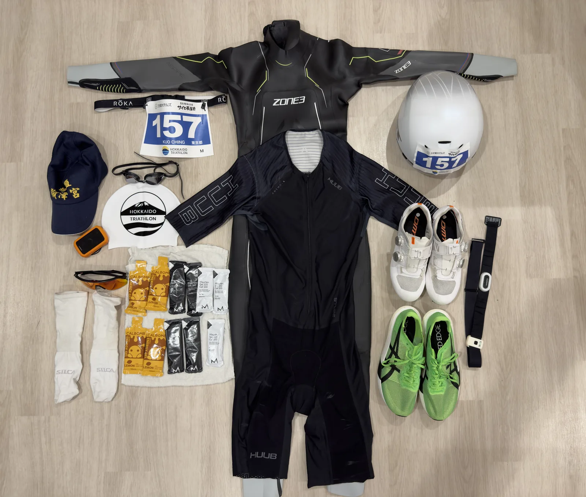

> **Official result: 6:14:40 | 16th overall (102 finishers) | 2nd in AG (M20-29)**
> Swim 41:13 · Bike 3:15:52 · Run 2:17:35
>
> *The official results only list swim/bike/run times, with no separate T1/T2 splits. The "watch" times in this post come from my watch's automatic transition detection, which isn't always spot-on.*

I wrote a [pre-race post for this event](../2026-hokkaido-toya-pre-race/) and went in treating it as a B race: a broken toe had kept me from running for a month and a half, so the goal was simply to finish. I ended up 2nd in my age group and 16th overall, a bit better than expected. That said, the field was small (only 102 finishers in B Type), so the placing itself doesn't mean much. What matters is how the execution and the numbers actually looked.

Driving to Lake Toya the day before, I realized halfway there that I'd forgotten my goggles and swim cap. A detour to a sporting goods store in Muroran for a new pair of goggles solved it. Close call. After arriving, I wandered along the lakeshore for a while. The water was dead calm, and someone was paddling a SUP with their dog on board, which was a pretty soothing sight. It also gave me a look at the water I'd be swimming the next day.

I laid out all my gear for a final check the night before, the emergency goggles included.

---

## Weather

Race day was sunny, with a high of around 28-29°C. The water felt fairly warm, maybe 25-26°C, but wetsuits were still required per the rules. The run had direct sun, but the lakeside course had plenty of tree shade, so it never got truly brutal.

---

## Swim (watch 40:36 | official 41:13 | avg HR 168 | max HR 179)

Lake Toya is freshwater, and it felt very different from the ocean swim at Miyakojima. Salt water gives you natural buoyancy; in a freshwater lake, my body clearly sat lower, and the same effort simply produced less speed.

The numbers back this up: my watch measured roughly 1:59/100m this time (GPS distance 2.05km in 40:36), versus 1:53/100m at Miyakojima last year (GPS distance 2.9km in 54:25). About 6 seconds per 100m slower. The freshwater buoyancy gap is probably most of the answer, rather than a fitness problem.

Another variable: I took a one-on-one swim lesson in Japan recently and my stroke is still mid-adjustment, something I mentioned in the pre-race post. This swim was a chance to test it in race conditions. Heart rate control was a bit better than Miyakojima: max HR 179 this time, versus spiking to 185 out of the water at Miyakojima. Progress, though average HR still sat at 168. The swim remains the most cardio-intensive leg for me.

## T1

The exit flow at the lake was simpler than Miyakojima. No incidents, and the time was about what I expected.

---

## Bike (official 3:15:52 | watch 3:10:27 | 91.7km | avg HR 158 | ~900m elevation gain | avg power 144.9W | NP 160W)

The course was exactly as mapped in the pre-race post: flat lakeside sections at the start and end, with three consecutive climbs of 5-8% over 2-3km around the 40km mark. My coach's advice was to ride primarily by heart rate (155-165) with power as a secondary reference (70-75% FTP), precisely because power jumps around on this kind of course, and staring at watts tends to produce wasted surges on the climbs.

In practice, avg HR came out to 158, right inside the coach's range. That part went to plan. But avg power was only 144.9W, about 62% of my FTP (233W, tested on the indoor trainer), clearly below the recommended 70-75% and well down from the 161.5W at Miyakojima.

However, on a course with concentrated climbs and long flats, avg power alone understates the actual load, and Normalized Power (NP) belongs in the picture. The Variability Index (NP divided by avg power) came out around 1.11, which isn't low, meaning power output swung around quite a bit. Looking at NP instead: 160W, about 69% of 233W FTP, much closer to the 70-75% target than the 62% that avg power suggests. On a mixed climb-and-flat course, NP is the more reasonable reference.

Breaking the power down by segment makes it clear why the variability was so high. Output on all three climbs was actually solid:

| Climb segment | Distance | Elevation | avg power |
|--------|------|------|-----------|
| ４８ Climb | 3.12km | 162m | 193W |
| 伏見 climb | 1.71km | 122m | 196W |
| ゴールは「山の神」climb | 1.81km | 120m | 195W |

All three were above 190W, near or beyond 80-85% of FTP, with heart rate riding right against the 165 ceiling. Now the flat segments:

| Flat segment | Distance | avg power |
|--------|------|-----------|
| Toya 132 | 16.1km | 138W |
| Lake Toya East | 15.9km | 151W |
| 洞爺湖畔東反時計回り TT | 14.1km | 152W |

The flats came out at only 138-152W. With heart rate pinned at the same ceiling but no gradient to fight, lower output is all it takes to hold pace. Since this course has far more flat mileage than climbing, the overall average got dragged down heavily by the low flat-section watts. This is exactly why my coach warned against watching average power, and the ride played out as a full confirmation of that call.

One more caveat about the power numbers themselves: the Speedplay power meter pedals I raced on (Wahoo POWRLINK) were recently removed and reinstalled, and the trainer used for the FTP test is a completely separate sensor. I've compared the two before: with the spacers installed, the Wahoo pedals read roughly 1.5-2% lower than the trainer, consistent in direction with the [POWRLINK Zero under-reading thread](https://wahoox.forum.wahoofitness.com/t/wahoo-powrlink-zero-under-reading/23768) on the official Wahoo forum, just not as severe. Adding that correction back, NP 160W becomes roughly 162-163W, about 70% of 233W FTP, landing right at the bottom edge of the coach's 70-75% target. I plan to remove the pedal spacers and retest to see if the readings shift.

---

## T2

Swapped into running shoes and headed out. Nothing notable.

---

## Run (official 2:17:35 | watch 2:17:55 | 23.11km | avg pace 5:57/km | avg HR 162 | max HR 172)

The coach's pacing plan split the run into two laps: lap one at HR 155-160 and 5:00-5:30/km pace, lap two at HR 160-165. In reality I never even touched the bottom of the lap-one pace range. Overall average came out to 5:57/km, slower than my 5:37/km at the Miyakojima full marathon, even though this distance is only a bit more than half a marathon and should in theory be faster.

There was also a small incident mid-run: the course marshal at one intersection spaced out, and another athlete and I ran off course. The GPS-recorded 23.11km already includes that detour, and it ended up matching the official 23.1km course closely anyway, so no real impact.

Laying out the per-kilometer splits, the first 12km or so were reasonably steady at 5:30-5:55/km. From km 13 the pace visibly dropped, and most of the second half sat at 6:00-6:35/km. Somewhere around there, the age-group winner came past from behind, and I never closed the gap again.

The half-by-half averages tell the story even more clearly: first 12km at avg HR ~164 and 5:45/km; second 11km at avg HR down to ~160 while pace fell to 6:13/km. Heart rate didn't climb as the pace faded. It actually dropped by almost 4 bpm. That combination of falling HR and falling pace points to plain muscular strength/endurance limits, not a cardio ceiling. The month and a half of zero run volume from the broken toe showed up directly in second-half muscular endurance. It's essentially the same pattern as my quads giving out in the second half of the Miyakojima marathon, just with a shorter distance letting me hold on longer this time.

---

## Results Summary

| Leg | Official time | Data |
|------|----------|------|
| Swim | 41:13 | avg HR 168 / max HR 179 |
| Bike | 3:15:52 | avg HR 158 / avg power 144.9W / NP 160W / 91.7km |
| Run | 2:17:35 | avg pace 5:57/km / avg HR 162 |
| **Total** | **6:14:40** | **16th overall, 2nd in AG (M20-29)** |

---

## Against the Pre-Race Targets

| Leg | Coach's target | Actual execution |
|------|--------------|----------|
| Swim 2km | 70-80% effort, steady finish | avg HR 168, intensity as planned, pace dragged down by freshwater buoyancy |
| Bike 91.7km | HR 155-165, power 70-75% FTP | avg HR 158 (on target); NP 160W ≈ 69% FTP, bottom edge of target; avg power 62% FTP clearly low (climbs high, flats low) |
| Run lap 1 | HR 155-160, pace 5:00-5:30 | First 12km avg HR 164, pace 5:45/km; HR above target, pace never reached the target range |
| Run lap 2 | HR 160-165 | Second 11km avg HR dropped to ~160, pace fell to 6:13/km; HR didn't rise with fatigue |

Overall, the bike heart rate execution tracked the coach's plan most closely. The run missed both HR and pace targets, but not because the engine gave out (HR was actually low). The muscular strength simply isn't back yet, which the pre-race post had honestly already predicted.

---

## Awards

2nd in my age group, so I got to collect a prize. Small field, so it doesn't carry much weight, but standing on the podium still felt pretty good.

---

## Post-Race Reflections

2nd in AG and 16th overall look decent on paper, but with a field this small the placing has limited reference value. What actually matters is the execution.

The swim was slowed by freshwater buoyancy and a stroke still mid-adjustment, both within expectations. The bike heart rate execution followed the coach's plan exactly, and the NP conversion actually lands fairly close to the target range; avg power just got dragged down by the flat sections, and the power meter discrepancy makes the numbers look more conservative than the real load. The run was the most honest part of the day: a month and a half without real running means the second-half fade was inevitable. No shortcuts there.

Zooming out, this isn't just a subjective feeling; the numbers are fairly blunt. This race: bike avg power 144.9W (NP 160W), run pace 5:57/km. Both are slower than Miyakojima (161.5W, 5:37/km), even though Miyakojima was much longer (123km bike, full 42.2km marathon run). Shorter distances should be easier to hold intensity over, yet both legs came out worse. That says this isn't a single-discipline problem but overall training condition, which has simply been a notch below where it was going into Miyakojima. The broken toe is only one factor; summer training since the heat arrived hasn't recovered in either volume or quality.

Next race is [99T](https://99tri.com.tw/) on October 2, and the goal is adjusted to match reality: break 5 hours. For now, a few days of proper rest to reset the body, then rebuild the training plan for this next cycle.
