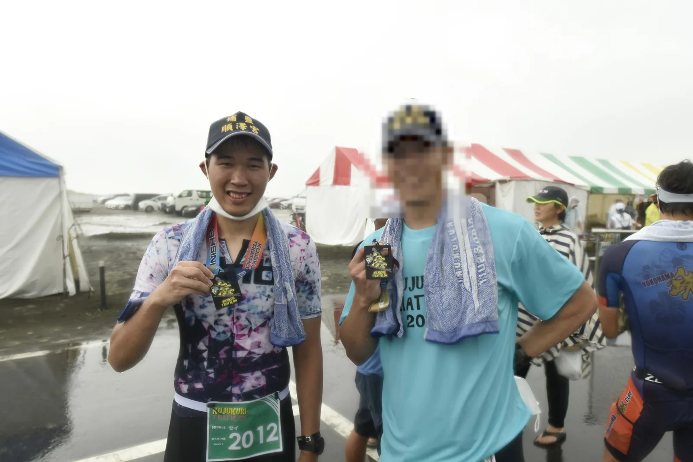

Four years ago my first-ever triathlon was the 99T in Kujukuri, and I jumped straight into the 113 distance. The weather that day wasn't great, and the organizers stopped the race partway through the run. I only got to around 14km, so strictly speaking, I never ran the full 21km in my first triathlon.

Four years later I'm going back to the same race. Miyakojima and Lake Toya came in between, and the 99T is this season's A race. Typhoons have been circling around Kanto lately, so I've been watching the forecast pretty nervously all week. Right now it looks like Typhoon No. 26 will speed past south of Kanto on Thursday. Hopefully nothing changes before Saturday.

---

## Race Overview

The [Kujukuri Triathlon (99T)](https://www.99t.jp/) middle distance starts at 8:00 on Saturday, October 3, around Ichinomiya Beach in Chiba. It's about an hour and a half by car from Tokyo, which makes it one of the closest middle-distance triathlons to the city.

| Leg | Distance | Location |
|------|------|------|
| Swim | 1.9km | Ichinomiya River mouth |
| Bike | 90.1km | Kujukuri Toll Road and Togane-Kujukuri Toll Road (2 laps) |
| Run | 21.1km | Kujukuri Toll Road |
| Total | 113.1km | Cutoff 16:30 |

The swim is inside the mouth of the Ichinomiya River rather than the open sea, so waves are relatively small. It's brackish water, so buoyancy should be a bit better than the pure freshwater at Lake Toya. The unusual part is that there's about 1km between the swim exit and transition, so T1 will be much longer than at most races. My heart rate is usually very high right after the swim, and if I run hard through that 1km it'll blow up before I even get on the bike. I need to keep that under control.

The bike course runs on closed toll roads. The middle distance is two laps: from transition, north along the coastal Kujukuri Toll Road, with two turnaround points up north, one at Katakai IC and one at Fukutawara PA after turning onto the Togane-Kujukuri Toll Road. Aid stations are at Fukutawara PA and Chosei IC. The whole route is almost completely flat with very few turns, the opposite of Lake Toya with its string of climbs in the middle. A course like this rewards steady output. There are no climbs to catch a break on and no descents to recover on. The question is whether you can hold one intensity for over two hours.

)](course_map.webp)

---

## The 99T Four Years Ago

September 18, 2022 was my first-ever triathlon. The weather wasn't good, and because of the big waves, the organizers shortened the swim to 1.5km. I remember it being overcast but still feeling hot, and later in the day wind, rain and thunder suddenly rolled in. Even the run ended up being stopped early.

Here's what I dug up from Strava:

| Leg | Watch data | Notes |
|------|----------|------|
| Swim | 32:36 | Shortened to 1.5km due to weather (GPS recorded 1.69km), avg HR 180, max HR 190 |
| T1 | ~11:48 | About 1km from swim exit to transition |
| Bike | 3:14:44 | 91.0km, avg ~28km/h |
| Run | 1:28:14 | 14.2km, avg pace 6:12/km, then stopped by the organizers |

Looking at the swim now, it's pretty wild. My 500m splits were 8:10, 9:33 and 11:04, getting slower the whole way, with heart rate pinned above 180. I had never done any open water training before that race, and back then the 99T used a mass start, so it was a total crush from the moment I got in the water. I got bumped, kicked and grabbed. Japanese swimmers in the water are like Taiwanese drivers on the road: nobody's being polite. The bike took about 3 hours 15 minutes on a regular road bike with no aero bars. On the run the rain kept getting heavier and thunder started. Around 10km the organizers decided to stop the race, and I crossed the finish line at about 14km and got a finisher medal, but I'd only run two-thirds of the 21km.

Coming back this time, part of me wants to finish those 7km I never got to run.

---

## Current Form

My last race was [Lake Toya in Hokkaido](../2026-hokkaido-toya-race-report/) at the end of August, right after coming back from a broken toe. The post-race conclusion was simple: my pace dropped in the second half of the run while my heart rate actually went down, which pointed to a lack of muscular endurance rather than cardio. So the focus for the month-plus since Toya has been rebuilding running volume and long runs.

### Run

First, monthly running volume, compared with what I showed in the Toya pre-race post:

| Month | Distance |
|------|------|
| April | 131.6 km (Miyakojima race month) |
| May | 88.3 km |
| June | 37.5 km |
| July | 23.6 km |
| August | 109 km (incl. 23.1km at Toya) |
| September (through 9/28) | 110.6 km |

Monthly volume isn't back to the 130-150km I was running before Miyakojima, but it's at least back to around 110km from the 20-30km during the broken toe. More importantly, September included long runs, which I had none of before Toya:

| Date | Distance | Avg pace | Avg HR | Notes |
|------|------|--------|--------|------|
| 9/5 | 20.4 km | 5:51/km | 151 | Two pickups to 5:16-5:21 in the middle |
| 9/9 | 18.3 km | 5:42/km | 152 | Progression, last 2km around 5:06 |
| 9/19 | 21.8 km | 6:08/km | 142 | Easy long run, HR mostly under 150 |
| 9/26 | 11.6 km | 5:11/km | 161 | Brick run after a 1.5-hour bike workout |

9/26 was the most useful session of this block. I rode a roughly 90-minute 80% FTP workout on Zwift first, then went straight into the run. With heart rate around 160, pace settled at 5:07-5:14/km after the first kilometer and held for the full 11.6km. In the first half of the Toya run I averaged HR 164 at only 5:45/km. Same situation (running off the bike), same heart rate range, and more than 30 seconds per km faster. The race will have 90km of cycling before the run, so the fatigue will be different, but it at least shows my running base has come back somewhat.

### Bike

Most bike workouts are on Zwift, about twice a week: SST, Z4 intervals or long 80% FTP tempo sessions, plus one weekend day riding long around Lake Kasumigaura. I rode about 585km in September. FTP is 237W from a retest before Toya.

A lap of Kasumigaura is 124km and very flat, which makes it a good simulation for the 99T toll road. On 9/13 I averaged 140W at HR 140, and later in the ride, with heart rate at 148-152, power was around 140-150W. 9/23 didn't go as well. I felt bad all day, couldn't get any food down in the second half, and basically rolled slowly back to the station. Average power was just 122W at HR 129.

### Swim

I swam about 19km in September, roughly double August, mostly pool sessions of 2.4-3.2km each. The stroke change I mentioned before Toya has now become habit, and I no longer have to think about the movement to swim it. Speed just hasn't improved yet, so that may need more time.

To sum up where things stand:

- **Swim**: much more volume than August, used to the new stroke, but not faster yet
- **Bike**: Zwift workouts holding up well; of the two 124km Kasumigaura rides, one went smoothly and one fell apart when I couldn't eat
- **Run**: back to 110km/month after the broken toe, with three runs over 18km, much better than before Toya

---

## Coach's Pacing Plan

I talked with my coach before the race, and this time everything is based on heart rate:

| Leg | Plan |
|------|------|
| Swim 1.9km | HR 140-150 |
| Bike 90.1km | HR 155 ± 5 |
| Run 21.1km | Around 160 for the first half, then try to push in the second half |

### Swim (1.9km)

140-150 is a pretty conservative range. At Toya my swim averaged HR 168 with a max of 179, and at my first 99T four years ago it was avg 180, max 190. The swim has always been the hardest leg on my cardio, and I think my tendency to get nervous plays a part. But in a long-distance race the swim is a much smaller share than the bike and run, and my coach's advice is to just swim smoothly.

The Ichinomiya River mouth is relatively calm and should be easier to control than the ocean swim at Miyakojima. Honestly I'm not very confident I can keep it under 150, but I'll try to keep it as low as I can. At the very least I don't want a repeat of four years ago, getting slower every 500m.

### Bike (90.1km)

HR 155 ± 5, so 150 to 160. At Toya the climbs kept my heart rate pinned at the top of the range. The 99T is flat, so heart rate should be much steadier, more like my Kasumigaura rides.

For power, I'm targeting 170-175W, which is about 72-74% of my 237W FTP and right inside the 70-75% range my coach gave me for Toya. I'll adjust based on how I feel on the day, and if heart rate won't stay down, heart rate takes priority.

On a flat course where you're in one position for a long time, holding the aero position is what matters. I'll be on my Cervélo P5 after its [refit](../cervelo-p5-tt-bike-refit/), with Reserve wheels and a TT helmet. I didn't get any bike photos at Toya, so I still don't know how much my outdoor position differs from the indoor fitting. Hopefully I'll get a few shots this time to check.

### Run (21.1km)

Around 160 for the first half, then try to push in the second half. On the 9/26 brick run, HR 160 was about 5:10/km. The bike before the race will be longer, so I expect the first half to land at 5:10-5:20/km. At that pace, 21.1km works out to about 1:49 to 1:53.

The lesson from Toya was that my muscles gave out first in the second half. This time I've added volume and long runs, and whether I can actually push in the second half is the thing I most want to test in this race.

---

## Weather

In late September, Kanto first got hit by heavy rain from Typhoon No. 25, and Chiba took quite a bit of damage. The organizers posted a notice on 9/23 about some train lines being affected. Next up is Typhoon No. 26. According to [tenki.jp as of 9/28](https://tenki.jp/forecaster/t_fujikawa/2026/09/28/40782.html), it's still rated "very strong" and moving northeast along the south side of Honshu, and on 10/1 (Thursday) it may approach the Izu Islands or the Chiba coast. It's a compact typhoon, so rain and wind pick up suddenly as it gets close, but it's moving fast and will then become an extratropical cyclone heading off toward the Kuril Islands.

The current [forecast for Ichinomiya](https://tenki.jp/forecast/3/15/4520/12421/10days.html) for race day on 10/3 is cloudy turning sunny, 17-23°C, 30% chance of rain, northeast wind at 2-4m/s. As long as the typhoon passes on Thursday as forecast, Saturday's weather should be close to ideal for racing. My bigger worry is the swell after the typhoon. Four years ago the swim was shortened because of big waves, so the conditions at the river mouth will come down to the organizers' call on the day.

Four years ago it was overcast but hot, and the weather ended up keeping me from finishing the full run. If it's cooler this time, both the bike and run will be much more comfortable. I'll cover the actual race-day weather in the race report.

---

## Nutrition

I want to push carbs higher than before this time. At Miyakojima and Toya my target was 80-90g/hr. This time I want around 110g/hr on the bike and at least 80g/hr on the run.

I'll also carry three gels with 100mg of caffeine each: one in the middle of the bike, one just before the end of the bike, and one as a spare for the run.

| Leg | Carb target | Caffeine |
|------|----------|--------|
| Bike | ~110g/hr | 1 gel mid-bike, 1 before T2 (100mg each) |
| Run | At least 80g/hr | 1 spare gel (100mg) |

There are 2 aid stations on the bike and 4 on the run, so I can rely on them for water and electrolytes. 110g/hr is a lot for the gut, and after not being able to eat anything in the second half of the 9/23 Kasumigaura ride, that's the last thing I want to happen in the race.

---

## Goals

The ideal goal is sub-5, but given my current form, a more realistic target is around 5:15.

Just as important is whether I can execute the plan across all three legs, especially whether I can actually push in the second half of the run instead of fading like at Toya. I also have a 45km trail race in Nikko on 11/15, so this race will give me a sense of how far my running has come back.

The temperatures look good for a PB right now, and if all three legs go well, sub-5 isn't completely out of reach.

This time I want to run the whole way to the finish on the Kujukuri course I didn't get to complete four years ago.
