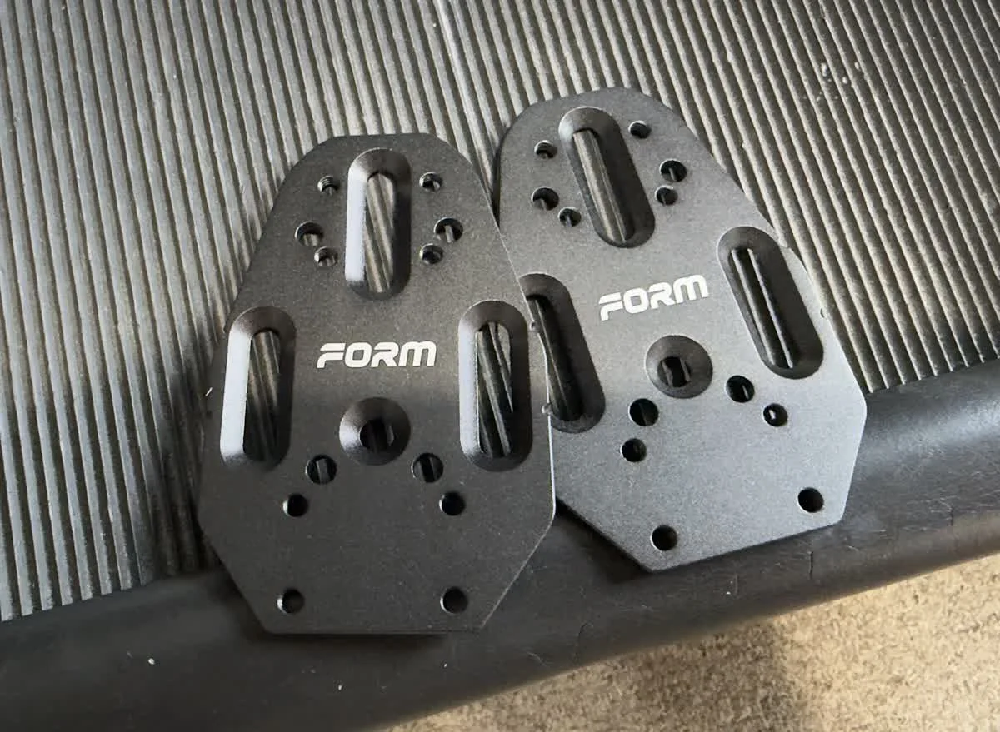

I had bike fits done in Taiwan before and after buying the Cervelo P5. A year had passed since the last one, and I'd been tweaking small things on my own, so I decided to get a fresh professional assessment. I found an English-speaking fitter through the [Triathlon in Tokyo website](https://www.triathlonintokyo.org/bike) — [Sun Merit Bike Fit Studio in Yokohama](https://bikefitting.jp/).

Fitter Makito Fushimi has solid credentials: IBFI Level 4, Retül Master Level, former Retül official instructor, years of experience supporting UCI professional road teams, and a long track record with competitive triathlon athletes. The session ran about three to four hours.

---

## What I Came In With

The main thing I told Makito going in: find the balance between aero, comfort, and power output for long efforts (5–6 hours). The current situation was shoulder and neck discomfort starting around the 3–4 hour mark, plus saddle discomfort.

---

## How the Fit Worked

He started with video observation — watching me ride without preset numbers in mind, to see what was actually happening. No Retül capture at this stage, intentionally, to avoid getting anchored to numbers too early and missing other details. After the assessment, the key conclusion was: **saddle is too high, and the overall position can be pushed further forward**.

Then came the physical assessment: flexibility, core strength, upper body strength, hip range of motion. After that, repeated rounds of ride, observe, adjust, ride again. Finally, markers, Retül 3D motion capture, report output — and only then comparing numbers before and after, with an explanation of what each number means.

---

## Physical Assessment: Right Quad Tighter Than Expected

The Thomas Test flagged right quad flexibility as compromised — "Right Quad is very tight" in the notes. I knew I was tight there, but hadn't realized how much it was capping the position. On a TT bike this matters — an aggressive aero position keeps the hip flexors in a shortened position for a long time, and a tight right quad on top of that affects pedaling efficiency and comfort.

Everything else — core strength and upper body strength — came back adequate, within range for an aggressive aero position.

---

## Before vs After: The Numbers

| Measurement | Before | After | Change |
|---|---|---|---|
| Saddle Height | 763 mm | 740 mm | −23 mm |
| Saddle Setback | −26 mm | −1 mm | +25 mm |
| Arm Pad Drop | −38 mm | 0 mm | +38 mm |
| Arm Pad Stack BB | 710 mm | 729 mm | +19 mm |
| Handlebar Reach | 528 mm | 504 mm | −24 mm |
| Eff. Seat Tube Angle | 79° | 80° | +1° |

The two main changes: saddle dropped 23 mm (confirming it was too high), and the overall position was pushed forward — setback moved from −26 mm to −1 mm, arm pads raised and brought in closer.

The difference is immediately obvious in the photos: the back angle after the fit is noticeably lower and flatter, the head is lower, and the transition from head to back is smoother. The aero position is substantially more solid than before.

This position is already at the limit of what the current hardware allows — both the saddle and cockpit are maxed out. If I swap parts later, there's room to push the effective seat tube angle further forward; the 80° here was limited by the existing setup.

---

## Three Detail Adjustments

### 3 mm Leg Length Shim on the Right

Measurement showed the right leg is shorter than the left, so a 3 mm shim was added under the right shoe cleat. Without it, the pelvis rocks during pedaling and power output becomes uneven.

### Verus Wedge on the Left Shoe

The left forefoot has a natural angulation. A wedge — thicker on one side, thinner on the other — was added so the pedal contact surface follows the foot's natural angle, reducing lateral knee stress.

### Both Cleats Moved Back

---

## On Rearward Cleat Placement

Makito added FORM Cleat Extender Plates to both shoes, moving the cleat position back.

His reasoning: rearward cleats reduce calf recruitment, keeping the calves fresher through the bike leg, which helps on the run.

**The mechanics:** As shown above, a traditional cleat aligned with the first metatarsal head creates a longer lever arm from the ankle joint to the cleat. The calf muscles (gastrocnemius and soleus) have to work harder to stabilize the ankle. Move the cleat back 10–20 mm to shorten that lever arm, and calf demand drops — pedaling force shifts to the quads and glutes, which are larger and more fatigue-resistant, and are also the muscles you rely on during the run. The calves and Achilles tendon act more as stabilizers than primary force producers in this setup. As a side effect, the shortened ankle lever also reduces the tendency to point the toes down while pedaling, slightly narrowing the frontal profile for a small aero gain.

**What the research says:** Millour et al. (2020), testing under simulated sprint-distance triathlon conditions, found rearward cleat placement reduced running energy cost by ~5.9% and medial gastrocnemius activation during the run by 25%, with clear benefits during steady-state cycling. Evans et al. (MDPI Sensors, 2021) tested in real outdoor conditions and found a significant drop in perceived exertion (RPE) during the post-bike run, with an effect size of 0.9. A 2025 biomechanics study (SportRxiv) found rearward cleat placement significantly reduced Achilles tendon strain, with implications for long-term tendon health.

One caveat from the same Millour et al. study: at sprint efforts (>100% MAP), rearward cleats actually increased activation in the calf, vastus lateralis, and hamstrings. So the benefits are clearest for the long steady-state efforts that define triathlon; if the ride involves a lot of sprinting or standing climbs, the picture gets more complicated — though triathlon riding is almost always long steady-state power, so this is less of a concern.

Joe Friel (Triathlon Training Bible) has advocated for this setup since 2007; Daniela Ryf and Jan Frodeno both use rearward cleat placement. For standard three-bolt shoes, FORM Cleat Extender Plates or PatroCleats are the common options. Getting to a true mid-foot position requires shoes with extra drilled holes or triathlon-specific footwear.

---

## Real-World Test: Kasumigaura + Kitaura, 180 km

After the fit I did a loop around Lake Kasumigaura and Lake Kitaura — 180 km, about six hours.

The difference was noticeable: same power output felt faster, and the aero position felt more solid. No wind tunnel, but the before/after side view tells the story clearly enough. Some shoulder and neck fatigue by the end — normal for a long TT bike effort — and noticeably better than before the refit. The 3–4 hour breakdown that used to show up didn't happen.

---

## Was It Worth It

This refit confirmed two things.

First, the saddle really was too high. Twenty-three millimeters doesn't sound like much, but saddle height directly affects hip angle, pedaling efficiency, and saddle comfort over long efforts. My old position was probably forcing the pelvis to over-compensate on every pedal stroke — most likely the root cause of the saddle discomfort after hour three or four.

Second, the Thomas Test confirmed the right quad issue. I knew I was tight there, but hadn't connected it to the ceiling on how aggressive a position was actually sustainable. This fit made it clear: hardware adjustments and body limitations need to be worked on together — numbers alone only go so far. That flexibility still needs work — I've been doing some stretching before bed most nights, and hope to see improvement over time.

TT bike fitting is different from road bike fitting — different factors, different tradeoffs. If you have a tri bike and haven't done a TT-specific fit, it's worth doing.

---

## Reference

- Sun Merit Bike Fit Studio: https://bikefitting.jp
- Millour et al. (2020), *Journal of Science and Cycling*: https://www.jsc-journal.com/index.php/JSC/article/view/521
- Evans et al. (2021), *MDPI Sensors*: https://www.mdpi.com/1424-8220/21/17/5899
- SportRxiv (2025), Achilles tendon strain & cleat position: https://sportrxiv.org/index.php/server/preprint/view/562
- Joe Friel on cleat position (2007): https://www.trainingbible.com/joesblog/2007/01/cleat-position.html
- Triathlete.com, *Midsole Cleat Placement*: https://www.triathlete.com/gear/bike/midsole-cleat-placement/
