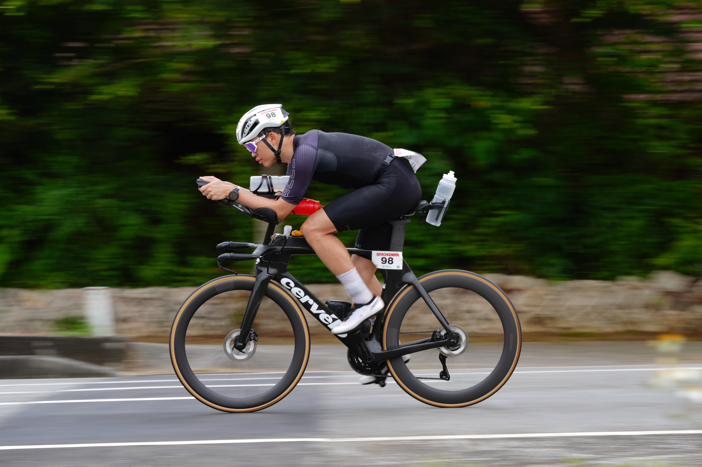

Hi, I'm Ching Kuo, currently living in Tokyo.

By day, I'm an Infrastructure Engineer—simply put, my job is to design and maintain massive server systems, ensuring they run stably under high loads without crashing. By early morning and on weekends, I'm an amateur triathlete.

I started **Tri Labs** because I realized that training for triathlons and maintaining cloud systems are surprisingly similar. Both require collecting data, monitoring metrics, and making adjustments *before* the system (my body) overloads and crashes. This blog is where I document this data-driven training journey from an engineer's perspective.

## The North Star: Sub-10 and Kona

When engineers start a project, the first step is defining the SLA and objectives. My long-term triathlon goals are very clear:
*   **2027:** Complete a full-distance Ironman in Sub-10 hours.
*   **Within 5 years (ASAP):** Qualify for the Ironman World Championship in Kona.

This is a very steep mountain to climb. That's why I treat my training like maintaining a complex system: I keep a steady output through continuous metric monitoring, avoid downtime (injuries), and constantly iterate to improve overall performance.

## The "Tech Stack": Gear & Data Hub

My training "tech stack" architecture is straightforward: my Garmin watch and bike computer collect the raw hardware data, Zwift serves as the testing environment for indoor cycling, and everything is funneled into TrainingPeaks—the central "Control Plane" for analysis. (Though Garmin's recent running power data always makes my TSS spike abnormally high, forcing me to manually revert each session to hrTSS... but that's a story for another day.)

When it comes to gear, my philosophy is: no brand loyalty, just data and real-world results. I will only share honest thoughts on things I actually bought and use. If you're curious about my current setup, check out my recently updated [Gear List](/gear/).

## Next Deploy: Miyako Triathlon

My next major "deploy" is the Miyako Triathlon on April 19.

This race will be a great opportunity to benchmark my current state. Last year, around the 15-30km mark of the run, I blew up entirely because I was drinking fluids too casually. This time, I will be hyper-focused on run pacing and nutrition strategy:

1. **Carbohydrates:** Planning to execute a high-carb strategy of 80-90g per hour (testing the real-world absorption rate of Maurten and Carbo Bomb gels).
2. **Hydration & Caffeine:** Establishing a strict hydration plan and caffeine intake timing to avoid repeating last year's tragedy.

## What's Next 

In the future, this blog will be updated with my race reports, honest gear reviews, and deep dives into training data.

If you are a gear nerd or data geek who loves analyzing your rides, feel free to follow me on Strava, or leave a comment about what gear you'd like me to review first. See you on the course!