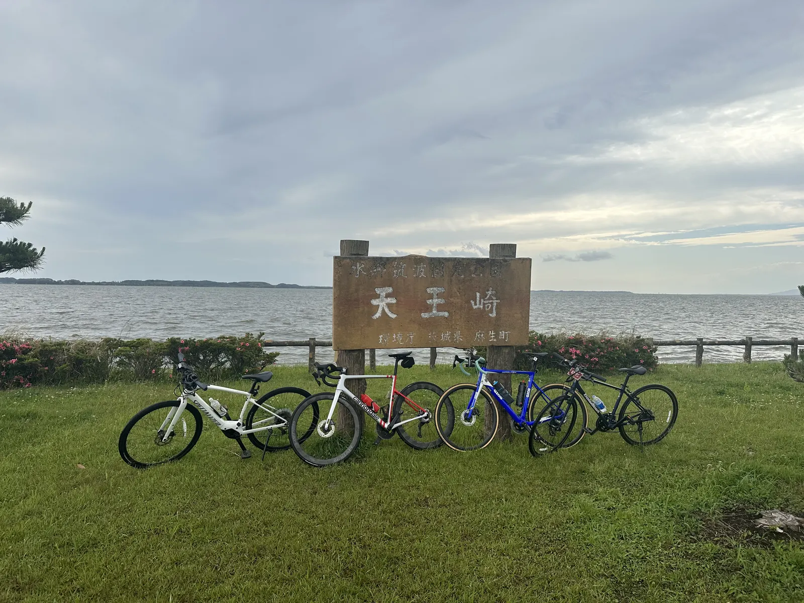
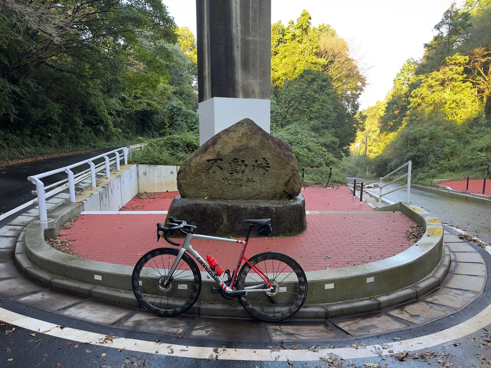
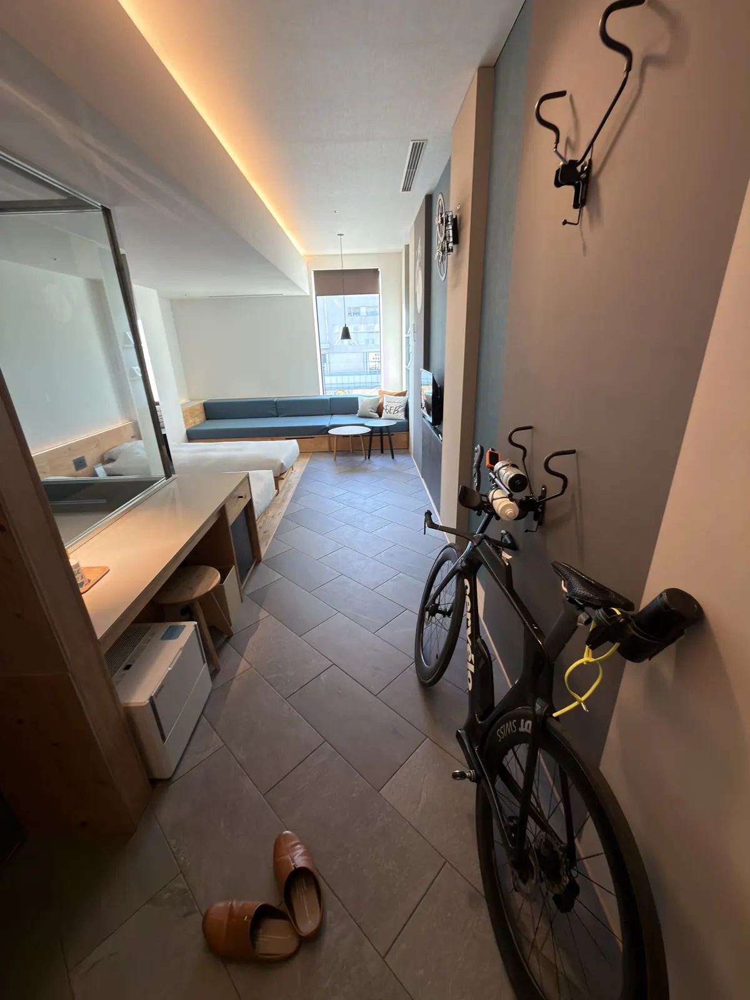

I honestly can't remember when I first heard about Kasumigaura, but I keep coming back for one reason: **this is the best TT training spot near Tokyo**.

It's surprisingly hard to find a route in the Kanto area where you can hold steady power for hours without dodging traffic or stopping at lights. Arakawa and Tamagawa are close, but they're packed with people — a friend recently crashed on Arakawa avoiding a kid, and large stretches of Tamagawa are pretty narrow. Holding a steady TT position on those routes is genuinely dangerous.

Kasumigaura, on the other hand, is a 125 km loop with almost zero elevation gain and minimal traffic. It's almost purpose-built for time trial training. The adjacent Tsukuba Kasumigaura Rinrin Road is a dedicated cycle path — it has more intersections so it's not ideal for TT, but the scenery is great and cherry blossom season is a must-visit.

This post covers everything you need to ride these two routes from Tokyo: getting there, route segments, fueling stops, and how to combine them based on what you want out of the day.

## Route Overview

The area splits into two connected routes:

| Route | Distance | Surface | Main Use |
|-------|----------|---------|----------|
| Kasumigaura full loop | ~125 km | Shared with cars but very low traffic | TT, long endurance |
| Kasumigaura Bridge shortcut | ~90 km | Same | Shorter version when time is tight |
| Kasumigaura + Kitaura (extended) | ~180 km | Same | Ultra-long endurance |
| Tsukuba Kasumigaura Rinrin Road (Tsuchiura ↔ Iwase, one-way) | ~40 km | Dedicated cycle path, more intersections | Sightseeing, cruising, cherry blossoms |

Kasumigaura is the second largest lake in Japan, in Ibaraki Prefecture. Both routes use Tsuchiura as the main starting point.

The combined "Tsukuba Kasumigaura Rinrin Road" is one of [Japan's six designated National Cycle Routes (ナショナルサイクルルート)](https://www.mlit.go.jp/road/bicycleuse/good-cycle-japan/national_cycle_route/) — alongside Shimanami Kaido, Biwa Lake (Biwaichi), the Pacific Coast Cycling Route, Tokachi 400, and Toyama Bay. Officially recognized as one of the long-distance routes in Japan most worth riding at least once.

Source: [Cycling Ibaraki (Ibaraki Prefecture)](https://cycling.pref.ibaraki.jp/ringring/). The actual GPS routes I use are linked at the bottom of the post.

## Getting There from Tokyo

The easiest option is the JR Joban Line limited express to Tsuchiura — about 45 minutes from Ueno. With a bike bag, just put it at the back of the car. The reserved seating on the limited express is more comfortable.

**Recommended on weekends: Joban Line Cycle Train**

If you're going on a Saturday or Sunday, you can use the Joban Line Cycle Train operated by JR East Mito Branch. There are 4 dedicated trains running between Ueno and Tsuchiura on weekends. **You can roll your bike on without disassembling it or putting it in a bag** — incredibly convenient for a same-day training run.

| Direction | Ueno depart | Tsuchiura arrive |
|-----------|-------------|------------------|
| Outbound | 7:02 / 7:53 | 8:06 / 9:08 |
| Return | 18:11 / 18:33 | 17:00 / 17:28 |

Each car holds 5 bikes, max 10 per train. Reservation required (free). See the [JR East official page](https://www.jreast.co.jp/mito/jobancycletrain/) for details.

**Driving**

Take the Joban Expressway and exit at Tsuchiura-Kita IC. Park at "Rinrin Port Tsuchiura" — it has parking, restrooms, showers, and road bike rentals (including e-bikes). If you're traveling light and want to test the route, renting on the day works fine.

Tsuchiura Station itself is the start of the Rinrin Road, so the connection from the station is very smooth — a big plus for visitors from Tokyo.

## Route Segment 1: Kasumigaura Loop

This is the main course. Start from Rinrin Port Tsuchiura and ride either clockwise or counterclockwise around the lake — the full loop is about 125 km.

**Main segments (counterclockwise — most people ride this direction):**

I use the convenience stops as mental waypoints — it makes pacing and morale much easier:

- Tsuchiura → 7-Eleven Inashiki Furuto (south shore west, ~30 km)
- → Itako (south shore east, ~20 km)
- → Michi-no-Eki Tamatsukuri (east shore north to Tamatsukuri, ~21 km)
- → Other side of the bridge (around the north basin to the west side of Kasumigaura Bridge, ~30 km)
- → Back to Tsuchiura (north/west shore home stretch, ~24 km)

About 125 km total. The 7-Eleven Inashiki Furuto and Michi-no-Eki Tamatsukuri are the two main fueling nodes — knowing the distances between them makes the ride feel more manageable.

**Lunch stop in Itako: Kappo Shimizuya**

If your timing works out and you reach Itako around lunchtime, drop by [Kappo Shimizuya](https://www.kappo-shimizuya.com/) ([Google Maps](https://maps.app.goo.gl/tbXMdyfkcoLpzBvm8)). It's a long-standing local Japanese restaurant — **the eel is really good** — and works well as a midpoint refuel on a long ride. A bowl of unagi rice and a bit of rest, and you've got the legs to finish the back half.

**Surface and Traffic**

Most of the cycling route is actually drawn onto regular roads shared with cars, but traffic is genuinely light. From my experience riding it a few times, most cars you see are anglers parked along the lake. The riding experience is simple — you can focus on power.

Wind is the biggest variable on this route. Kasumigaura has zero shelter, and on windy days both crosswinds and headwinds get unpleasant. Check the wind forecast before you head out and pick clockwise or counterclockwise so the headwind hits while you're still fresh in the first half.

**Long rides in TT position**

This route is also my top pick for long-distance training in the TT position. 125 km of flat road, low traffic, evenly spaced fuel stops — exactly the right volume for a single day of endurance work. Holding heart rate/power in Z2, a full lap takes about 4–4.5 hours, getting back to Tsuchiura with time to shower, eat, and catch the train home. If you're building toward a long-distance triathlon, this is the easiest place to stack aerobic base.

**Shorter version: Cut across at Kasumigaura Bridge**

If you're tight on time or want to break it shorter, ride from Tsuchiura to Kasumigaura Bridge, cross to the other side, and return on the opposite shore — about 90 km. Useful for long intervals, or 113 (half-distance) triathlon training when you don't want to commit to the full loop.

**Adding distance: Loop in Kitaura**

If 125 km isn't enough, the east side of Kasumigaura connects to another lake called Kitaura — looping both lakes together adds up to about 180 km. Still entirely flat, good for ultra-long endurance training.

## Route Segment 2: Tsukuba Kasumigaura Rinrin Road

This route is built on the abandoned JR Tsukuba Line — a converted rail-trail running from Tsuchiura to Iwase, about 40 km one way. The whole thing is a dedicated cycling path with no car traffic.

Compared to the lake loop, Rinrin Road has fewer traffic lights but more intersections with general roads. Traffic at these crossings is usually light but still requires attention. The path is a bit narrower than the lake route but not uncomfortably so — overall pretty easy to ride. Because of those intersections, it's not great for holding steady TT power. **Its value is in the other direction — cruising on a road bike here is genuinely beautiful**. The route preserves a number of old station ruins like Old Tsukuba Station and Old Makabe Station, now turned into rest stops, all well maintained. Mt. Tsukuba shifts in the background as you ride, and during cherry blossom season the entire path becomes a sea of flowers.

**Going further: Climbing Mt. Tsukuba mid-route**

If you want to throw in some climbing, you can branch off Rinrin Road in the middle to climb Mt. Tsukuba and then loop back. Mt. Tsukuba is a classic Kanto-area climb training spot — combining flat and climb work in a single day, with a lot of route flexibility.

## Fuel, Restrooms, and Emergencies

Convenience stores along the Kasumigaura loop are reasonably distributed — mostly 7-Eleven and FamilyMart, averaging one every 15–20 km. My two most-used stops:

- **7-Eleven Inashiki Furuto**: A key node on the south shore, ~30 km in counterclockwise from Tsuchiura — perfect for water and carbs
- **Michi-no-Eki Tamatsukuri**: Mid-loop, just east of Kasumigaura Bridge, with a full restaurant and restrooms — basically a mandatory stop
- **Michi-no-Eki Shimotsuma**: More toward the north end of Rinrin Road, useful on the Rinrin Road day

For restrooms, parks line the lake every few km, and the old stations along Rinrin Road almost all kept their public restrooms. Mobile reception is solid throughout — in an emergency you can pull up Google Maps and find the nearest station or bike shop.

## Recommended Combinations

Based on past rides, two combinations work best:

**One-day training: Kasumigaura loop**

This is the standard combo for Z2 long rides, TT work, and long endurance. Leave Tsuchiura in the morning, finish 125 km by late afternoon. If you've still got legs and want more distance, add Kitaura for an extra 50 km. All flat — good for stacking aerobic base, FTP testing, or long intervals.

**Two-day touring: Kasumigaura loop + Rinrin Road**

Day one: lake loop. Day two: Rinrin Road out and back (or one way with the train home). This balances training and sightseeing — during cherry blossom season the Rinrin Road day is absolutely worth it. For overnight in Tsuchiura, see below.

## Where to Stay: Hoshino Resorts BEB5 Tsuchiura

For an overnight in Tsuchiura with your road bike, **BEB5 Tsuchiura** is basically the top pick. It sits inside the PLAYatre TSUCHIURA cycling complex right next to Tsuchiura Station — a few minutes' walk from the platform.

The hotel is designed for cyclists from the ground up:

- Wheel your bike straight into the room — no need to leave it outside or in storage
- Pro maintenance tools and a pump station in the lobby
- Bike shop, rental shop, and restaurants all in the same complex

I've stayed there a few times — clean rooms, reasonable price, and after 125 km when you just want to shower and collapse, the location is unbeatable. Next morning you roll out without any disassembly or repacking.

## Seasons and Other Notes

The most comfortable months are April–May (cherry blossoms to fresh greenery) and October–November (cool and dry).

Summer is humid and the route has zero shade — heatstroke and hydration pacing need real attention. The Cycle Train arrives Tsuchiura around 8–9 a.m., and in summer it's already 25°C+ by then, so make sure you carry enough water and stay on top of fueling. Winter wind off the lake is stronger than you'd expect — bring an extra wind layer to be safe.

After typhoons or heavy rain, watch for fallen leaves, branches, and standing water in low sections. Check the official route status before heading out so you don't run into a closure mid-ride.

## GPS Routes

Here are the two routes I use — drop them straight into Garmin or Wahoo:

- **Kasumigaura full loop, 125 km (Garmin Connect)**: <https://connect.garmin.com/modern/course/458003577>
- **Tsukuba Kasumigaura Rinrin Road (Strava Routes)**: <https://www.strava.com/routes/26753121>

## Wrap-up

There aren't many routes in the Kanto area where you can comfortably train TT, and Kasumigaura is the obvious pick. A 125 km flat loop in a single day, low traffic, reasonable access — for anyone with triathlon or time-trial training needs, it's an extremely practical choice.

If you just want a relaxed day taking in the scenery, aim for Rinrin Road instead. Cherry blossom season here is stunning — highly recommend going at least once.

## Reference

- [Cycling Ibaraki – Tsukuba Kasumigaura Rinrin Road (Ibaraki Pref. official)](https://cycling.pref.ibaraki.jp/ringring/) — Official route map, fuel stops, current status updates
- [GOOD CYCLE JAPAN – Tsukuba Kasumigaura Rinrin Road (MLIT)](https://www.mlit.go.jp/road/bicycleuse/good-cycle-japan/national_cycle_route/tsukuba.html) — National Cycle Route designation overview
- [Joban Line Cycle Train (JR East Mito Branch)](https://www.jreast.co.jp/mito/jobancycletrain/) — Weekend trains where you can roll your bike on without disassembly
- [Hoshino Resorts BEB5 Tsuchiura](https://hoshinoresorts.com/ja/hotels/beb5tsuchiura/) — Cycling-themed hotel right next to Tsuchiura Station
- [PLAYatre TSUCHIURA](https://playatre.com/) — Cycling complex inside Tsuchiura Station (BEB5, rentals, bike shop)
- [Kappo Shimizuya](https://www.kappo-shimizuya.com/) — Long-standing Japanese restaurant in Itako, a solid mid-loop refuel option
