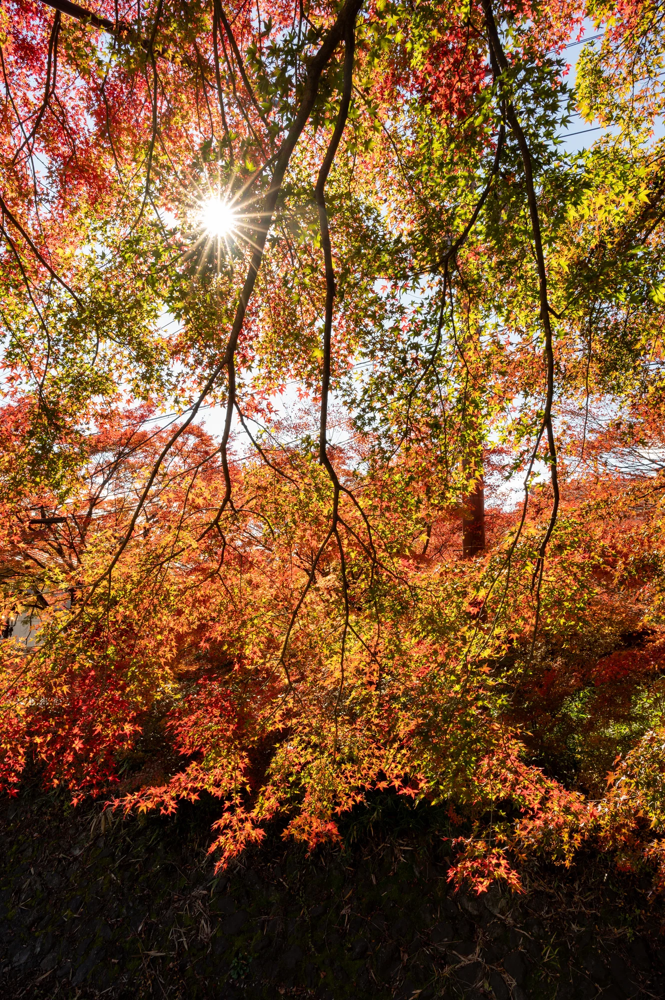
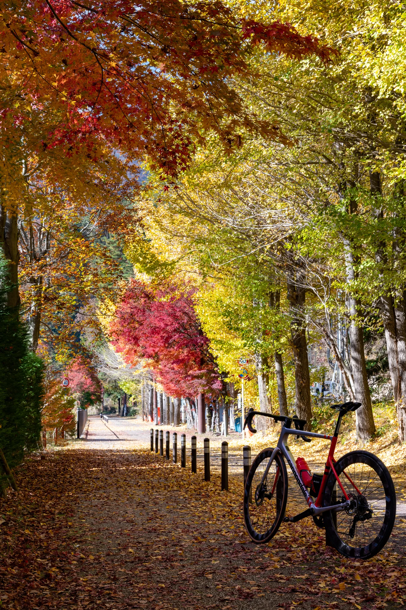

I've already written about a few routes near Tokyo: the [flat TT loop at Kasumigaura](../kasumigaura-rinrin-road-cycling-route/), the [Tomin no Mori climb](../tomin-no-mori-cycling-route/), and [Doshi Michi + Lake Yamanaka](../doshimichi-yamanakako-cycling-route/). This one covers the other four lakes of the Fuji Five Lakes: starting from Otsuki Station, climbing Route 139 up to Lake Kawaguchi, then passing Lake Sai and Lake Shoji before reaching Lake Motosu. Lake Yamanaka was already covered on the Doshi Michi ride, so this route collects the remaining four in one go.

I've ridden this route a few times, and one of those rides was in late November, right at the tail end of the foliage season. Lake Kawaguchi has its famous Momiji Corridor, and the hillsides along the road and the shore of Lake Shoji were all deep red. Scenery-wise this is one of the best routes I've ridden near Tokyo. If you can only pick one season to go, mid-to-late November is the answer — the photos in this post are from that ride.

## Route overview

| Section | Distance | Notes |
|------|------|------|
| Otsuki Station → Tsuru → Fujiyoshida (Route 139) | ~25 km | Mostly gentle climbing, ~400 m of gain |
| Fujiyoshida → Lake Kawaguchi | ~5 km | City streets through Yoshida, then the lakeside |
| Lake Kawaguchi → Lake Sai | ~8 km | Lakeside road + one short climb into Saiko |
| Lake Sai → Lake Shoji → Lake Motosu | ~15 km | Route 139 through the Aokigahara forest + lakeside roads |
| Lap of Lake Motosu | ~11 km | Nearly flat, the bluest water of the four |
| Return the same way to Otsuki | ~45 km | Mostly downhill — fast, so be careful |

With the Motosu lap the total is about 115 km with roughly 930 m of climbing; skip Lake Motosu and turn around earlier and it's about 99 km with around 870 m. Almost all the climbing is packed into the first half of the outbound leg, and after the Motosu turnaround it's basically one long descent back to Otsuki — a "suffer first, coast later" kind of route. See the Garmin course link at the end for the full route.

## Why start from Otsuki

Taking the Chuo Line to Otsuki is quite a bit cheaper than transferring to the Fujikyu Railway and riding all the way to Kawaguchiko Station. The Fujikyu leg from Otsuki to Kawaguchiko alone costs 1,170 yen one way — doing that round trip with a rinko bag adds up.

The other reason is training. The ~25 km from Otsuki to Fujiyoshida along Route 139 gains about 400 m at a bit over 2% average — a long, steady gradient that's great for holding consistent power. Ride the train to Kawaguchiko instead and you lose that climb entirely; the ride becomes an almost completely flat tour of the lakes.

That said, if you're purely here for the foliage and the views, **starting from Kawaguchiko Station is a perfectly reasonable choice**. Without the climb from Otsuki, the rest of the route is beginner-friendly — apart from one short ramp into Lake Sai and another near Lake Shoji, none of it is hard.

## Route sections

### Otsuki Station → Fujiyoshida (the long gentle climb)

From Otsuki Station, follow Route 139 toward Fujiyoshida, climbing gently along the Katsura River valley. This section passes through the town of Tsuru; traffic lights are sparse, and the gradient sits at 2–3% most of the time with the occasional steeper pitch. The core climbing section is about 18 km with 400 m of gain — just right as a tempo effort.

There are plenty of convenience stores along the way, so fueling is no problem. In foliage season the hillsides start showing color from Tsuru onward, and it only gets better as you climb.

### Fujiyoshida → Lake Kawaguchi

Past central Fujiyoshida, you reach the shore of Lake Kawaguchi quickly. On a clear day, Mt. Fuji stays on your left from here on. The lake has a loop road, and the north shore around Oishi Park and the Kubota Itchiku Art Museum is the highlight area in foliage season. **The Momiji Corridor sits on the north shore**, and a foliage festival runs from mid to late November — a tunnel of maple leaves with Mt. Fuji and the lake behind it. The crowds are there for a reason.

Note that during the festival, the north shore gets busy with both tourists and cars. Slow down when riding through, and walk your bike off the road when stopping for photos.

### Lake Kawaguchi → Lake Sai

Heading from the west side of Lake Kawaguchi toward Lake Sai, there's a short climb of about 1 km averaging around 6% — the steepest part of the whole ride, but it's short; get out of the saddle and it's over. In foliage season this stretch has plenty of maples along the road, a good excuse to stop mid-climb.

Over the top is Lake Sai, with far fewer tourists than Kawaguchi — a quiet lake with Mt. Fuji as the backdrop. Of the four lakes, this one has the best atmosphere in my opinion. The Kohoku View Line on the north shore has wide-open views and is worth the detour.

### Lake Sai → Lake Shoji → Lake Motosu

Leaving Lake Sai, rejoin Route 139 and ride through the Aokigahara forest toward Lake Shoji. It's the smallest of the four lakes, but the shoreline in foliage season is beautiful — most of my "maples + bike" photos were taken here. Stop anywhere along the shore and the framing just works.

Finally, continue toward Lake Motosu — the lake on the back of the 1,000 yen note, with the deepest blue water of the four. The lap around the lake is about 11 km, nearly flat with very little traffic, easily the most relaxed part of the route. Finish the lap and that's the turnaround; head back the way you came. If you're short on time or legs, skipping the lap and turning around at the lake is completely fine — the views are right there near the entrance.

### The way back

The return from Lake Motosu to Otsuki is almost entirely downhill — the 400 m you earned on the way out all comes back here. The descent from Fujiyoshida to Tsuru is fast, with some road seams and crosswinds, so don't get greedy with speed. Save a little energy for the end: there are scattered traffic lights and some traffic before Otsuki Station.

Compared to Doshi Michi, this route has less than half the climbing and is noticeably easier. The climbing is concentrated in the long gentle gradient at the start, and the lakes and return leg are ridden at a sightseeing pace — in foliage season you'll stop for photos more than you expect. If you want more of a workout, riding the Otsuki–Fujiyoshida section as a tempo block has real training value.

## Fueling and things to watch

Fueling is much easier here than on Doshi Michi: there are plenty of convenience stores between Otsuki and Fujiyoshida, and around Lake Kawaguchi you'll find everything. The one thing to plan for is that **supply points get sparse between Lake Sai and Lake Motosu** — the forest section has little more than the occasional vending machine, so top up your bottles before leaving Kawaguchiko.

Traffic is moderate overall. Route 139 between Otsuki and Fujiyoshida carries a fair amount of traffic including trucks, so keep to the edge and watch behind you. **Traffic drops off a lot past Lake Kawaguchi** — the Sai/Shoji/Motosu area is relaxed riding — but the north shore of Kawaguchi gets heavy tourist traffic in foliage season, so be extra careful there.

The best season is the foliage window from mid to late November. Be aware that mornings around the Fuji Five Lakes can be close to freezing at that time of year, while midday sun brings it back up to the mid-teens — layers and a windbreaker are essential. The sun also sets early; it starts getting dark past four in the afternoon, so don't schedule the ride too late.

## Route data

The full course is on my Garmin Connect:

- **Otsuki / Fuji Four Lakes (Garmin Connect)**: <https://connect.garmin.com/modern/course/238877385>

## Wrap-up

This route visits all four of the Fuji Five Lakes except Lake Yamanaka in a single day, with the climbing up front and the scenery in the back half. In foliage season, the Momiji Corridor at Kawaguchi and the shore of Lake Shoji are the annual highlights. If you want the training, start from Otsuki and take on the long gradient; if you're here for the views, start from Kawaguchiko Station — both versions work.

Combine it with the Doshi Michi + Lake Yamanaka route from before and you've collected all of the Fuji Five Lakes. Highly recommended in November.
