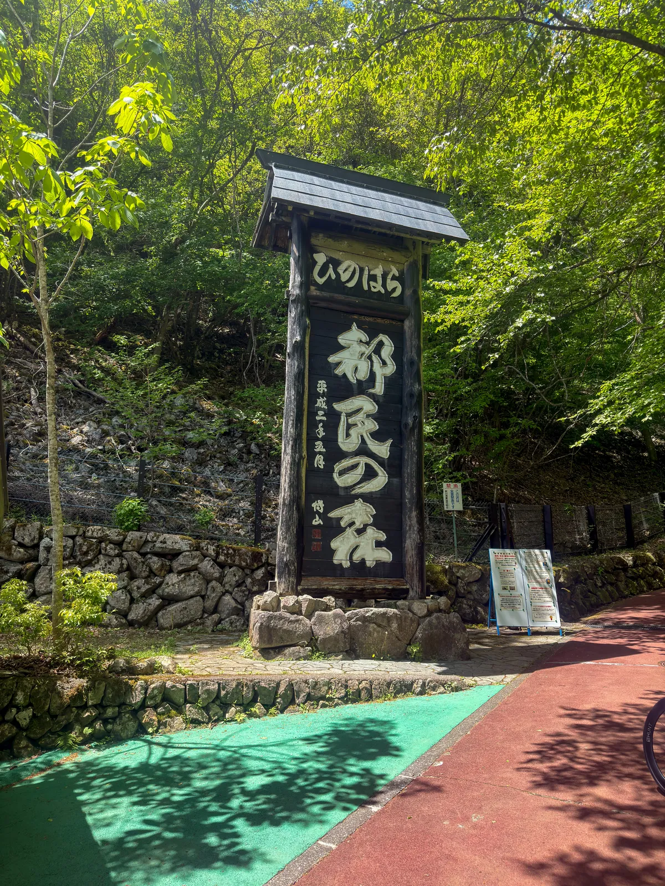

Kasumigaura is where I keep going back to train flat TT efforts, but flat work alone isn't enough. When you want a solid climb in the Kanto area, Okutama — west of Tokyo — actually hides a classic route: **Tomin-no-Mori**.

Tomin-no-Mori itself is a forest park on the Okutama Shuyu Road. Climb up along the loop road and the finish at Kazahari Pass is the **highest paved road in Tokyo** (also the highest point of any ordinary public road in the metropolis), at about 1,146 m. The route has a stretch of mountain road with no traffic lights where you can hold steady power, and you can do the whole thing as a day trip from central Tokyo — which makes it a popular climbing spot near the city.

This post covers the route's segments, climb data, fueling, and things to watch out for, plus a difficulty comparison for riders who know Taiwan's climbs, so you can get a feel for what level this road is.

## Route Overview

You can climb Tomin-no-Mori from two sides. Most Japanese riders take the "front" (omote) side, climbing up from Musashi-Itsukaichi along the Hinohara Kaido. I ride the "back" (ura) side myself — starting from Ome Station, looping around to Lake Okutama, then climbing the Shuyu Road from there. Here's my Ome route broken down first:

| Segment | Distance | Surface | Main Use |
|---------|----------|---------|----------|
| Ome Station → Lake Okutama | ~25 km | Ome Kaido (R411), regular road with traffic lights | Warm-up, transfer |
| Lake Okutama → Kazahari Pass (Okutama Shuyu Road) | ~11 km | Mountain road, no signals the whole way | Main climb |
| Kazahari Pass → Tomin-no-Mori | ~1 km | Loop road, gentle rollers | Turnaround, rest & fuel |
| Tomin-no-Mori → Hinohara → Musashi-Itsukaichi | ~33 km | Loop road descent + Hinohara Kaido | Descent |
| Musashi-Itsukaichi → Ome Station (over Futatsuzuka Pass) | ~18 km | Regular road, short climb on the way back | Final stretch, save some legs |

The high point of the whole route is Kazahari Pass at about 1,146 m. The Shinrin-kan (forest center) parking lot at Tomin-no-Mori sits a bit lower, around 1,000 m. Starting from Ome Station, climbing Kazahari Pass and descending the full loop comes to roughly 88 km with about 1,400 m of climbing — a solid one-day ride.

What riders love most about the Okutama Shuyu Road is that one stretch of mountain road with no traffic lights at all, so you can hold steady power without interruption. The road also has gated hours, and they differ by side: the Okutama-lake (Kawano) side I climb is only open 8:00–19:00 in summer (Apr–Sep) and 9:00–18:00 in winter (Oct–Mar), so you can't start the climb from the lake before the gate opens; the Hinohara side (Tomin-no-Mori to Kuzuryu Bridge) is open 5:00–21:00 year-round. Daytime riding is fine — just check the Kawano gate's opening time if you're starting early.

The full GPS route is linked via Garmin at the end of the post — import it straight into your head unit.

## Difficulty Comparison: What Level Is This Climb?

The distances and elevations around Okutama can be hard to picture from the numbers alone, so here's a familiar reference point — one Taiwanese riders will recognize.

From Musashi-Itsukaichi (the front side) to Tomin-no-Mori is about 33 km in total, of which the climb proper is roughly 21 km with 750 m of elevation gain; because the early section rises gently along a valley, the average gradient is mild overall — it's widely considered one of the most beginner-friendly climbs in the Kanto area.

The back side I ride — climbing from Lake Okutama up the Shuyu Road to Kazahari Pass — is more like a "condensed" version of the climb. This stretch happens to be the segment used by the Tokyo Hill Climb OKUTAMA race: the official figures are about 12 km and 590 m of gain (my own head unit logs roughly 11 km and 540 m — the difference comes from where the start and finish are marked). Going by the official segment, the climbing is almost identical to Taiwan's Balaka Highway: Balaka from the Sanzhi side is about 10 km with 580–620 m of gain. The difference is that this climb is a bit longer and a touch gentler (around 4–5%, versus closer to 6% on Balaka).

So in short, if you can ride Balaka, this climb at Tomin-no-Mori is well within your range — just be ready for "a bit longer but more gradual." What's actually harder is the transfer distance on either end and the total climbing over the whole day, not the steepness of any single climb.

## Two Ways Up: Musashi-Itsukaichi (front) vs Ome (back)

As mentioned above, Tomin-no-Mori has two common starting points.

**Musashi-Itsukaichi (the front side)** is the mainstream choice. From Musashi-Itsukaichi Station you head west along the Hinohara Kaido, passing Hinohara and Kazuma, join the loop road, and climb to Tomin-no-Mori. This is the front-facing route most guides and races use, and it has more places to refuel: there are convenience stores around Musashi-Itsukaichi Station and a few more along the Hinohara Kaido up toward Hinohara, but deeper in toward Kazuma there's almost nothing — so stock up before heading into the mountains. If it's your first time and you want the route most people ride, starting here is the simplest.

**Ome (the back side)** is what I'm used to. Honestly there was no particular reason at first — I just started from Ome Station the first time I went, riding the Ome Kaido (R411) through Mitake and Lake Okutama, then climbing the Shuyu Road up to Kazahari Pass from the lake side, and I've stuck with it ever since. The upside is the early section follows the scenic Tama River valley, and Lake Okutama is beautiful too; the downside is that fuel stops are even sparser than the front side, so you have to manage your own pacing.

Each side has its character: the front (Musashi-Itsukaichi → Tomin-no-Mori) is longer and gentler — about 33 km in total, with the climb proper around 21 km and 750 m of gain — and has more places to refuel; the back (Lake Okutama → Kazahari Pass) is shorter but more concentrated at about 11 km and 540 m of gain, with lake views along the way. Pick whichever based on which station you want to start from and what scenery you want to see.

## Getting to the Start

Whether you start from Ome or Musashi-Itsukaichi, you take the JR over — and remember to bag your bike (JR requires bikes to be in a bag to board).

**To Ome Station (the back side I ride)**: Ome Station is on the JR Ome Line. From central Tokyo, take the JR Chuo Line Rapid to Tachikawa, then transfer to the Ome Line to Ome — about 75 minutes from Shinjuku. On weekends and holidays there's also the direct "Holiday Rapid Okutama," which runs straight from Shinjuku to Ome with no transfer — pretty convenient when you've got a bike with you.

**To Musashi-Itsukaichi Station (the mainstream front side)**: Musashi-Itsukaichi Station is on the JR Itsukaichi Line. From central Tokyo take the Chuo Line to Haijima, then transfer to the Itsukaichi Line to Musashi-Itsukaichi — about 70 minutes from Shinjuku. There used to be a direct "Holiday Rapid Akigawa," but it was discontinued in 2023, so now you always transfer once at Haijima.

## Route Segments

Here's the breakdown of the Ome route I ride.

### Ome Station → Lake Okutama (warm-up)

From Ome Station, head northwest along the Ome Kaido (R411), passing Mitake, Kori, and Okutama Station, riding up along the Tama River valley the whole way. This section has traffic lights and some car traffic; overall it's a gentle uphill with small rollers, so don't rush the pace — just use it to warm up and open the legs. Past Okutama Station, a little further on you'll see Lake Okutama (the Ogouchi Reservoir — the lake in the photo at the top of this post). The view opens up wide here, a good spot to stop, refuel, and get ready for the climb.

### Lake Okutama → Kazahari Pass (the main climb)

From Lake Okutama, follow the shore to the gate of the Okutama Shuyu Road and the climb begins in earnest. Rough numbers for this section:

| Metric | Value |
|--------|-------|
| Distance | ~11 km |
| Average gradient | ~4.8% |
| Elevation gain | ~540 m |

The gradient isn't steep overall, but the middle-to-upper section runs through a series of switchbacks around the Tsukuyomi No. 1 and No. 2 parking lots, and the higher you go the more the view opens up — on a clear day you can see Lake Okutama below you. This whole section has no traffic lights and is the best part of the route for steady output. Once you see the Kazahari Pass sign, you've reached the high point of the route.

### Kazahari Pass → Tomin-no-Mori → Descent

Past Kazahari Pass, continue about 1 km toward Hinohara and you'll reach Tomin-no-Mori. There's a forest center, a restaurant, a shop, and restrooms here, plus plenty of bike racks — it's the most complete rest and fuel stop on the route. A lot of riders turn around or take a break here, grab something to eat, snap a photo, and head down.

For the descent, you drop down the Shuyu Road from Tomin-no-Mori, join the Hinohara Kaido through Kazuma and Hinohara, and come back toward Musashi-Itsukaichi. There are lots of corners on the descent and the road is shared with cars, so keep your speed under control.

If, like me, you start from Ome and need to loop back to Ome Station, here's a heads-up: **the return is not all flat or downhill**. From Itsukaichi back to Ome you go over Futatsuzuka Pass — about 5 km and 240 m of climbing. The gradient isn't crazy, but after a full day of riding your legs are pretty much done, and this little climb to finish really makes itself felt. In summer you'll usually reach this point around early afternoon, the hottest part of the day, so the heat and fatigue pile on and this stretch hurts even more. So don't empty the tank at Kazahari Pass — save a little for the way home, or that last climb or two will get pretty ugly.

## Fueling and Things to Watch Out For

The thing you most need to plan ahead on this route is fueling. There are almost no convenience stores along the Okutama Shuyu Road, so **before heading into the mountains, top up your water and food around Ome or Okutama Station**. The only real resupply up the mountain is the Shinrin-kan at Tomin-no-Mori (restaurant, shop, vending machines) — miss it and you're toughing it out until you're back down. The shop's curry rice is a classic choice; one plate after a climb hits just right.

Besides fueling, a few more things to keep in mind:

The valleys get dark early and mountain roads have few streetlights, so unless you're planning to ride at night, it's best to start early and get down early. The route passes through a few tunnels (along the Tama River on the Ome Kaido, and on the loop road), and they're dimly lit inside — bring a rear light if you can, so cars behind can see you more easily; it's safer.

This area is **bear country** — both Okutama Town and Hinohara Village put out bear sighting alerts, so try not to linger alone in remote sections at dawn or dusk. That said, weekend traffic is heavy and the odds of actually meeting a bear are pretty low; you're far more likely to see a monkey watching from the roadside as you grind up the climb.

The Shuyu Road descent has lots of corners and is shared with cars; on weekends there's plenty of motorcycle and car traffic, and the shoulder isn't wide, so **control your speed on the descent and don't cross into the oncoming lane**. Kazahari Pass is over 1,100 m and gets snow and ice in winter; the loop road also closes when rainfall is heavy, so check road conditions before you set out.

Finally, there aren't many bail-out points along this route, so make sure you carry a full repair kit and a spare tube.

## Best Seasons

The most comfortable seasons are April–June (fresh greenery) and October–November (autumn leaves); during Okutama's foliage season the Shuyu Road is gorgeous along its whole length, and it gets chilly on the descent, so bring a wind layer. In summer it's already hot when you set off down low, but it cools off a lot once you climb to around 1,000 m.

During the rainy season or after a typhoon, the road may have rockfall, fallen leaves, and standing water, and the mountains fog up easily — check road and weather conditions before deciding to go.

## GPS Route

The full GPS route imports straight into Garmin or Wahoo:

- **Ome Station → Tomin-no-Mori (Okutama Shuyu Road) day-trip loop (Garmin Connect)**: <https://connect.garmin.com/modern/course/126057158>

## Wrap-up

Kasumigaura is great for flat training; Tomin-no-Mori is a really convenient climbing option near Tokyo. A day-trip round trip up the highest paved road in Tokyo, with a forest park to rest at the finish — whether you want to train climbing, stack up long-distance vertical, or just ride something with a sense of purpose, it fits. If you're also interested in flat TT routes near Tokyo, check out my earlier [Kasumigaura + Rinrin Road route guide](../kasumigaura-rinrin-road-cycling-route/) — the two routes make a nice flat-and-climb pair.

The things to remember: fuel stops are sparse and the Shuyu Road has a nighttime closure, so carry enough water, bring your lights, pack a repair kit, check the gate hours — and leave the rest to your legs.

## Reference

- [Okutama Shuyu Road (Tokyo Metropolitan Construction Bureau, Nishi-Tama Construction Office)](https://www.kensetsu.metro.tokyo.lg.jp/jimusho/nishiken/okutama-hp) — Official opening hours, closure info, and road condition notices
- [Tomin-no-Mori (Tokyo Hinohara Tomin-no-Mori)](https://www.hinohara-mori.jp/) — Forest center, restaurant, and facility info
- [Tokyo Hill Climb Series (Tokyo Hill Climb Organizing Committee)](http://www.kfctriathlon.com/html/event_bike.html) — Race segment info for Tomin-no-Mori (HINOHARA) and Kazahari Pass (OKUTAMA)
- [Cycling guide: Balaka Highway breakdown (velodash Magazine)](https://blog.velodash.co/2020/08/12/balaka/) — Distance, gradient, and elevation data for the Balaka Highway comparison
