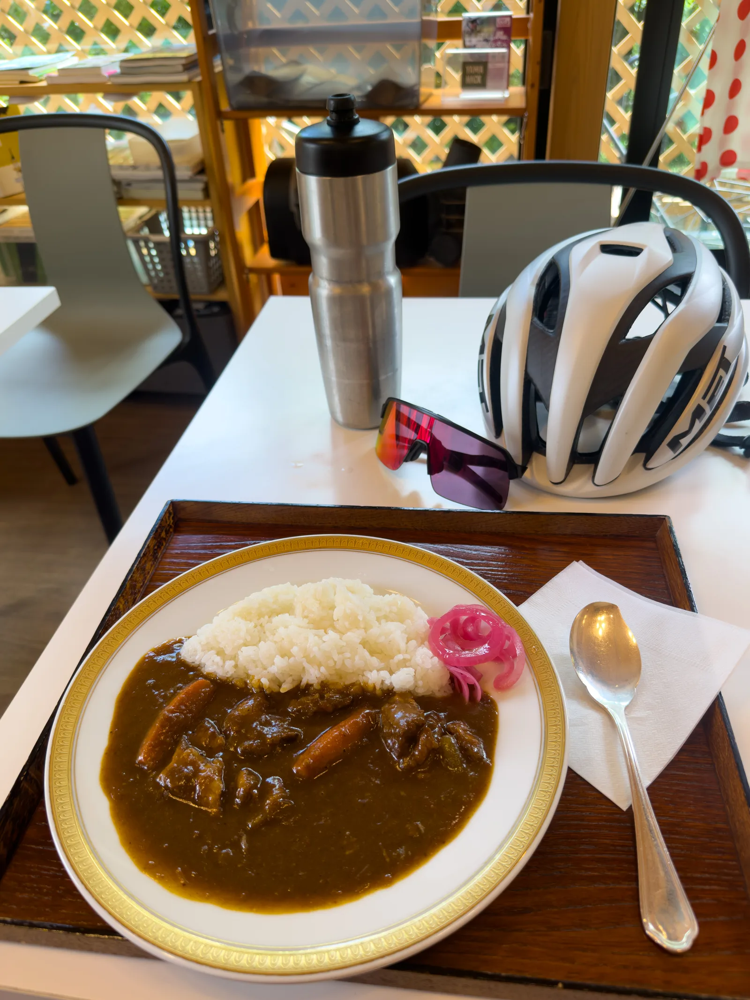

After writing about [Tomin-no-Mori](../tomin-no-mori-cycling-route/), here's another climb every Kanto cyclist has heard of: **Yabitsu Pass (ヤビツ峠)**. Sitting at 761 m in the Tanzawa mountains of Kanagawa, it's one of Kanto's hill climb meccas, and plenty of riders come here regularly to time their climbs. From my place, the train ride to Hadano Station is actually a bit shorter than getting to Tomin-no-Mori, so I picked a day to go check it out. I ended up climbing it three times.

This post covers the route segments on both sides of the pass, climb data, fueling, and things to watch out for, with the usual difficulty comparison against Taiwan's Balaka Highway.

## Route Overview

Like Tomin-no-Mori, Yabitsu has two sides: the **front side (omote)** climbing from Hadano (Naganuki intersection), and the **back side (ura)** climbing from Lake Miyagase. The two sides have very different characters:

| Route | Distance | Elevation gain | Avg gradient | Character |
|-------|----------|----------------|--------------|-----------|
| Front (Naganuki → pass) | ~11.8 km | ~670 m | ~5.9% | Steady climb after the opening section, the classic TT segment |
| Back (Lake Miyagase → pass) | ~17.8 km | ~477 m | ~4.9% on the climbing sections | Long but gentle, narrow road along a stream valley |

My ride went like this: start at Hadano Station and climb the front side → descend the back side to Lake Miyagase → climb back up from the back → descend the front side to around the torii gate → climb a third time back to the pass → curry at the rest house to finish. That covers both sides in one day, with about 1,700 m of total climbing.

The full GPS route is linked at the end of the post as a Strava route you can import straight into your bike computer.

## Difficulty: Even Closer to Balaka Than Tomin-no-Mori

When I wrote about Tomin-no-Mori, I said its back side has about the same elevation gain as Balaka but gentler gradients. Yabitsu's front side is an even closer match: 11.8 km, 670 m of gain, 5.9% average, versus Balaka's roughly 10 km, 580–620 m, and nearly 6%. Practically the same spec, just slightly longer. If you ride Balaka comfortably, the front side of Yabitsu is the same kind of climb. Even the feel on the pedals is similar.

The front side has one more great feature: **after a few short descents near the start, it climbs almost continuously to the pass**. Unlike roads that give back elevation partway up, here you can hold steady output once you're past the opening section. One rep takes around an hour depending on your level, which makes it good for Z3–Z4 work around threshold. That's also why so many riders use it for climbing tests.

## Getting There

The start is **Hadano Station** on the Odakyu Odawara Line, about 70 minutes from Shinjuku on a rapid express. Remember to pack your bike in a rinko bag (JR and private railways in Japan require bikes to be bagged). From the station it's a short ride to the Naganuki intersection where the front-side climb starts. It works nicely as a warm-up.

One thing worth knowing: Kanachu buses run from Hadano Station all the way up to Yabitsu Pass (mainly for hikers), so you will meet buses on the road. More on that in the notes below.

## Route Segments

### Naganuki → Minoge (the steepest part)

The front-side climb starts right at the Naganuki intersection, and there's a 7-Eleven next to it. Stock up on water and sports drinks here, because it's the last convenience store before the mountain.

From Naganuki up to the Minoge bus stop is the steepest section of the whole climb, with stretches over 10%. Shortly after the start you pass a torii gate by the road. It's quite recognizable, and a handy progress marker on your first visit. This section still runs between houses and farmland, so just settle into a rhythm and don't burn matches early.

### Minoge → Nanohanadai → Yabitsu Pass (middle and upper sections)

Past Minoge you're properly in the mountains and the gradient settles into a steady 5–6%. From here it's just about staying on the pedals. Almost the entire middle and upper part of the climb is under tree cover, and this is the biggest difference from Tomin-no-Mori: **there's a lot more shade, so it's noticeably cooler in summer**. At Tomin-no-Mori you're often grinding in direct sun near the top; here, even in July it's still fairly comfortable.

The trade-off is the road surface, which is worse than Tomin-no-Mori. **There are a lot of potholes**, and with the light flickering through the trees they're hard to spot ahead of time, so take extra care on the descent. Some sections above Minoge are also fairly narrow, and buses run on this road, so ease off and keep left when passing oncoming traffic.

Partway up, Nanohanadai has an observation deck and toilets, the only proper rest stop mid-climb. Keep pushing a bit further and the Yabitsu Pass sign means you've topped out.

One fun observation: **there are a lot of runners here**, and it felt like more runners than cyclists. With its steady gradient and full tarmac, plenty of runners come specifically for uphill training. Trail runners and hikers mostly take the bus up to the pass or come over from the Oyama side, so they're a different crowd from the ones you see on the road. Getting cheered on by runners (or trading pained smiles) mid-climb is just part of the Yabitsu experience.

### Descending the Back Side: Lake Miyagase

Descending north from the pass puts you on the back side, following the valley down toward Miyagase until you reach the lake. The back side is even narrower, with spring water seeping across the road and fallen leaves, and the same pothole situation, so don't get greedy on the descent. Down at the lake the view suddenly opens up, and Lake Miyagase is quite a sight. The lakeside **Miyagase Lakeside Park** has toilets, vending machines, and shops. It's the best rest and resupply point on the back side, so fill your bottles here before turning around to climb back to the pass.

The back-side climb is 17.8 km of gentle gradient. It's much easier on average but long, which makes it a nice tempo or recovery-effort climb. Pairing it with a hard front-side rep makes for a solid day of training.

## Fueling and Things to Watch Out For

### Yabitsu Pass Rest House

The **Yabitsu Pass Rest House** at the top is the main supply point on this route. It is open 9:00–16:00 on operating weekdays and 8:30–16:30 on weekends and holidays. It is **closed Wednesdays and Thursdays, but open on holidays**, so check before you go.

The signature dish is the Tanzawa Royal Curry, made with local Hadano pork and produce. I ate it after my third rep, and when you're that hungry everything tastes amazing. That said, **at 1,650 yen a plate it's not cheap as ride fuel goes**, and the shop doesn't offer free water, so you'll have to buy some if you want to refill bottles. If you're on a budget, carry your own fuel and treat the curry as a reward.

### Other Notes

As mentioned, the 7-Eleven at the start is the last convenience store before the mountain, so **top up water and food there first**. The middle of the route isn't completely without supplies: the rest house is at the pass, and the Tanzawa Home shop in front of the bus stop is open on weekends and holidays, with a drink vending machine and a few items for sale. The truly barren stretch is **the back-side descent from the pass until Lake Miyagase**, so make sure you're carrying enough water before dropping down that side.

Once you reach Lakeside Park there's plenty of food, and it's a good place for a proper refuel. Just remember you still have to climb back to the pass afterward, so don't overdo it.

The road carries buses, hikers, and a lot of runners, especially on weekends. **Control your speed on descents** and don't cut across the center line on narrow corners. Combined with the potholes, your attention on the way down should be on the road surface.

The back side also has three tunnels, so use front and rear lights. Mobile coverage is patchy in the mountain section, so download the route for offline use before you go.

The area around the pass ices over in winter, and heavy rain often leaves rocks and leaves on the road, so check conditions before heading out. Bail-out points are limited mid-route. Bring a full flat kit and a spare tube.

## Best Season

Thanks to all that shade, this route is still rideable in summer, one of the few Kanto-area climbs you can say that about. Spring greenery and autumn foliage are more pleasant of course. In winter watch for ice, and note the pass is noticeably colder than the valley, so bring a wind layer for the descent.

## The Route

The full GPS route, ready to import into your bike computer:

- **Hadano Station → Yabitsu Pass, front and back sides (Strava Routes)**: <https://www.strava.com/routes/3510635578306958412>

## Conclusion

That rounds out three types of Kanto-area routes: [Kasumigaura](../kasumigaura-rinrin-road-cycling-route/) for flat work, [Tomin-no-Mori](../tomin-no-mori-cycling-route/) for long gentle climbing, and Yabitsu Pass as the test climb for intensity. One front-side rep takes about an hour, with a steady climb after the opening section. If you want to know where your climbing fitness stands, one rep here will tell you.

Things to remember: lots of potholes, narrow roads with buses, and the curry at the top is neither cheap nor served with free water. Bring enough fuel, take the descents easy, and the rest is up to your legs.

## Reference

- [Yabitsu Pass, the Hill Climb Mecca (Hadano City official)](https://www.city.hadano.kanagawa.jp/kanko/spot-shisetsu/2/1045.html): route and tourism info
- [Yabitsu Pass (Kanagawa) | Hill Climb List](https://hillclimblist.com/route/kanagawa_yabitsu/): front-side distance, elevation, and gradient data
- [Yabitsu Pass back side guide (Aozora Ride)](https://aozoraride.com/yabitsu/): back-side route info
- [Yabitsu Pass Rest House (Tanzawa MON official)](https://tanzawamon.jp/yabitsutouge-resthouse/): hours and facility info
- [Tanzawa Home Yabitsu Pass shop (OMOTAN)](https://omotan-hadano.jp/gourmet/%E5%9B%BD%E6%B0%91%E5%AE%BF%E8%88%8E-%E4%B8%B9%E6%B2%A2%E3%83%9B%E3%83%BC%E3%83%A0%E3%83%A4%E3%83%93%E3%83%84%E5%B3%A0%E5%A3%B2%E5%BA%97/): weekend and holiday shop hours, vending machine, and supplies
- [Balaka Highway guide (velodash Magazine)](https://blog.velodash.co/2020/08/12/balaka/): Balaka distance, gradient, and elevation data
