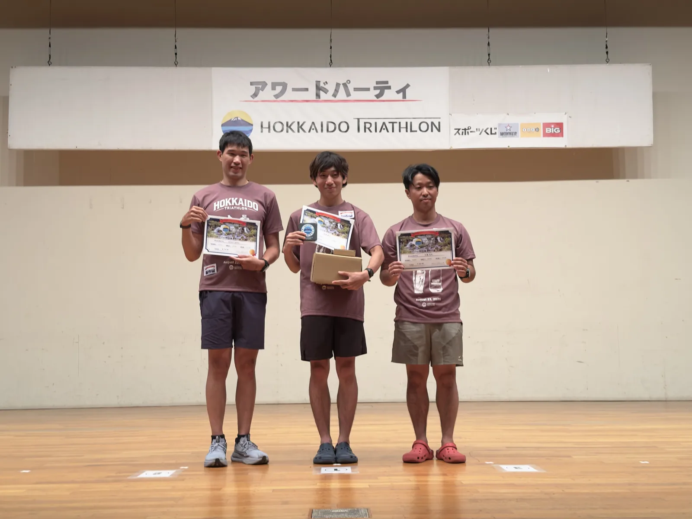

> **公式リザルト：6:14:40 | 総合 16 位（完走 102 人）| 年代別（20-29 歳男子）2 位**
> スイム 41:13 · バイク 3:15:52 · ラン 2:17:35
>
> *公式リザルトはスイム／バイク／ランの 3 区間のタイムのみで、T1／T2 のトランジションタイムは別掲されていません。本文中の「ウォッチ」のタイムは時計が自動判定したトランジション区切りによるもので、毎回正確に切れているとは限りません。*

このレースについては[プレレース記事](../2026-hokkaido-toya-pre-race/)を書いた通り、最初から B レースのつもりで臨みました。足指の骨折で 1 ヶ月半ほとんど走れておらず、完走できれば十分という位置づけです。結果は年代別 2 位、総合 16 位と予想より少し良かったのですが、そもそも参加人数が少なく（B Type の完走者は 102 人）、順位自体にあまり参考価値はありません。重要なのは実際の execution とデータです。

前日に車で洞爺湖へ向かう途中、ゴーグルとスイムキャップを忘れたことに気づき、室蘭市内のスポーツ用品店に寄って新しいゴーグルを買って事なきを得ました。ヒヤッとしました。洞爺湖に着いてから湖畔を少し散歩したところ、湖面は穏やかで、犬を乗せて SUP を漕いでいる人がいて、なかなか癒される光景でした。翌日泳ぐ水域の下見も兼ねられました。

前夜にギアを全部並べて最終チェック。途中で買ったゴーグルもこの中に混ざっています。

---

## 天気

当日は好天で、最高気温は 28-29 度ほど。水温は体感でかなり暖かく、25-26 度くらいでしたが、規定通りウェットスーツを着用しました。ランは直射日光がありましたが、湖畔は木陰が多く、耐えられないほどの暑さではありませんでした。

---

## スイム（ウォッチ 40:36 | 公式 41:13 | avg HR 168 | max HR 179）

洞爺湖は淡水湖で、宮古島の海のスイムとは感覚がかなり違いました。海水は塩分濃度が高く浮力が自然に得られますが、淡水湖では体が明らかに沈み気味になり、同じ力の出力でもスピードが落ちます。

数字で比較すると、今回ウォッチで計測したペースは約 1:59/100m（GPS 距離 2.05km、40:36）、昨年の宮古島は 1:53/100m（GPS 距離 2.9km、54:25）。100m あたり約 6 秒遅く、淡水湖の浮力差がほぼ答えで、体力の問題だけではなさそうです。

もう一つの変数として、この期間に日本でマンツーマンのスイムレッスンを受けており、フォームはまだ調整中です。プレレース記事にも書いた通り、今回は実戦テストの機会でもありました。心拍のコントロールは宮古島より少し改善して、今回の max HR は 179。宮古島ではスイムアップ時に 185 まで上がっていたので進歩ではありますが、平均心拍はやはり 168 で、スイムは相変わらず自分にとって最も心肺負荷の大きい区間です。

## T1

湖からの動線は宮古島よりシンプルで、特にトラブルもなく、タイムも想定通りでした。

---

## バイク（公式 3:15:52 | ウォッチ 3:10:27 | 91.7km | avg HR 158 | 獲得標高約 900m | avg power 144.9W | NP 160W）

コースはプレレース記事で描いた通り、前後は湖沿いのフラット区間、中間の 40km 付近に 5-8%・2-3km の登坂が 3 連続。コーチのアドバイスは心拍主体（155-165）、パワーは補助（FTP の 70-75%）でした。理由は、この手のコースではパワーが常に跳ね回るため、ワット数を見つめて走ると登坂で無駄な出力を出しやすいからです。

実際の結果は avg HR 158 で、コーチの指定レンジ内。この部分は計画通りでした。しかし全体の avg power は 144.9W にとどまり、FTP（233W、室内トレーナーで計測）換算で約 62%。コーチ推奨の 70-75% を明らかに下回り、宮古島の 161.5W からも一段落ちています。

ただ、登坂が集中しフラットが長いコースでは、avg power だけを見ると実際の負荷を過小評価しがちで、Normalized Power（NP）と合わせて見るべきです。今回の Variability Index（NP ÷ avg power）は約 1.11 と低くない数字で、出力の変動がかなり大きかったことを示しています。NP で見ると 160W、233W FTP 換算で約 69%。avg power の 62% よりコーチ推奨の 70-75% にずっと近く、登坂とフラットが交互に来るコースでは NP のほうが妥当な指標です。

セグメントごとにパワーを分解すると、なぜ変動がこれほど大きかったのかがよく分かります。3 つの登坂の実際の出力はどれも低くありません：

| 登坂セグメント | 距離 | 獲得標高 | avg power |
|--------|------|------|-----------|
| ４８ Climb | 3.12km | 162m | 193W |
| 伏見 climb | 1.71km | 122m | 196W |
| ゴールは「山の神」climb | 1.81km | 120m | 195W |

3 本とも 190W 以上で、FTP の 80-85% に迫るかそれを超え、心拍も 165 の上限に張り付いて走っていました。一方フラット区間は：

| フラットセグメント | 距離 | avg power |
|--------|------|-----------|
| Toya 132 | 16.1km | 138W |
| Lake Toya East | 15.9km | 151W |
| 洞爺湖畔東反時計回り TT | 14.1km | 152W |

フラットは 138-152W 程度。同じ心拍上限で走っていても、勾配の抵抗がなければより低い出力で維持できるためです。このコースはフラットの距離が登坂よりずっと長く、全体平均がフラットの低いワット数に大きく引き下げられました。コーチが事前に「平均パワーを見つめるな」と念押しした理由そのもので、実走で完全に裏付けられた形です。

パワーの数字自体にもう一つ前置きしておくべき変数があります。今回使った Speedplay のペダル型パワーメーター（Wahoo POWRLINK）は少し前に脱着したばかりで、FTP を計測した室内トレーナーは別のセンサーです。以前両者を突き合わせたところ、スペーサーを付けた状態では Wahoo ペダルの読み値がトレーナーより 1.5-2% ほど低く、Wahoo 公式フォーラムの [POWRLINK Zero under-reading のスレッド](https://wahoox.forum.wahoofitness.com/t/wahoo-powrlink-zero-under-reading/23768) で報告されている低め表示の傾向と方向は一致しています（幅はそこまで大きくありませんが）。この補正を加えると NP 160W はおよそ 162-163W、233W FTP 換算で約 70% となり、コーチの目標 70-75% の下限にちょうど乗ります。今後ペダルのスペーサーを外して再計測し、読み値が変わるか確認する予定です。

---

## T2

ランシューズに履き替えて出発。特に問題なし。

---

## ラン（公式 2:17:35 | ウォッチ 2:17:55 | 23.11km | avg pace 5:57/km | avg HR 162 | max HR 172）

コーチのペース指示は 2 周に分けて、1 周目は心拍 155-160・ペース 5:00-5:30、2 周目は心拍 160-165 でした。実際には 1 周目のペース下限にすら届かず、全体の平均ペースは 5:57/km。宮古島のフルマラソンの 5:37/km より遅く、距離はフルの半分強しかないので、理論上はもっと速くて然るべきです。

途中で小さなハプニングもありました。交差点で誘導していた係員がぼんやりしていて、別の選手と一緒にコースを間違えたのです。GPS 記録の 23.11km にはこの余分な区間も含まれており、公式発表の 23.1km とほぼ一致したので、実質的な影響はありませんでした。

1km ごとのスプリットを並べると、最初の 12km ほどは 5:30-5:55/km の間で比較的安定していましたが、13km 目から明らかに落ち始め、後半はほとんどが 6:00-6:35/km。ちょうどその辺りで年代別 1 位の選手に後ろから抜かれ、その後追いつけませんでした。

前後半の平均で見るとさらに明確です。前半 12km は avg HR 約 164・ペース 5:45/km、後半 11km は avg HR が約 160 に下がったのにペースは 6:13/km まで落ちました。ペースの低下に伴って心拍が上がるどころか、逆に 4 bpm 近く下がっています。この「心拍が下がり、ペースも落ちる」という組み合わせが指すのは、心肺が保たなかったのではなく、純粋な筋力／筋持久力の不足です。足指骨折による 1 ヶ月半のラン空白期間が、そのまま後半の筋持久力に現れました。宮古島のフル後半で大腿四頭筋が止まったのと本質的に同じパターンで、今回は距離が短い分、持ちこたえられる時間が少し長かっただけです。

---

## リザルトまとめ

| 種目 | 公式タイム | データ |
|------|----------|------|
| スイム | 41:13 | avg HR 168 / max HR 179 |
| バイク | 3:15:52 | avg HR 158 / avg power 144.9W / NP 160W / 91.7km |
| ラン | 2:17:35 | avg pace 5:57/km / avg HR 162 |
| **合計** | **6:14:40** | **総合 16 位、年代別（20-29 男子）2 位** |

---

## プレレース目標との対照

| 種目 | コーチの事前目標 | 実際の execution |
|------|--------------|----------|
| スイム 2km | 7-8 割の力で安定して泳ぎ切る | avg HR 168、強度は想定通り。ペースは淡水湖の浮力差で低下 |
| バイク 91.7km | HR 155-165、パワー 70-75% FTP | avg HR 158（達成）；NP 160W ≈ 69% FTP で目標下限付近；avg power は 62% FTP と明らかに低め（登坂で高く、フラットで低い） |
| ラン 1 周目 | HR 155-160、ペース 5:00-5:30 | 前半 12km avg HR 164・ペース 5:45/km。心拍は目標超過、ペースは目標レンジに届かず |
| ラン 2 周目 | HR 160-165 | 後半 11km avg HR は約 160 に低下、ペースは 6:13/km まで落ち、疲労とともに心拍が上がらず |

全体で見ると、バイクの心拍 execution が最もコーチのプラン通りでした。ランは心拍もペースも目標レンジに入りませんでしたが、心肺が保たなかったわけではなく（心拍はむしろ低め）、筋力がまだ戻っていないだけです。この点はプレレース記事の時点で正直に予想していた通りでした。

---

## 表彰式

年代別 2 位で表彰を受けました。参加人数が少ないレースなので重みはそれほどありませんが、表彰台に立つのはやはり気分の良いものです。

---

## レース後の振り返り

年代別 2 位・総合 16 位という数字は悪くないように見えますが、そもそも参加人数が少なく、順位の参考価値は限定的です。本当に見るべきは execution です。

スイムは淡水湖の浮力とフォーム調整期の影響で、遅くなったのは想定内。バイクは心拍の execution が完全にコーチのプラン通りで、NP 換算では目標レンジにかなり近く、avg power がフラット区間に引き下げられたのとパワーメーター自体の誤差で、数字が実際の負荷より控えめに見えているだけです。ランは今回最も正直な部分でした。1 ヶ月半まともに走っていない以上、後半でペースが落ちるのは必然で、近道はありません。

もう少し引いて見ると、これは主観的な感覚ではなく、数字がかなり率直に物語っています。今回のバイク avg power 144.9W（NP 160W）、ランペース 5:57/km。どちらも宮古島（161.5W、5:37/km）より遅いのに、宮古島のほうが距離はずっと長い（バイク 123km、ランはフル 42.2km）のです。距離が短ければ強度を維持しやすいはずなのに両方落ちているということは、単一の種目の問題ではなく、ここ最近のトレーニング状態全体が宮古島前より一段落ちているということです。骨折は要因の一つに過ぎず、暑くなってからの夏トレーニング自体、量も質もまだ理想の状態に戻っていません。

次のレースは 10 月 2 日の [99T](https://99tri.com.tw/) で、目標も現実に合わせて下方修正し、まずは 5 時間切りを狙います。この数日はしっかり休んで体をリセットしてから、この周期のトレーニングプランを組み直すつもりです。
