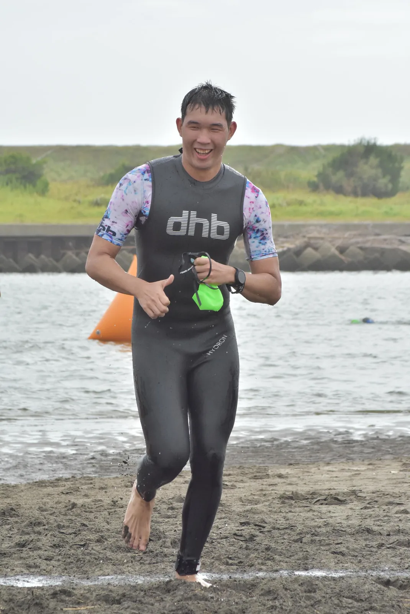
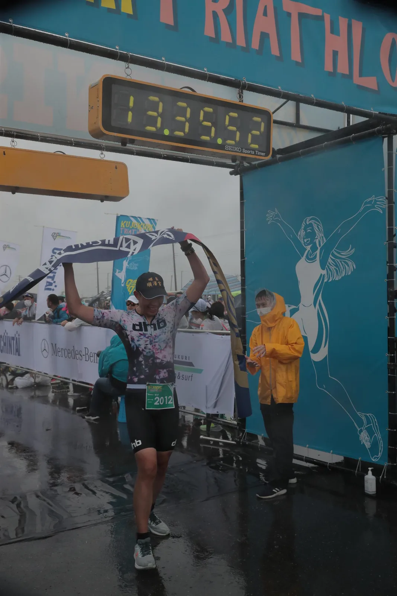
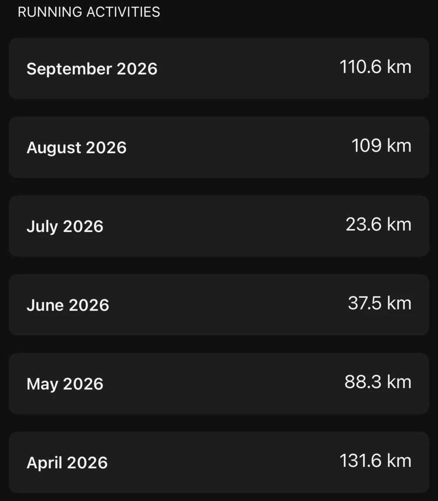

4 年前、人生初のトライアスロンとしてエントリーしたのが九十九里の 99T で、いきなり 113 距離に挑戦しました。その日は天気があまり良くなく、ランの途中で大会側がレースを打ち切り、14km ほどで終わりました。厳密に言えば、初めてのトライアスロンでは 21km を走り切れていません。

4 年ぶりに同じ大会へ戻ります。その間に宮古島と洞爺湖を走り、この 99T が今シーズンの A レースです。最近は台風が関東の周りをうろうろしていて、レース前の 1 週間は天気予報をかなりハラハラしながら見ていました。今のところ台風 26 号は木曜日に関東の南を足早に通過する見込みで、土曜日までこれ以上変化がないことを願っています。

---

## 大会概要

[九十九里トライアスロン（99T）](https://www.99t.jp/)のミドルディスタンスは 10 月 3 日（土）朝 8:00 スタート、会場は千葉県の一宮海岸周辺です。東京から車で 1 時間半ほどで、関東で東京から最も近いミドル以上の距離のトライアスロンのひとつです。

| 種目 | 距離 | 場所 |
|------|------|------|
| スイム | 1.9km | 一宮川河口 |
| バイク | 90.1km | 九十九里有料道路・東金九十九里有料道路（2 周回） |
| ラン | 21.1km | 九十九里有料道路 |
| 合計 | 113.1km | 制限時間 16:30 |

スイムは海ではなく一宮川の河口内で泳ぐため、波は比較的小さめです。淡水と海水が混ざる汽水なので、洞爺湖の純粋な淡水よりは浮力が少し良いはずです。特徴的なのは、スイムを上がってからトランジションエリアまで約 1km あることで、T1 の時間は一般的なレースよりかなり長くなります。これまでのレースではスイムを上がった直後は心拍がかなり高いことが多く、この 1km を走って飛ばすとバイクに乗る前に心拍が上がりきってしまうので、今回は気をつけたいところです。

バイクは交通規制された有料道路を使い、ミドルディスタンスは 2 周回です。トランジションから海岸沿いの九十九里有料道路を北上し、北側に折り返し地点が 2 か所あります。1 つは片貝 IC、もう 1 つは東金九十九里有料道路に入った先の福俵 PA で、エイドステーションは福俵 PA と長生 IC に設置されています。コースはほぼ完全にフラットでカーブも少なく、中盤に登坂が連続する洞爺湖とはまったくの別物です。このタイプのコースは安定した出力が求められ、登りで一息つくことも下りで回復することもできません。ひとつの強度を 2 時間以上維持できるかが問われます。

）](course_map.webp)

---

## 4 年前の 99T

2022 年 9 月 18 日、人生初のトライアスロンでした。その日は天気が悪く、波が高かったためスイムは 1.5km に短縮されました。曇りなのに体感はむしろ暑かった記憶があり、後半には急に風雨と雷がやってきて、ランも途中で打ち切りになりました。

当時の Strava の記録を掘り起こしてみました：

| 種目 | 時計の記録 | 備考 |
|------|----------|------|
| スイム | 32:36 | 天候により 1.5km に短縮（GPS 記録 1.69km）、avg HR 180、max HR 190 |
| T1 | 約 11:48 | スイムアップからトランジションまで約 1km |
| バイク | 3:14:44 | 91.0km、平均約 28km/h |
| ラン | 1:28:14 | 14.2km、平均ペース 6:12/km、その後大会側が打ち切り |

今見るとスイムはなかなかひどい内容です。500m ごとのラップは 8:10、9:33、11:04 とどんどん遅くなり、心拍はずっと 180 以上に張り付いていました。実はそれまでオープンウォーターの練習をまったくしたことがなく、しかも当時の 99T は全員一斉スタートだったので、入水した瞬間からものすごい混雑で、ぶつかられ、蹴られ、つかまれました。水の中の日本人は台湾の道路を走る車と同じで、まったく遠慮がありません。バイクは 3 時間 15 分ほどで、当時は普通のロードバイクにエアロバーすら付けていませんでした。ランでは雨がどんどん強くなり雷も鳴り始め、10km 付近で大会側がレースの打ち切りを決定しました。最終的に 14km ほどでフィニッシュゲートを通過して完走メダルはもらえましたが、21km のうち 3 分の 2 しか走れませんでした。

今回戻ってきたのは、あのとき走れなかった 7km を取り戻したいという気持ちも少しあります。

---

## 現在の状態

前回のレースは 8 月末の[北海道・洞爺湖](../2026-hokkaido-toya-race-report/)で、足指の骨折から復帰したばかりでした。レース後の振り返りの結論はシンプルで、ラン後半にペースが落ちる一方で心拍はむしろ下がっており、心肺ではなく筋持久力が足りていないというものでした。そのため洞爺湖後の 1 ヶ月あまりは、走行距離とロング走を取り戻すことが重点でした。

### ラン

まずは月間走行距離を、洞爺湖のレース前記録と並べて比較します：

| 月 | 走行距離 |
|------|------|
| 4 月 | 131.6 km（宮古島レース月） |
| 5 月 | 88.3 km |
| 6 月 | 37.5 km |
| 7 月 | 23.6 km |
| 8 月 | 109 km（洞爺湖の 23.1km を含む） |
| 9 月（9/28 まで） | 110.6 km |

月間走行距離は宮古島前の 130〜150km にはまだ戻っていませんが、骨折期間の 20〜30km からは 110km 前後まで回復しました。より大事なのは、9 月にロング走ができたことで、洞爺湖前にはまったくできていなかった部分です：

| 日付 | 距離 | 平均ペース | 平均心拍 | 備考 |
|------|------|--------|--------|------|
| 9/5 | 20.4 km | 5:51/km | 151 | 中盤に 5:16-5:21 まで 2 回ペースアップ |
| 9/9 | 18.3 km | 5:42/km | 152 | ビルドアップ、ラスト 2km は約 5:06 |
| 9/19 | 21.8 km | 6:08/km | 142 | 楽なロング走、心拍はほぼ 150 以下 |
| 9/26 | 11.6 km | 5:11/km | 161 | ブリックラン、先に 1.5 時間のバイクメニュー |

9/26 がこのサイクルで最も参考になる 1 本でした。先に Zwift で 1 時間半ほど 80% FTP のメニューをこなし、降りてすぐに走りました。心拍 160 前後で、最初の 1km 以降はペースが 5:07-5:14/km に安定し、11.6km を通して落ちませんでした。洞爺湖のラン前半は avg HR 164 でペースは 5:45/km だったので、同じバイク後のランで同じ心拍域なのに、1km あたり 30 秒以上速くなっています。レースではランの前に 90km のバイクがあるので疲労度は違いますが、少なくともランの土台はある程度戻ってきたと言えそうです。

### バイク

バイクのメニューは主に Zwift で、週 2 回ほど SST、Z4 インターバル、80% FTP のロングテンポをこなし、週末のうち 1 日は霞ヶ浦へロングライドに行っています。9 月は合計約 585km 走り、FTP は洞爺湖前に再計測した 237W です。

霞ヶ浦 1 周は 124km でとてもフラットなので、99T の有料道路のシミュレーションにちょうど良いコースです。9/13 は平均パワー 140W、平均心拍 140 で、後半に心拍が 148-152 まで上がったときのパワーは 140-150W ほどでした。9/23 はうまくいかず、その日は調子がかなり悪く、後半は補給がまったく喉を通らず、ほぼゆっくり流して駅まで戻っただけでした。平均パワーは 122W、平均心拍は 129 にとどまりました。

### スイム

9 月は約 19km 泳ぎ、8 月のほぼ 2 倍です。ほとんどが 1 回 2.4〜3.2km のプール練習でした。洞爺湖前に書いたフォームの修正は、新しい動きにもう慣れて、動作を意識しなくても泳げるようになりました。ただスピードはまだ伸びておらず、ここはもう少し時間がかかりそうです。

現状をまとめると：

- **スイム**：8 月より練習量が大幅に増え、新しいフォームには慣れたが、スピードはまだ上がっていない
- **バイク**：Zwift のメニューは順調に維持、霞ヶ浦 124km は 2 回のうち 1 回は順調、1 回は後半に補給が入らず失速
- **ラン**：骨折による空白期間から月 110km まで回復、18km 以上のロング走が 3 回あり、洞爺湖前よりかなり良い状態

---

## コーチのペース指示

レース前にコーチと相談し、今回の指示はすべて心拍ベースです：

| 種目 | 指示 |
|------|------|
| スイム 1.9km | 心拍 140-150 |
| バイク 90.1km | 心拍 155 ± 5 |
| ラン 21.1km | 前半は 160 前後、後半は上げてみる |

### スイム（1.9km）

140-150 というのはかなり控えめなレンジです。洞爺湖のスイムは avg HR 168、max 179、4 年前の初めての 99T では avg 180、max 190 でした。スイムはずっと自分にとって心肺への負担が最も大きい種目で、緊張しやすい性格も関係している気がします。ただ、ロングディスタンスのレースではスイムの占める割合はバイクやランよりずっと小さいので、コーチからはスムーズに泳げば十分だと言われています。

一宮川の河口は比較的穏やかなので、宮古島の海のスイムよりはコントロールしやすいはずです。150 以下に抑えられるかは正直あまり自信がありませんが、できるだけ低く抑えるつもりです。少なくとも 4 年前のように 500m ごとに遅くなっていく展開は避けたいです。

### バイク（90.1km）

心拍 155 ± 5、つまり 150〜160 です。洞爺湖は登坂が多く、心拍はずっと上限に張り付いた状態で走っていましたが、99T は完全にフラットなので心拍はかなり安定するはずで、霞ヶ浦に近い状態になると思います。

パワーは自分で 170-175W を目安にしていて、237W の FTP 換算で約 72-74%、洞爺湖のときにコーチから指示された 70-75% のレンジにちょうど収まります。当日の状態を見て調整し、心拍が抑えられない場合は心拍を優先します。

フラットなコースで長時間同じ姿勢を続けるので、TT バイクのエアロポジションを維持できるかが重要です。今回は[再フィッティング](../cervelo-p5-tt-bike-refit/)を済ませた Cervélo P5 に Reserve のホイール、TT ヘルメットで臨みます。洞爺湖ではバイクの写真が残っておらず、屋外で実際に走っているときのポジションが室内のフィッティング時とどれくらい違うのかまだ分かっていません。今回は何枚か撮ってもらって、しっかり確認したいと思います。

### ラン（21.1km）

前半は 160 前後、後半は上げてみる作戦です。9/26 のブリックランでは心拍 160 で約 5:10/km でした。レースではその前のバイクがもっと長いので、前半は 5:10-5:20/km あたりになると予想しています。このペースだと 21.1km は約 1 時間 49 分〜1 時間 53 分です。

洞爺湖の教訓は、後半に筋肉が先に限界を迎えたことでした。今回は走行距離もロング走も補えているので、後半に本当に「上げられる」かどうかが、このレースで一番確かめたいことです。

---

## 天気

9 月下旬の関東は、まず台風 25 号の大雨に見舞われ、千葉ではかなりの被害が出ました。大会側も 9/23 に一部の電車に影響が出ている旨のお知らせを出しています。続いて台風 26 号ですが、[tenki.jp の 9/28 の情報](https://tenki.jp/forecaster/t_fujikawa/2026/09/28/40782.html)によると、現在も「非常に強い」勢力で本州の南を北東へ進んでおり、10/1（木）に伊豆諸島か千葉県の沿岸に接近するおそれがあります。コンパクトな台風のため近づくと雨や風が急に強まりますが、移動は速く、その後は温帯低気圧に変わって千島方面へ抜けていく見込みです。

現時点の[一宮町の予報](https://tenki.jp/forecast/3/15/4520/12421/10days.html)では、レース当日の 10/3 は曇りのち晴れ、気温 17〜23°C、降水確率 30%、北東の風 2〜4m/s です。台風が予報どおり木曜日に通過すれば、土曜日の天気はレースにはかなり理想的です。心配なのは台風通過後のうねりで、4 年前はスイムが高波のため短縮されたので、今回の河口のコンディションは当日の大会側の判断次第です。

4 年前は曇りなのに暑く、最終的に天気のせいでランを最後まで走れませんでした。今回はもう少し涼しければ、バイクもランもかなり楽になるはずです。当日の実際の天気はレース後の振り返りで書きます。

---

## 補給

今回は補給をこれまでより増やす予定です。宮古島と洞爺湖では炭水化物の目標が 80-90g/hr でしたが、今回はバイクで 110g/hr 前後、ランでも最低 80g/hr を目指します。

さらにカフェイン 100mg 入りのジェルを 3 つ持っていきます。バイクの中盤に 1 つ、バイク終盤の降りる前にもう 1 つ、残りの 1 つはランの予備です。

| 種目 | 炭水化物目標 | カフェイン |
|------|----------|--------|
| バイク | 約 110g/hr | 中盤と降車前に各 1 つ（100mg） |
| ラン | 最低 80g/hr | 予備 1 つ（100mg） |

エイドはバイクに 2 か所、ランに 4 か所あるので、水と電解質はエイドで補えます。110g/hr は胃腸への負担が小さくなく、9/23 の霞ヶ浦のように後半に補給が入らなくなる状況は、レースでは絶対に避けたいところです。

---

## 目標

理想の目標は 5 時間切りですが、現在の状態を考えると、現実的な目標は 5:15 前後です。

同じくらい大事なのは、3 種目とも計画どおりに実行できるか、特にランの後半に洞爺湖のように落ちるのではなく、本当にペースを上げられるかどうかです。11/15 には 45km の日光トレイルレースも控えているので、ランの回復具合をこのレースで先に確かめておきたいと思います。

今のところ気温は PB を狙うのにぴったりなので、3 種目ともうまく実行できれば、5 時間切りもまったく不可能ではないと思います。

4 年前に九十九里で走り切れなかった分、今回はフィニッシュまでしっかり走り切りたいです。
