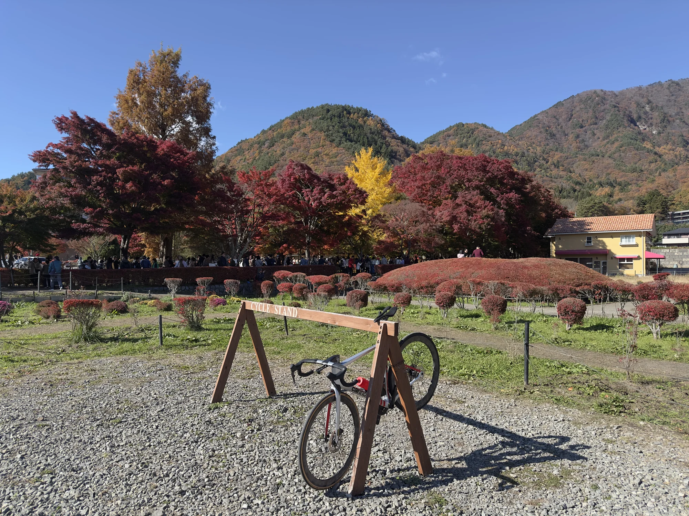
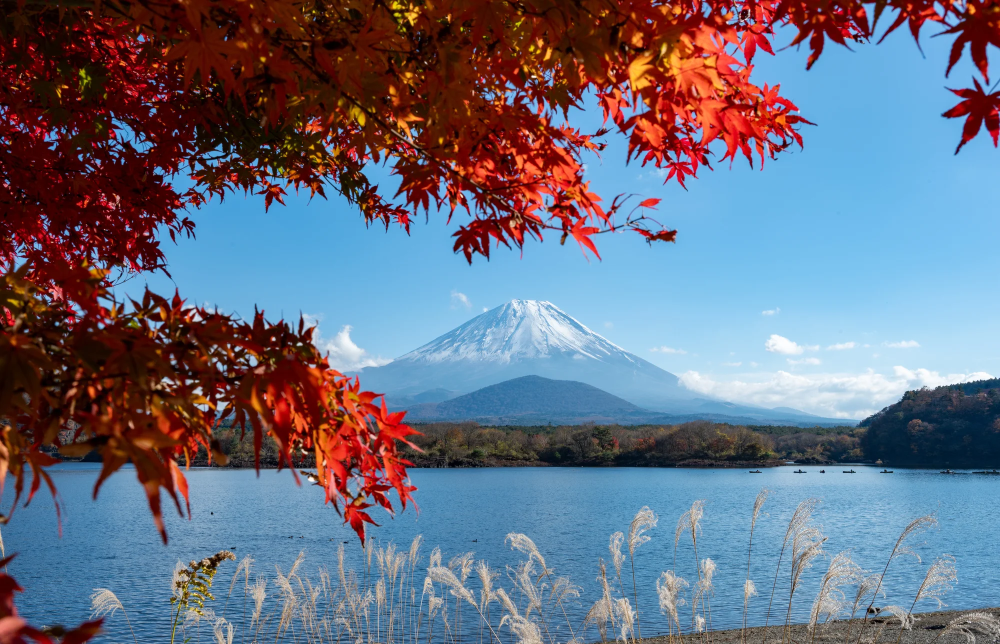
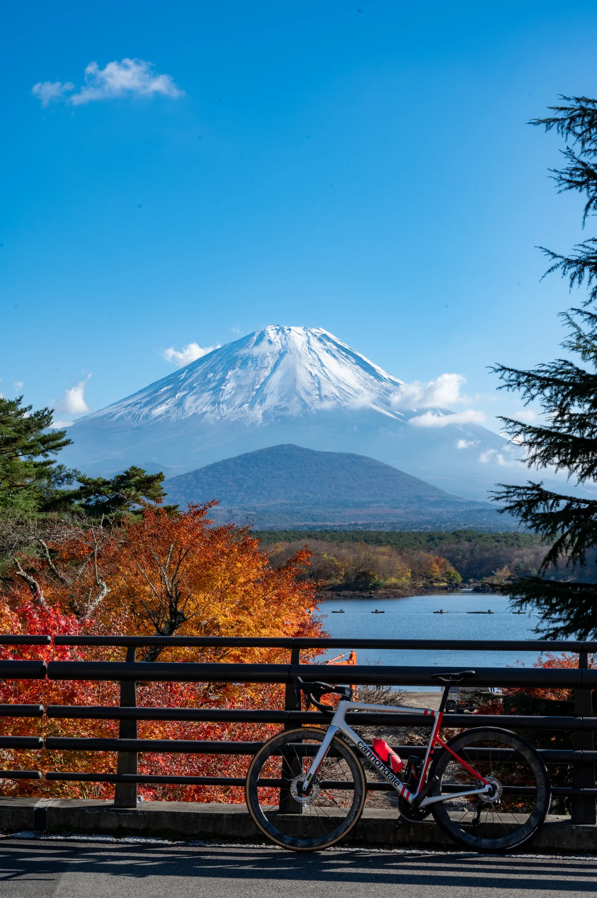

これまで東京近郊のルートをいくつか紹介してきました：[霞ヶ浦の平坦 TT](../kasumigaura-rinrin-road-cycling-route/)、[都民の森ヒルクライム](../tomin-no-mori-cycling-route/)、そして[道志みち＋山中湖](../doshimichi-yamanakako-cycling-route/)。本記事で紹介するのは富士五湖の残り四つの湖です。大月駅からスタートして国道 139 号を河口湖まで登り、西湖・精進湖を経て本栖湖へ向かう日帰りルート。山中湖は道志みちの回ですでに走ったので、このルートで残りの四湖を一気に回収します。

このルートは何度か走っていますが、そのうちの一回は 11 月下旬、紅葉シーズンの終わり頃でした。河口湖には有名な紅葉回廊があり、道中の山肌も精進湖の湖畔も真っ赤に染まっていて、景色の良さでは東京近郊で走った中でもトップクラスのルートです。季節を一つ選ぶなら、迷わず 11 月中旬〜下旬をおすすめします。本記事の写真もその時のものです。

## ルート概要

| 区間 | 距離 | 特徴 |
|------|------|------|
| 大月駅 → 都留 → 富士吉田（国道 139 号） | 約 25 km | 緩い登りが中心、獲得標高約 400 m |
| 富士吉田 → 河口湖 | 約 5 km | 市街地を抜けて湖畔へ |
| 河口湖 → 西湖 | 約 8 km | 湖畔道＋西湖への短い登り |
| 西湖 → 精進湖 → 本栖湖 | 約 15 km | 青木ヶ原樹海の国道 139 号＋湖畔道 |
| 本栖湖一周 | 約 11 km | ほぼ平坦、四湖で一番青い湖 |
| 同じ道を大月へ戻る | 約 45 km | ほとんど下り。スピードが出るので注意 |

本栖湖一周を含めると総距離約 115 km・獲得標高約 930 m。本栖湖をスキップして折り返す場合は約 99 km・約 870 m です。登りはほぼ往路の前半に集中していて、本栖湖で折り返した後は基本的に大月まで下り基調。「先にきつく、後は楽」なタイプのルートです。完全なルートは文末の Garmin コースのリンクを参照してください。

## なぜ大月スタートなのか

中央線で大月駅まで行く方が、富士急行線に乗り換えて河口湖駅まで行くよりかなり安く済みます。富士急行線の大月〜河口湖は片道 1,170 円。輪行袋を担いで往復すると、なかなか効いてくる金額です。

もう一つの理由はトレーニングです。大月から国道 139 号で富士吉田までの約 25 km は獲得標高約 400 m、平均勾配 2% 強の長い緩斜面で、一定のパワーで踏み続ける練習にちょうど良い区間です。河口湖駅まで電車で行ってしまうと、この登りが丸ごとなくなり、ほぼ平坦な湖巡りになってしまいます。

もちろん、目的が紅葉と景色だけなら、**河口湖駅からスタートするのも十分に合理的な選択**です。大月からの登りがなければ、残りの区間は初心者にも優しく、西湖への短い坂と精進湖手前の坂を除けば難所はありません。

## ルート詳細

### 大月駅 → 富士吉田（長い緩斜面）

大月駅を出て国道 139 号を富士吉田方面へ、桂川の谷に沿って緩やかに登っていきます。都留の市街地を通りますが信号は多くなく、勾配はほとんどの区間で 2〜3%、ときどき少し急な箇所があります。コアの登り区間は約 18 km・獲得標高 400 m で、テンポ走にちょうど良い長さです。

沿道にはコンビニが多く、補給の心配はありません。紅葉シーズンなら都留を過ぎたあたりから山肌が色づき始め、登るほどに見応えが増していきます。

### 富士吉田 → 河口湖

富士吉田の市街地を抜けるとすぐに河口湖の湖畔に出ます。天気が良ければ、ここから先は富士山がずっと左手に見えています。河口湖には湖畔の周回道路があり、北岸の大石公園や久保田一竹美術館のあたりが紅葉シーズンのハイライト。**紅葉回廊（もみじ回廊）は湖の北岸にあり**、11 月中旬〜下旬には紅葉まつりが開催されます。もみじのトンネル越しに富士山と湖面。人が多いのには理由があります。

紅葉まつりの期間中、北岸は観光客も車も多くなります。通過するときはスピードを落とし、写真を撮るときは自転車を車道の外まで押して移動しましょう。

### 河口湖 → 西湖

河口湖の西側から西湖方面へ向かうと、約 1 km・平均 6% ほどの短い登りがあります。全行程で一番急な区間ですが、短いのでダンシングで踏めばすぐ終わります。紅葉シーズンはこの区間の沿道にももみじが多く、登りに疲れたら立ち止まって眺めるのにちょうど良いです。

登り切った先が西湖です。河口湖よりも観光客がずっと少なく、静かな湖面の向こうに富士山。四湖の中で一番雰囲気が良い湖だと個人的には思っています。北岸の湖北ビューラインは視界が開けていて、北岸回りで走る価値があります。

### 西湖 → 精進湖 → 本栖湖

西湖を離れて国道 139 号に戻り、青木ヶ原樹海を抜けて精進湖へ。四湖の中で一番小さな湖ですが、紅葉シーズンの湖畔はとても美しく、私の「もみじ＋自転車」の写真の多くはここで撮ったものです。湖畔のどこで停まっても絵になります。

最後は本栖湖方面へ。本栖湖は千円札の裏面に描かれた富士山の撮影地で、湖水の青さは四湖で一番深いです。一周約 11 km、ほぼ平坦で車も少なく、ルート全体で最ものんびりした区間。一周し終えたらそこが折り返し地点で、来た道を戻ります。時間や脚が足りない場合は、一周をスキップして折り返しても全く問題ありません。湖の景色は入口付近からでも十分楽しめます。

### 帰路

本栖湖から大月への帰路はほとんど下りで、往路で稼いだ 400 m がここで全部返ってきます。富士吉田から都留への下りはスピードが出やすく、路面の継ぎ目や横風もあるので、欲張らないように。大月駅の手前には信号と交通量が少し残っているので、最後まで脚を残しておきましょう。

道志みちと比べると獲得標高は半分以下で、強度としてはかなり楽です。登りは序盤の長い緩斜面に集中していて、湖巡りと帰路は景色を見ながら走れるペース。紅葉シーズンは写真を撮るための停車が想像以上に多くなります。もっとしっかり練習したい場合は、往路の大月〜富士吉田をテンポ区間として踏むのも十分に価値があります。

## 補給と注意点

補給面ではこのルートは道志みちよりずっと恵まれています。大月〜富士吉田の沿道にはコンビニが多く、河口湖周辺には何でもあります。注意すべきは**西湖から本栖湖の間は補給ポイントが非常に少ない**ことで、樹海区間には自動販売機がぽつぽつある程度。河口湖を離れる前にボトルを満たしておくのが安全です。

交通量は全体的に中程度。大月〜富士吉田の国道 139 号はそれなりに交通量があり、トラックも少なくないので、路肩寄りを走って後方に注意してください。**河口湖を過ぎると交通量は大きく減り**、西湖・精進湖・本栖湖のあたりは快適に走れますが、紅葉シーズンの河口湖北岸は観光の車が多いので、この区間は特に注意が必要です。

季節のおすすめは何といっても 11 月中旬〜下旬の紅葉シーズンです。ただしこの時期の富士五湖周辺は早朝の気温が氷点近くまで下がり、日中は日差しで 15 度前後まで戻ります。レイヤリングとウィンドブレーカーは必須。日没も早く、午後 4 時を過ぎると暗くなり始めるので、遅めのスケジュールは避けましょう。

## ルートデータ

完全なコースは私の Garmin Connect で公開しています：

- **大月/富士四湖（Garmin Connect）**：<https://connect.garmin.com/modern/course/238877385>

## まとめ

このルートは富士五湖のうち山中湖を除く四つの湖を一日で回るもので、登りは前半に、景色は後半に集中しています。紅葉シーズンの河口湖紅葉回廊と精進湖畔は年に一度のハイライト。トレーニングしたい人は大月から長い緩斜面を踏み、景色目当ての人は河口湖駅からスタート。どちらの走り方もありです。

以前紹介した道志みち＋山中湖と組み合わせれば、富士五湖はコンプリート。11 月の紅葉シーズンに、ぜひ走ってみてください。

## Reference

- [富士河口湖紅葉まつり（富士河口湖町観光課）](https://fujisan.ne.jp/) — 紅葉回廊と紅葉まつりの情報
- [富士急行線 運賃](https://www.fujikyu-railway.jp/fare/) — 大月〜河口湖 片道 1,170 円
- [富士五湖観光情報](https://www.mtfujitrail.com/) — 各湖の見どころと周辺施設
