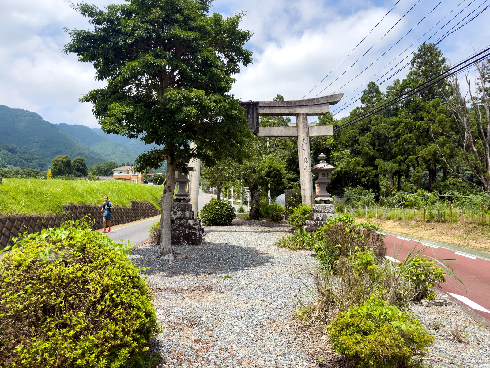
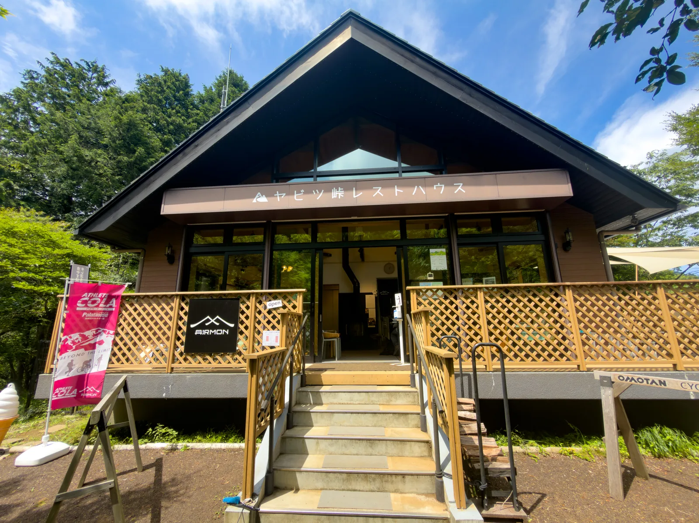

[都民の森](../tomin-no-mori-cycling-route/)の記事に続いて、今回は関東のサイクリストなら誰もが知っている定番の坂、**ヤビツ峠**を紹介します。ヤビツ峠は神奈川県の丹沢山地にあり、標高は 761 m。関東ヒルクライムの聖地のひとつで、タイムアタックのために定期的に通うライダーも多い場所です。自宅からだと秦野駅までの輪行時間が都民の森より少し短いこともあり、ある日試しに登りに行ったところ、結局 3 本も登ってしまいました。

本記事では表裏両側のルート区分、勾配データ、補給と注意点をまとめ、いつも通り台湾の巴拉卡公路との難易度比較も添えます。

## ルート概要

ヤビツ峠も都民の森と同じく両側から登れます。秦野側（名古木交差点）から登る**表ヤビツ**と、宮ヶ瀬湖側から登る**裏ヤビツ**です。両側の性格はかなり違います。

| ルート | 距離 | 標高差 | 平均勾配 | 特徴 |
|--------|------|--------|----------|------|
| 表ヤビツ（名古木 → 峠） | 約 11.8 km | 約 670 m | 約 5.9% | 序盤を除き安定した登り、タイムアタックの定番区間 |
| 裏ヤビツ（宮ヶ瀬湖 → 峠） | 約 17.8 km | 約 477 m | 登り区間 約 4.9% | 距離は長いが緩い、道幅が狭く渓谷沿い |

今回の走り方は、秦野駅スタートで表側を登る → 裏側を宮ヶ瀬湖まで下る → 裏側から峠へ登り返す → 表側を鳥居付近まで下る → 3 本目を登って峠へ → レストハウスでカレーを食べて終了、という流れです。1 日で表裏両側を走り、獲得標高は約 1,700 m でした。

GPS ルートは記事末尾に Strava のリンクを載せています。サイクルコンピューターにそのままインポートできます。

## 難易度：都民の森よりさらに巴拉卡に近い

都民の森の記事では、裏側の獲得標高が巴拉卡とほぼ同じで勾配はより緩い、と書きました。ヤビツ峠の表側はさらに近い存在です。11.8 km・獲得標高 670 m・平均 5.9% は、巴拉卡（約 10 km・580～620 m・平均 6% 弱）とほぼ同スペックで、距離が少し長いだけ。巴拉卡を普通に登れる方なら、表ヤビツは同じタイプの坂で、脚の感覚までよく似ています。

表側にはもうひとつ大きな特徴があります。**序盤に短い下りがいくつかありますが、その後はほぼ登りが続く**ことです。登った分を途中で吐き出すような道と違い、序盤の短い下りを過ぎれば、峠まで安定した出力を維持できます。1 本の所要時間は脚力にもよりますがおおむね 1 時間前後で、Z3–Z4 のスレッショルド周辺のトレーニングにちょうどいい。多くのライダーがここでヒルクライムのテストをするのも納得です。

## アクセス

スタート地点は小田急小田原線の**秦野駅**です。新宿から快速急行で約 70 分。輪行袋への収納をお忘れなく。駅から表側の起点である名古木交差点まではすぐで、ウォームアップにちょうどいい距離です。

ちなみに秦野駅からはヤビツ峠行きの神奈中バスも出ています（主に登山者向け）。つまり道中でバスとすれ違うことになります。この点は後述の注意点でも触れます。

## ルート区分

### 名古木 → 蓑毛（序盤、最も急な区間）

表側の起点は名古木交差点で、すぐ横に 7-Eleven があります。山に入る前の最後のコンビニなので、水とスポーツドリンクはここで揃えておきましょう。

名古木から蓑毛バス停あたりまでが全体で最も急な区間で、10% を超える箇所もあります。登り始めてすぐ、道路脇に鳥居が現れます。かなり目立つので、初めての方は進行の目印にするといいでしょう。この区間はまだ民家と農地の間を走るので、リズムを整えることに集中して、序盤から踏みすぎないように。

### 蓑毛 → 菜の花台 → ヤビツ峠（中盤〜終盤）

蓑毛を過ぎると本格的な山岳区間に入り、勾配は 5～6% の安定した区間に戻ります。あとはひたすら踏むだけです。中盤以降はほぼ全区間が木陰で、ここが都民の森との最大の違いです。**木陰が圧倒的に多く、夏でもかなり涼しい**。都民の森は終盤に日差しの中を登ることが多いですが、こちらは 7 月でも比較的快適でした。

ただし良いことばかりではなく、路面状態は都民の森より悪めです。**穴ぼこがかなり多く**、木漏れ日で明暗が切り替わる中では先読みしづらいので、特に下りは注意してください。また蓑毛より上は道幅の狭い区間があり、バスも通行するため、すれ違い時は減速して左に寄りましょう。

途中の菜の花台には展望台とトイレがあり、中間地点で唯一まともな休憩ポイントです。そこからもうひと踏みして、ヤビツ峠の標識が見えたら登頂です。

もうひとつ面白い光景があります。ここは**ランナーがとても多く**、体感ではサイクリストより多いくらいでした。勾配が安定して全区間舗装路のため、坂道走の練習に来るランナーが多いようです。トレイルランナーや登山者はバスで峠まで上がるか大山側から歩いてくるので、車道で会うのはまた別の層です。登坂中にランナーから声援をもらう（あるいはお互い苦笑いする）のは、このルートの日常です。

### 裏側へダウンヒル：宮ヶ瀬湖

峠から北へ下ると裏ヤビツです。渓谷沿いに宮ヶ瀬方面へ下り、宮ヶ瀬湖に出ます。裏側は道幅がさらに狭く、湧き水や落ち葉があり、穴ぼこ事情も同じなので、下りで欲張らないように。湖まで下ると視界が一気に開け、宮ヶ瀬湖の景色はなかなかのものです。湖畔の**宮ヶ瀬湖畔園地（Lakeside Park）**にはトイレ・自販機・売店があり、裏側で最も充実した休憩・補給ポイントです。峠へ登り返すなら、ここでボトルを満タンにしてから。

裏側からの登り返しは 17.8 km の緩斜面です。平均勾配はかなり緩いものの距離が長く、テンポ走や回復強度の登りにちょうどいいルートです。表側の高強度 1 本と組み合わせれば、しっかり走れる 1 日になります。

## 補給と注意点

### ヤビツ峠レストハウス

峠にある**ヤビツ峠レストハウス**がこのルートの主要補給ポイントです。営業時間は、営業日の平日が 9:00～16:00、土日祝が 8:30～16:30 です。**定休日は水・木曜日ですが、祝日は営業しています**。出発前に確認しておきましょう。

看板メニューは秦野産の豚肉と野菜を使った丹沢ロイヤルカレーです。私は 3 本目を登り終えてから食べましたが、あれだけ空腹だと何を食べても美味しい。ただ現実的な話をすると、**1 皿 1,650 円と補給としては安くない**うえ、無料の水の提供はないので、ボトルに水を入れたい場合は購入が必要です。予算を抑えたい方は補給食を自分で持って登り、カレーはご褒美と割り切るのがいいでしょう。

### その他の注意点

前述の通り、起点横の 7-Eleven が山に入る前の最後のコンビニです。**水と食料はここで補給しておきましょう**。ルート中盤がまったく補給なしというわけではなく、峠にはレストハウスがあります。バス停前の丹沢ホーム売店は土日祝のみ営業しており、飲料の自販機と若干の物販があります。本当に補給がないのは**裏側の峠から宮ヶ瀬湖までの区間**なので、裏側へ下る前に水を十分に確保してください。

湖畔の Lakeside Park まで下りれば食べ物の選択肢は豊富で、しっかり補給できます。ただしその後また峠まで登り返すので、食べ過ぎにはご注意を。

道中にはバス・登山者・多数のランナーがいます。特に週末は**下りのスピードを必ず抑え**、狭い区間ではセンターラインを越えないように。前述の穴ぼこ問題もあるので、下りでは路面に集中してください。

裏ヤビツにはトンネルが 3 か所あり、前後ライトが必要です。山間部は携帯電話の電波が入らない区間もあるので、出発前に地図をオフラインで保存しておきましょう。

冬季は峠付近が凍結します。大雨の後は落石や落ち葉が多いので、出発前に道路状況を確認しましょう。途中のエスケープポイントは少ないため、パンク修理キットとスペアチューブは必携です。

## ベストシーズン

木陰のおかげで、このルートは夏でも走れます。関東近郊のヒルクライムスポットとしては貴重な夏の選択肢です。春の新緑と秋の紅葉の時期はもちろんさらに快適。冬は凍結に注意し、峠は麓よりかなり気温が低いので、下り用のウインドブレーカーを忘れずに。

## 実走ルート

GPS ルートはサイクルコンピューターにそのままインポートできます。

- **秦野駅 → ヤビツ峠 表裏周回（Strava Routes）**：<https://www.strava.com/routes/3510635578306958412>

## まとめ

これで関東近郊のルートがちょうど 3 タイプ揃いました。[霞ヶ浦](../kasumigaura-rinrin-road-cycling-route/)は平坦練、[都民の森](../tomin-no-mori-cycling-route/)はロングの緩斜面、そしてヤビツ峠は強度を上げるテスト坂です。表側は 1 本約 1 時間、序盤を過ぎれば安定した勾配が続きます。自分の登坂力がどのレベルか知りたければ、ここを 1 本登ればわかります。

覚えておくべきは、穴ぼこが多いこと、狭い道にバスが通ること、峠のカレーは安くなく無料の水もないこと。補給を十分に持ち、下りは慎重に。あとは脚に任せましょう。

## Reference

- [ヒルクライムのメッカ「ヤビツ峠」（秦野市公式）](https://www.city.hadano.kanagawa.jp/kanko/spot-shisetsu/2/1045.html): ルート・観光情報
- [ヤビツ峠（神奈川県）｜ヒルクライムリスト](https://hillclimblist.com/route/kanagawa_yabitsu/): 表ヤビツの距離・標高差・勾配データ
- [ヤビツ峠 裏側解説（青空ライド）](https://aozoraride.com/yabitsu/): 裏ヤビツのルート情報
- [ヤビツ峠レストハウス（丹沢MON公式）](https://tanzawamon.jp/yabitsutouge-resthouse/): 営業時間・施設情報
- [国民宿舎 丹沢ホーム ヤビツ峠売店（OMOTAN）](https://omotan-hadano.jp/gourmet/%E5%9B%BD%E6%B0%91%E5%AE%BF%E8%88%8E-%E4%B8%B9%E6%B2%A2%E3%83%9B%E3%83%BC%E3%83%A0%E3%83%A4%E3%83%93%E3%83%84%E5%B3%A0%E5%A3%B2%E5%BA%97/): 土日祝の営業時間・自販機・物販情報
- [自転車攻略｜巴拉卡公路解説（velodash Magazine）](https://blog.velodash.co/2020/08/12/balaka/): 巴拉卡公路の距離、勾配、獲得標高データの比較
