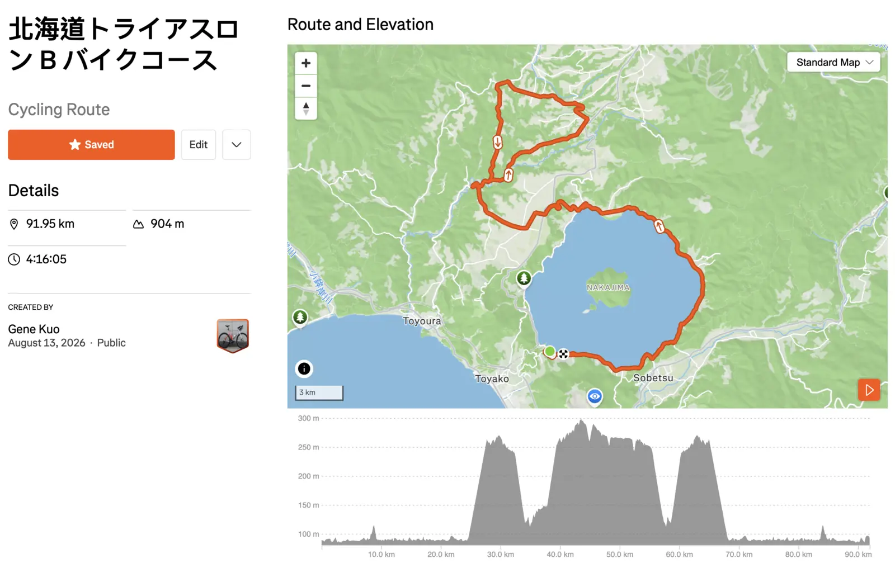

宮古島比完之後回東京，原本想好好把夏訓的量堆起來，結果腳趾骨折，有一個半月幾乎完全沒辦法跑步。七月底回了一趟台灣，好像每次回台灣都會胖，回來之後工作又特別忙，整個訓練節奏斷斷續續，騎車還算有維持，跑步就是停擺。體重也很誠實地反映了這段時間的狀態，變胖了，很現實 QQ。

所以這場洞爺湖就是帶著 B race 的心態去的。不設什麼硬目標，能完賽就好，順便去北海道吹吹涼風、吃點好吃的，當作宮古島之後的一次輕鬆出賽。

報名的時候本來在 A Type 跟 B Type 之間猶豫，最後選了距離短的 B Type。主要原因是十月的 99T（70.3 距離）才是這個賽季的 A race，不希望八月這場影響到後面的備賽。這場如果硬上 A Type 的 137km 自行車，恢復時間會拉長，反而吃掉接下來的訓練時間。所以這場就是志在參加，去體驗一下北海道的賽道跟風景，比完還能無痛接回課表。

---

## 賽事簡介

[北海道トライアスロン](https://hokkaido-triathlon.jp/)，8 月 23 日（週日）早上 7:00 出發，地點在洞爺湖周邊，賽道延伸到羊蹄山山麓。我報的是 B Type：

| 項目 | 距離 |
|------|------|
| 游泳 | 2km（洞爺湖，淡水） |
| 自行車 | 91.7km |
| 跑步 | 23.1km |
| 合計 | 116.8km |

, [CC BY-SA 3.0](https://creativecommons.org/licenses/by-sa/3.0/)，經裁切壓縮）](hero.webp)

游泳在洞爺湖裡面游，從珍小島海灘出發，淡水湖游泳跟海游的感受差蠻多的，浮力比較小，但不用擔心浪跟鹹水，算是各有優缺。跑步則是沿著湖畔跑，據說幾乎是平的，而且樹蔭多，八月的北海道應該不至於太熱。

跟宮古島比起來，距離短了不少（116.8km vs 168km），游泳少 1km，自行車少了約 30km，跑步從全馬縮到 23km。

### 自行車賽道

先把路線畫出來看了一下，B Type 是 91.95km、累積爬升 904m：

爬升圖蠻好讀的：前段沿著洞爺湖騎，湖面海拔 84m 左右，基本上是平的；大概 25km 之後開始往北邊山區走，中間 40km 左右連續三個爬坡，最高點約 300m；最後 20 多公里再回到湖邊的平路。

爬升 904m 分散在三段裡，單段落差大約 200m，所以沒有什麼硬爬坡，但連續起伏對配速的干擾比純平路大。宮古島的爬升是 976m 分散在 123km 的小丘陵，這裡是 904m 集中在中間那 40km，性質不太一樣。

---

## 備賽狀態（老實說）

最大的變數是腳趾骨折。把這半年的月跑量拉出來看，掉的幅度很明顯：

| 月份 | 跑量 |
|------|------|
| 3 月 | 149.6 km |
| 4 月 | 131.6 km（宮古島賽月） |
| 5 月 | 88.3 km |
| 6 月 | 37.5 km |
| 7 月 | 23.6 km |
| 8 月（至 8/13） | 45.2 km |

三、四月備賽宮古島的時候月跑量還有 130 到 150km，五月開始掉，六七月骨折之後直接剩下 20 到 30km，等於整整一個半月沒有真的在跑。八月骨頭長好才慢慢跑回來，目前 45.2km。

不過骨折這件事沒什麼好意外的，跑量會掉成這樣完全在預期之內。教練照傷勢把課表調掉，跑步先停，重心移到游泳跟自行車，該做的處置都做了，剩下的就是等它好。騎車的量有撐住，FTP 應該沒有掉太多。brick run 也沒做，不過我平常本來就只有賽前幾週才會排，這部分影響沒有想像中大，比較沒把握的還是單純的跑步耐力。

游泳的部分有個新變數：這段期間在日本上了一堂一對一的游泳課，姿勢正在調整，但還沒完全變成習慣。改動作的過渡期速度掉一點是正常的，目前看起來確實有稍微慢一些些，這次下水應該就會知道調整到哪了。

七月底回台灣那段時間也不是完全沒動，該練的還是有練，只是量掉了一些，加上台灣的東西實在太好吃。回來之後花了一段時間才把節奏拉回來，體重上升了一些，體感也比宮古島賽前差一點。

總結一下目前的狀態：

- **游泳**：有在練，但姿勢還在改，速度暫時掉了一些
- **自行車**：三項裡面狀態最好的，至少有在騎
- **跑步**：剛從一個半月的空窗期回來，長距離完全沒練到

---

## 教練給的配速建議

賽前跟教練討論過，拿到的建議是這樣：

| 項目 | 建議 |
|------|------|
| 游泳 2km | 7 到 8 成力，穩穩游完 |
| 自行車 91.7km | 心率 155-165，功率 70-75% FTP |
| 跑步 23.1km | 第一圈心率 155-160、第二圈 160-165，配速 5:00-5:30/km |

### 游泳（2km）

7 到 8 成力，不搶出發位置。姿勢還在調整期，本來就不該強求速度，重點是把新的動作在比賽情境下跑一遍，順便看看維持得住多久。宮古島出水心率飆到 185，這次希望能控制一點。

### 自行車（91.7km）

路線起伏大，功率會一直跳，所以教練的建議是以心率 155-165 為主、功率 70-75% FTP 為輔。這跟宮古島那種盯著瓦數騎的方式不太一樣，宮古島賽道平，功率好控；這裡中段連續三個爬坡，硬要壓平均功率反而會在爬坡時憋出一堆無效的高輸出。

實際執行就是爬坡不要衝，寧可掉速也不要讓心率飆過 165，下坡再回收。最後那 20km 回到湖邊平路的時候刻意再收一點，把腿留給跑步。

### 跑步（23.1km）

跑步是繞湖畔兩圈，所以教練把心率拆成兩段：第一圈 155-160，第二圈 160-165，配速抓 5:00-5:30/km。

這段是整場最大的問號。5:00-5:30 其實比宮古島全馬的 5:37 還快，以正常狀態來說不算激進，但我剛從一個半月的空窗期回來，長距離完全沒練到，能不能撐完第二圈老實說沒有把握。

計畫是第一圈嚴格照心率走，不要因為腿還有力就跑太快，第二圈再看狀況決定要不要放。如果肌肉撐不住，就照宮古島的經驗處理，安全完賽優先。

---

## 補給

補給策略大致沿用宮古島的經驗，碳水目標維持在 80-90g/hr。自行車段距離比宮古島短，車上的補給量相對輕鬆一些。宮古島的水壺漏水事件記憶猶新，這次出發前一定要仔細檢查。

跑步只有 23km，照 5:00-5:30 的配速大概兩小時出頭，補給壓力比全馬輕很多，帶幾包膠加上補給站的水應該就夠了。

---

## 對這場比賽的期待

說實話，以目前的狀態去比一場 117km 的三鐵，心理壓力反而比宮古島小很多。宮古島是 A race，賽前訂了完賽時間，比完之後還要逐項檢討有沒有達標。這場的配速建議是拿來當執行的參考，不是拿來達標的，能照著跑當然好，跑不到也不會怎麼樣。志在參加，就是去感受一下北海道的夏天、在洞爺湖裡游泳、騎車看羊蹄山的風景，然後把比賽完成。

腳趾恢復得還行，希望到比賽當天能夠穩定地跑完 23km。如果真的不行，走完也是完賽。

真正要拚的是十月的 99T，這場就當作是回歸賽場的暖身，順便把游泳的新姿勢跟骨折後的跑感都先試一遍。
