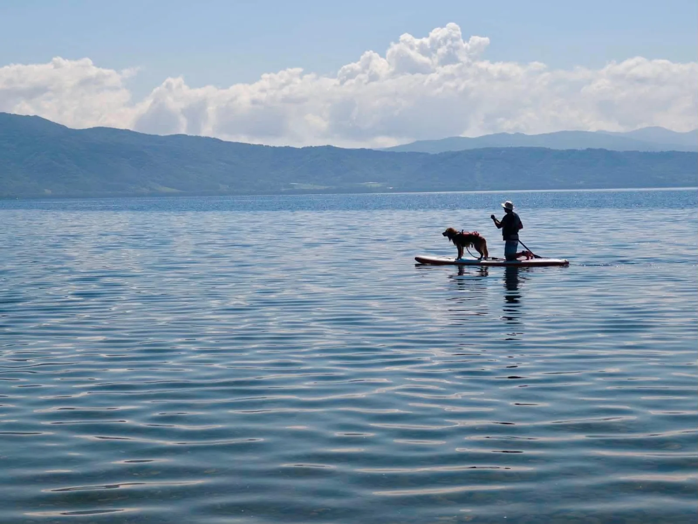

> **官方成績：6:14:40 | 綜合排名第 16 位（102 人完賽）| 分組（20-29 歲男）第 2**
> 游泳 41:13 · 自行車 3:15:52 · 跑步 2:17:35
>
> *官方成績只計游泳／自行車／跑步三段時間，沒有另外列出 T1／T2 轉換時間；文中「手錶」時間是手錶自動判斷 transition 分段算出來的，不保證每次都抓得剛好準。*

賽前寫了 [2026 北海道洞爺湖三鐵賽前紀錄](../2026-hokkaido-toya-pre-race/)，這場本來就是抱著 B race 的心態去的：腳趾骨折一個半月幾乎沒跑步，志在參加，能完賽就好。結果分組拿到第 2、綜合第 16，比預期好一些，不過這場報名人數不多（B Type 只有 102 人完賽），名次本身沒有太多參考性，重點還是實際執行狀況跟數據。

比賽前一天開車前往洞爺湖，途中才發現忘記帶蛙鏡跟泳帽，只好繞去室蘭市區的運動用品店買了一副新的蛙鏡應急，虛驚一場。到了洞爺湖後在湖邊晃了一下，湖面平靜無波，看到有人牽著狗一起划 SUP，畫面蠻療癒的，順便看看隔天要游的水域。

賽前把裝備攤開檢查一次，那副臨時買的蛙鏡也混在裡面。

---

## 天氣

比賽當天是好天氣，當天最高氣溫大約 28-29 度。游泳的水溫感覺蠻溫暖的，大概 25-26 度，不過還是照規定穿了防寒衣。跑步段有陽光直射，但湖畔樹蔭多，整體沒有到非常煎熬的程度。

---

## 游泳（手錶 40:36 | 官方 41:13 | avg HR 168 | max HR 179）

洞爺湖是淡水湖，跟宮古島的海泳感受差蠻多的。海水鹽度高，浮力自然比較好；淡水湖游起來明顯感覺身體會往下沉一些，同樣的力氣輸出，速度就是慢下來。

拿數字對比一下：這次手錶測得的配速大約 1:59/100m（GPS 距離 2.05km，40:36），宮古島去年是 1:53/100m（GPS 距離 2.9km，54:25）。慢了大概 6 秒/100m，淡水湖浮力差的猜測大概就是答案，倒不完全是體能問題。

另一個變數是這段期間在日本上了一堂一對一游泳課，姿勢還在調整中，賽前紀錄就寫過這件事，這次下水算是實戰測試的機會。心率控制得比宮古島好一點，這次 max HR 179，宮古島出水時衝到 185，算是有進步，不過平均心率還是落在 168，游泳對我來說始終是心肺負擔最重的一段。

## T1

淡水湖出發點動線比宮古島單純，沒有特別的插曲，時間跟預期差不多。

---

## 自行車（官方 3:15:52 | 手錶 3:10:27 | 91.7km | avg HR 158 | 爬升約 900m | avg power 144.9W | NP 160W）

賽道跟賽前紀錄畫的一樣：前後兩段沿湖平路，中間 40km 左右連續三個 5-8%、2-3km 的爬坡。教練賽前的建議是心率為主（155-165）、功率為輔（70-75% FTP），原因就是這種路線功率會一直跳，盯著瓦數騎反而容易在爬坡時憋出無效輸出。

實際執行下來，avg HR 158，落在教練給的區間內，這部分照計畫執行了。但整趟的 avg power 只有 144.9W，換算成 FTP（233W，室內訓練台測的）大概是 62%，明顯低於教練建議的 70-75%，也比宮古島當時的 161.5W 低了一截。

不過這趟路線爬坡集中、平路又長，光看 avg power 容易低估身體實際承受的負荷，這種地形應該加上 Normalized Power（NP）一起看。這趟的 Variability Index（NP 除以 avg power）大概是 1.11，數字不算低，代表功率輸出中途晃動蠻大。用 NP 來看：160W，換算 233W FTP 大概是 69%，比單看 avg power 的 62% 更貼近教練建議的 70-75%，爬坡加平路交錯的路線，NP 才是比較合理的參考指標。

把功率拆到分段看會比較清楚為什麼晃動這麼大。三段爬坡的實際輸出其實都不低：

| 爬坡段 | 距離 | 爬升 | avg power |
|--------|------|------|-----------|
| ４８ Climb | 3.12km | 162m | 193W |
| 伏見 climb | 1.71km | 122m | 196W |
| ゴールは「山の神」climb | 1.81km | 120m | 195W |

三段都在 190W 以上，接近甚至超過 FTP 的 80-85%，心率也確實貼著 165 的天花板在騎。反過來看平路段：

| 平路段 | 距離 | avg power |
|--------|------|-----------|
| Toya 132 | 16.1km | 138W |
| Lake Toya East | 15.9km | 151W |
| 洞爺湖畔東反時計回り TT | 14.1km | 152W |

平路段功率普遍只有 138-152W，同樣頂著心率天花板騎，沒有坡度阻力的情況下自然只需要更低的輸出就能維持。這場路線平路里程比爬坡段長很多，全場均值被平路的低瓦數大幅拉低，這也是教練賽前特別提醒「不要盯著平均功率」的原因，實際執行下來完全印證了這個判斷。

功率數字本身還有一個變數要說在前面：這次比賽用的 Speedplay 踏板功率計（Wahoo POWRLINK）前陣子才拆裝過，室內訓練台測的 FTP 用的又是另一套系統，兩邊本來就不是同一顆感測器。之前實際拿兩邊對表過，裝著墊片的狀態下，Wahoo 踏板讀值大概比訓練台低 1.5-2%，方向跟 Wahoo 官方論壇上 [POWRLINK Zero under-reading 的討論串](https://wahoox.forum.wahoofitness.com/t/wahoo-powrlink-zero-under-reading/23768) 提到的偏低情形一致，只是幅度沒有那麼誇張。把這個修正加回去，NP 160W 大概變成 162-163W，換算 233W FTP 大概是 70%，剛好卡在教練給的 70-75% 目標下緣。之後打算把踏板墊片拿掉重新測一次，看看讀值會不會再變。

---

## T2

換裝跑鞋出發，沒有特別狀況。

---

## 跑步（官方 2:17:35 | 手錶 2:17:55 | 23.11km | avg pace 5:57/km | avg HR 162 | max HR 172）

教練賽前的配速建議是分兩圈：第一圈心率 155-160、配速 5:00-5:30，第二圈心率 160-165。實際上連第一圈的配速下限都沒摸到，全程均速落在 5:57/km，比宮古島全馬的 5:37/km 還慢，畢竟這距離只有全馬的一半多一點，理論上應該要更快才對。

中間還有個小插曲：路口指揮的大叔恍神，我跟另一位選手跑錯路線。GPS 記錄的 23.11km 距離已經包含這段多繞的路，跟官方公佈的 23.1km 賽道比起來這次實際差不多，沒什麼太大影響。

把每公里配速攤開看，前面 12km 左右還算穩定，落在 5:30-5:55/km 之間，第 13km 開始明顯往下掉，後半段大多落在 6:00-6:35/km。大概就是在這附近，分組第一名從後面超車過去，之後就沒再追上。

用前後半程的平均數字看更清楚：前半 12km avg HR 約 164、配速 5:45/km；後半 11km avg HR 反而降到約 160、配速卻掉到 6:13/km。心跳沒有跟著配速下滑而升高，反而降了將近 4 bpm，這種「心跳降、配速掉」的組合，指向的是單純的肌力/肌耐力不足，而不是心肺撐不住。腳趾骨折那一個半月的跑量空窗，這場直接體現在後半程的肌肉耐力上，跟宮古島全馬後半段四頭肌罷工的狀況本質上是同一個模式，只是這次距離短，撐得住的時間長一點。

---

## 成績總覽

| 項目 | 官方時間 | 數據 |
|------|----------|------|
| 游泳 | 41:13 | avg HR 168 / max HR 179 |
| 自行車 | 3:15:52 | avg HR 158 / avg power 144.9W / NP 160W / 91.7km |
| 跑步 | 2:17:35 | avg pace 5:57/km / avg HR 162 |
| **總計** | **6:14:40** | **綜合第 16 位、分組（20-29 男）第 2** |

---

## 跟賽前目標對照

| 項目 | 教練賽前目標 | 實際執行 |
|------|--------------|----------|
| 游泳 2km | 7-8 成力，穩穩游完 | avg HR 168，強度符合預期，配速被淡水湖浮力拖慢 |
| 自行車 91.7km | HR 155-165、功率 70-75% FTP | avg HR 158（達標）；NP 160W 約 69% FTP，卡在目標下緣；avg power 62% FTP 明顯偏低（爬坡拉高、平路拉低） |
| 跑步第一圈 | HR 155-160、配速 5:00-5:30 | 前 12km avg HR 164、配速 5:45/km，心率超出目標，配速也沒進到目標區間 |
| 跑步第二圈 | HR 160-165 | 後 11km avg HR 降到約 160，配速掉到 6:13/km，心率反而沒有隨疲勞往上走 |

整體看下來，自行車的心率執行最貼近教練的規劃，跑步則是心率跟配速都沒有進到目標區間，但不是心肺撐不住（心率甚至偏低），而是肌力真的還沒回來，這點賽前紀錄裡其實就先預期到了。

---

## 頒獎

分組第 2 名，領了獎。這場報名人數不多，含金量沒有太多，不過站上台領獎的感覺還是不錯的。

---

## 賽後反思

分組第二、綜合第 16，數字看起來不差，但這場報名人數本來就少，名次的參考價值有限，真正該看的是執行面。

游泳受限於淡水湖浮力跟姿勢調整期，慢下來在預期之內。自行車的心率執行完全照教練的計畫走，NP 換算下來其實蠻接近目標區間，只是 avg power 被平路段拉低，加上功率計本身的落差，數字看起來比實際負荷更保守一些。跑步是這次最誠實的部分，一個半月沒有真的在跑步，後半段配速掉下來是必然的結果，沒有捷徑。

更整體地看，這不只是主觀感覺，數字其實蠻直接：這場自行車 avg power 144.9W（NP 160W）、跑步配速 5:57/km，兩個數字都比宮古島慢（161.5W、5:37/km），但宮古島的距離明明更長（自行車 123km、跑步全馬 42.2km）。理論上距離短應該更容易維持強度，結果卻是兩邊都掉，代表這不是單一環節的問題，而是這陣子整體的訓練狀態，本來就比宮古島賽前那段時間差一截。骨折只是其中一個因素，夏天天氣熱之後的夏訓本身，量跟質都還沒回到理想狀態。

下一場是 10 月 2 日的 [99T](https://99tri.com.tw/)，目標也跟著現實狀況下修，這次希望能破 5 小時就好。接下來這幾天先好好休息，把身體狀態歸零，再重新開始建立這個週期的課表。
