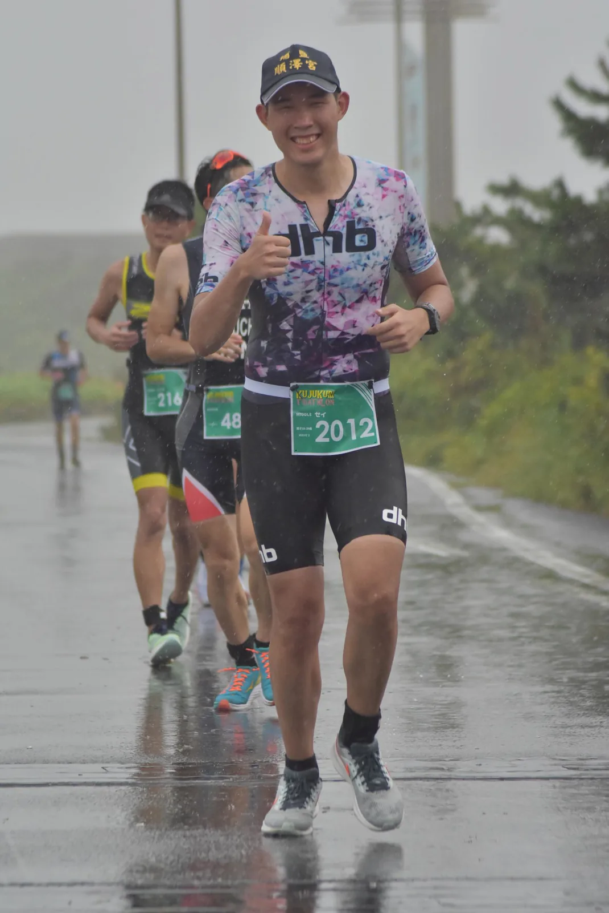
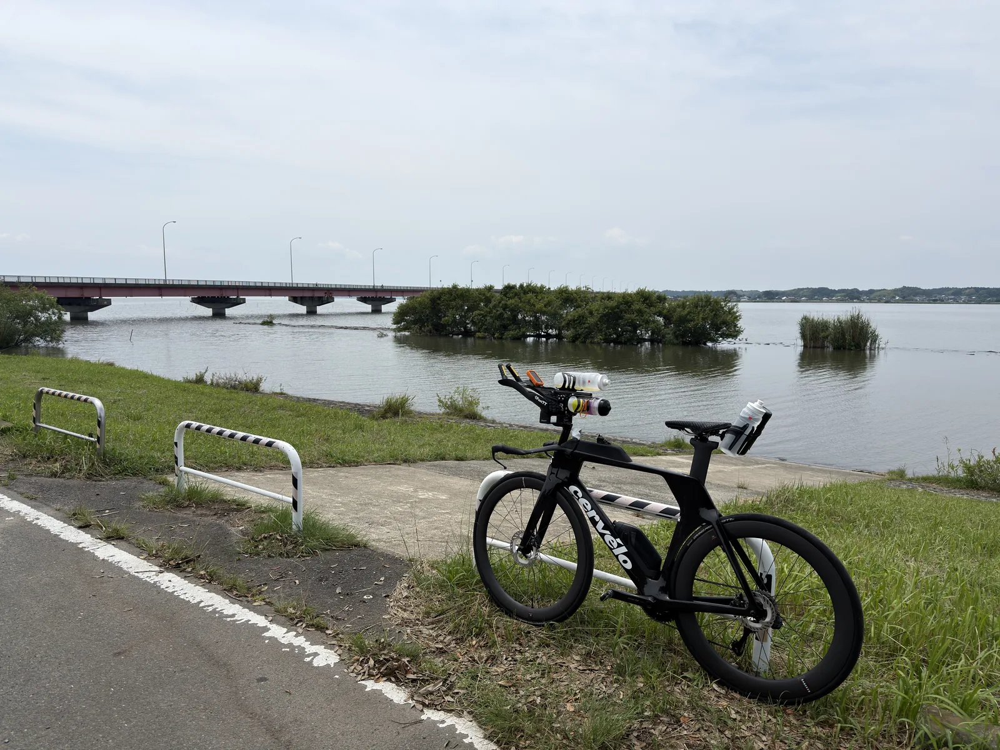

四年前第一次參加三鐵，報名的就是九十九里的 99T，而且一開始就直接挑戰 113 距離。那次比賽天氣不太好，最後在跑步段被大會提前終止，跑到 14km 左右就結束了，所以嚴格說起來，我的第一場三鐵其實沒有完整跑完 21km。

四年後再回到同一場比賽，中間比了宮古島跟洞爺湖，這場 99T 是這個賽季的 A race。前陣子颱風一直在關東附近打轉，比賽前一週看天氣預報看得蠻緊張的，目前看起來颱風 26 號會在週四加速從關東南邊擦過，希望到週六不會再有什麼變化。

---

## 賽事簡介

[九十九里トライアスロン（99T）](https://www.99t.jp/)，10 月 3 日（週六）早上 8:00 Middle 距離出發，地點在千葉一宮海岸一帶。從東京開車大概一個半小時，算是關東離東京最近的中長距離三鐵之一。

| 項目 | 距離 | 地點 |
|------|------|------|
| 游泳 | 1.9km | 一宮川河口 |
| 自行車 | 90.1km | 九十九里有料道路、東金九十九里有料道路（2 圈） |
| 跑步 | 21.1km | 九十九里有料道路 |
| 合計 | 113.1km | 關門 16:30 |

游泳在一宮川的河口裡面游，不是直接下海，所以浪相對小，淡鹹水混合，浮力會比洞爺湖純淡水好一點。比較特別的是游泳上岸之後到轉換區還有大概 1km 的距離，T1 的時間會比一般比賽長不少。之前比賽游完上岸心率通常都很高，這段 1km 如果又用跑的衝過去，還沒上車心率就先爆了，這次要注意控制。

自行車在封路的有料道路上，Middle 距離要騎兩圈，從轉換區沿著海岸線的九十九里有料道路往北，北邊有兩個折返點：一個在片貝 IC，另一個是轉進東金九十九里有料道路之後的福俵 PA，補給站則設在福俵 PA 跟長生 IC。整條路幾乎是平的、彎道很少，跟洞爺湖那種中段連續爬坡的路線完全是兩回事。這種賽道很吃穩定輸出，沒有爬坡可以喘口氣，也沒有下坡可以回收，考驗的是能不能把一個強度維持兩個多小時。

）](course_map.webp)

---

## 四年前的 99T

2022 年 9 月 18 日，我人生第一場三鐵。那天天氣不太好，因為浪大，游泳被大會縮短成 1.5km。印象中那天雖然是陰天，體感卻偏熱，到了後段還突然颳風下雨打雷，連跑步也被提前終止。

把當年 Strava 上的紀錄翻出來看：

| 項目 | 手錶紀錄 | 備註 |
|------|----------|------|
| 游泳 | 32:36 | 因天氣縮短為 1.5km（GPS 記錄 1.69km），avg HR 180、max HR 190 |
| T1 | 約 11:48 | 上岸到轉換區大概 1km |
| 自行車 | 3:14:44 | 91.0km，均速約 28km/h |
| 跑步 | 1:28:14 | 14.2km，均配速 6:12/km，之後被大會終止 |

游泳那段現在看起來蠻誇張的，每 500m 的時間是 8:10、9:33、11:04，越游越慢，心率一路頂在 180 以上。其實在那之前我完全沒有練過開放水域，加上 99T 當年是所有人一起出發，一下水就是超級擠，被撞、被踢、被抓，日本人在水中跟台灣人在車上一樣，沒在跟你客氣的。自行車 3 小時 15 分左右，當時騎的還是一般的公路車，連 aero bar 都沒有裝。跑步段雨越下越大，還打起了雷，跑到 10km 左右時大會決定提前終止比賽，最後在 14km 左右通過終點、拿到完賽獎牌，但 21km 只跑了三分之二。

這次回來，其實有點想把當年沒跑完的那 7km 補完的意思。

---

## 備賽狀態

上一場是八月底的[北海道洞爺湖](../2026-hokkaido-toya-race-report/)，當時腳趾骨折後剛回來，賽後回顧的結論很直接：跑步後半段配速掉下來，心跳反而往下降，是肌耐力不夠，不是心肺撐不住。所以洞爺湖之後這一個多月，重點其實就是把跑量跟長距離補回來。

### 跑步

先看月跑量，跟洞爺湖賽前紀錄放在一起比較：

| 月份 | 跑量 |
|------|------|
| 4 月 | 131.6 km（宮古島賽月） |
| 5 月 | 88.3 km |
| 6 月 | 37.5 km |
| 7 月 | 23.6 km |
| 8 月 | 109 km（含洞爺湖 23.1km） |
| 9 月（至 9/28） | 110.6 km |

月跑量還沒回到宮古島備賽時的 130 到 150km，但至少從骨折那段的 20 到 30km 回到 110km 左右。比較關鍵的是九月有跑到長距離，這是洞爺湖之前完全沒有的：

| 日期 | 距離 | 均配速 | 均心率 | 備註 |
|------|------|--------|--------|------|
| 9/5 | 20.4 km | 5:51/km | 151 | 中段兩次加速到 5:16-5:21 |
| 9/9 | 18.3 km | 5:42/km | 152 | 漸速，最後 2km 約 5:06 |
| 9/19 | 21.8 km | 6:08/km | 142 | 輕鬆長跑，心率大多壓在 150 以下 |
| 9/26 | 11.6 km | 5:11/km | 161 | 轉換跑，前面先騎 1.5 小時課表 |

9/26 那次算是這個週期最有參考性的一次：前面先在 Zwift 騎了一個半小時左右的 80% FTP 課表，下車直接接跑。心率抓 160 上下，第一公里之後配速就穩在 5:07-5:14/km 之間，整整 11.6km 沒有掉。對照洞爺湖跑步前半段 avg HR 164、配速只有 5:45/km，同樣是下車之後的跑步、同樣的心率區間，配速快了三十秒以上。比賽前面會是 90km 的自行車，疲勞程度還是不一樣，不過至少代表跑步的底子有回來一些。

### 自行車

自行車的課表大多在 Zwift 上，一週大概兩次 SST、Z4 間歇或 80% FTP 的長節奏課，週末再找一天去霞ヶ浦騎長距離。九月總共騎了大概 585km，FTP 則是洞爺湖賽前重測的 237W。

霞ヶ浦一圈 124km，路線很平，拿來當 99T 有料道路的模擬蠻適合的。9/13 那趟均功率 140W、均心率 140，後段心率來到 148-152 的時候功率大概在 140-150W。9/23 那趟就沒那麼順了，當天狀況很差，後半段補給完全吃不下，基本上就是慢慢晃回車站，均功率只有 122W、均心率 129。

### 游泳

九月游了大概 19km，差不多是八月的兩倍，大多是每次 2.4 到 3.2km 的泳池課。洞爺湖賽前提到的姿勢調整，現在新的動作算是已經習慣了，不會再有「要想著動作才游得出來」的感覺，只是速度還沒有跟著進步，這部分可能還需要一點時間。

總結一下目前的狀態：

- **游泳**：量比八月多很多，新姿勢已經習慣，但速度還沒上來
- **自行車**：Zwift 課表維持得不錯，霞ヶ浦兩次 124km 一次順、一次後半補給吃不下
- **跑步**：從骨折空窗回到 110km/月，有三次 18km 以上的長跑，比洞爺湖賽前好很多

---

## 教練給的配速建議

賽前跟教練討論過，這次的建議全部用心率來抓：

| 項目 | 建議 |
|------|------|
| 游泳 1.9km | 心率 140-150 |
| 自行車 90.1km | 心率 155 ± 5 |
| 跑步 21.1km | 前半 160 上下，後半再拉上去試試 |

### 游泳（1.9km）

140-150 這個區間其實蠻保守的。洞爺湖游泳 avg HR 168、max 179，四年前第一次比 99T 更是 avg 180、max 190。游泳一直是我心肺負擔最重的一段，感覺跟自己容易緊張也有關係，不過在長距離賽事裡，游泳佔的比例比自行車跟跑步低很多，教練提醒順順游就好。

一宮川河口相對平靜，照理來說比宮古島的海游好控制，實際能不能壓在 150 以下，我個人沒有太多信心，但會盡量壓低一點。至少不要再出現四年前那種每 500m 越游越慢的狀況。

### 自行車（90.1km）

心率 155 ± 5，也就是 150 到 160。洞爺湖因為爬坡多，心率一直貼著上緣在騎；99T 全平，心率應該會穩很多，比較像霞ヶ浦的狀態。

功率的部分我自己抓 170-175W，換算 237W FTP 大概是 72-74%，剛好落在洞爺湖時教練給的 70-75% 區間裡。實際會看當天狀況，心率如果壓不住就以心率為準。

平路長時間同一個姿勢，TT 車的 aero 位維持得住才是重點。這次騎的是做過[重新 fit](../cervelo-p5-tt-bike-refit/) 的 Cervélo P5，配 Reserve 的輪組，也會戴 TT 帽。洞爺湖那場沒有留下騎車的照片，所以一直不知道實際在戶外騎的姿勢跟室內 fitting 時差多少，這次希望能拍到幾張，好好驗證一下。

### 跑步（21.1km）

前半 160 上下，後半再試著拉上去。9/26 轉換跑心率 160 大概是 5:10/km，比賽前面的自行車更長，我自己預期前半會落在 5:10-5:20/km。照這個配速算，21.1km 大概是 1 小時 49 分到 1 小時 53 分。

洞爺湖的教訓是後半段肌肉先撐不住，這次跑量跟長跑都有補，後半能不能真的「拉上去」，就是這場最想驗證的一件事。

---

## 天氣

九月下旬關東先是被颱風 25 號的大雨掃過，千葉受災蠻嚴重的，大會也在 9/23 發了公告提醒部分電車受影響。接著是颱風 26 號，根據 [tenki.jp 9/28 的資訊](https://tenki.jp/forecaster/t_fujikawa/2026/09/28/40782.html)，目前還是「非常に強い」等級，會沿著本州南方往東北移動，10/1（週四）可能接近伊豆群島或千葉沿岸。這個颱風範圍比較小，接近時雨跟風會突然變強，不過移動速度快，之後會轉成溫帶氣旋往千島群島方向離開。

以目前[一宮町的預報](https://tenki.jp/forecast/3/15/4520/12421/10days.html)來看，比賽當天 10/3 是陰轉晴、氣溫 17-23°C、降雨機率 30%、東北風 2-4m/s。只要颱風照預測在週四通過，週六的天氣對比賽來說其實蠻理想的。比較擔心的是颱風過後的湧浪，四年前游泳就是因為浪大被縮短，這次河口的狀況就只能看大會當天的判斷。

四年前是陰天但偏熱，最後還因為天氣沒能完整跑完，這次如果能涼一點，自行車跟跑步都會舒服很多。比賽當天實際的天氣就等賽後回顧再補。

---

## 補給

這次補給想比之前再拉高一些。宮古島跟洞爺湖的碳水目標是 80-90g/hr，這次自行車段想拉到 110g/hr 左右，跑步也至少要有 80g/hr。

另外會帶 3 包含 100mg 咖啡因的膠：自行車中段吃一包、快下車前再吃一包，剩下一包留在跑步備用。

| 項目 | 碳水目標 | 咖啡因 |
|------|----------|--------|
| 自行車 | 約 110g/hr | 中段、下車前各 1 包（100mg） |
| 跑步 | 至少 80g/hr | 1 包備用（100mg） |

大會自行車段有 2 個補給站、跑步段有 4 個，水跟電解質可以靠補給站補。110g/hr 對腸胃的負擔不小，9/23 霞ヶ浦那次後半段吃不下的狀況，比賽時可不想再遇到一次。

---

## 目標

最理想的目標是 sub 5，不過以目前的狀態，比較實際的目標應該是 5:15 左右。

這次同樣在意的是能不能照著計畫執行完三項，尤其是跑步後半段能不能真的拉上去，而不是像洞爺湖那樣掉下來。11/15 還有一場 45km 的日光越野跑，也可以藉這場先看看跑步狀態恢復得如何，心裡先有個底。

目前看起來溫度很適合 PB，如果三項都執行得好，破 5 也不是完全沒機會。

四年前在九十九里沒跑完的那段，這次希望能完整跑到終點。