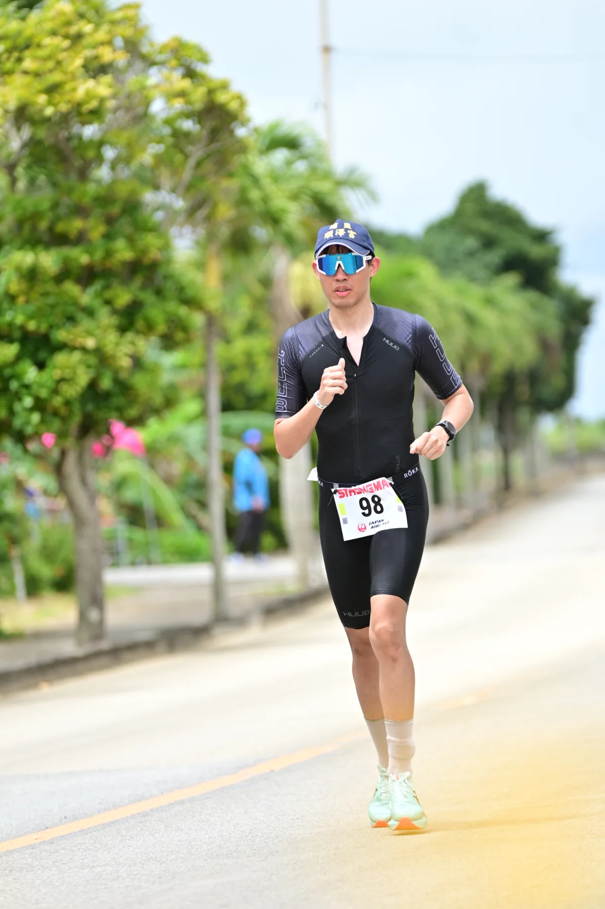

去年四月在宮古島完賽之後，回東京時回顧了一下，整場比賽其實蠻順的，雖然出發前緊張忘了帶車表，整段自行車靠手錶跟體感騎，但出 T2 的時候狀態不錯，結果跑步前幾公里有點急，中段掉速，快到終點前才又稍微回神一點。今年提前來寫個賽前紀錄，把目標都寫進去，比完賽可以好好回顧一下自己的完成狀況。

---

## 賽道快速回顧

第 40 屆宮古島，**4 月 19 日（週日）7:00 開槍**，今年路跑距離從 35km 升級成全馬：

| 項目 | 距離 |
|------|------|
| 游泳 | 3km（与那覇前浜，2 圈） |
| 自行車 | 123km（繞島一圈多） |
| 路跑 | 42.195km |
| 合計 | 約 168km |

游泳在与那覇前浜海灘出發，整個出發區風景很好，游的時候也有機會看到魚，去年游泳的時候就有看到，還蠻有趣的。去年早上陰天，景色打了些折扣；今年如果天氣好應該更漂亮。

自行車繞宮古島一圈多，地形整體偏平，賽道本身不算特別難，難的是 123km 的距離加上四月的熱帶氣候，體感消耗比看起來重。路跑 42km 接在長騎之後，今年改全馬，後半段會是一場心理戰。

---

## 去年成績

去年（第 39 屆，2025/04/20）是第一次跑宮古島，完賽時間 **8 小時 11 分 41 秒**。

| 項目 | 時間 | 關鍵數據 |
|------|------|---------|
| 游泳 3km | 51:54 | avg HR 165，配速 1:51/100m |
| T1 | 7:37 | — |
| 自行車 123km | 3h 50m 31s | avg 154W（FTP 221W），avg HR 153，TSS 263，IF 0.827 |
| T2 | 3:31 | — |
| 路跑 35km | 3h 18m 08s | avg 5:39/km，avg HR 160 |

自行車忘帶車表，全程靠手錶跟體感騎，踩得算保守，完成後感覺剛剛好。去年 FTP 約 221W，平均 154W 是 FTP 的 70%，但 IF 跑到 0.827，NP 比平均功率高不少，輸出起伏比理想狀況大一些。

路跑出 T2 的時候狀態還不錯，於是前段節奏有點急；大概 20-30km 中段掉速，快到終點前又稍微回來一點。去年路跑距離是 35km，今年改全馬，這個前急後慢的節奏要調整。

---

## 今年的目標與策略

### 游泳（3km）｜目標 50 分

去年游泳基本上沒有特別練開放水域，今年有稍微補強。目標配速維持 1:50/100m 左右，同時希望出水的 HR 能稍微低一點。去年出水 avg HR 165，游泳本身沒問題，但如果能省一點力出來狀態會更好。

### 自行車（123km）｜目標 avg 160-165W

今年 FTP 233W，有車表可以盯瓦數。目標平均 **160-165W**（約 69-71% FTP），跟去年 154W 的體感類似，但有車表控管之後輸出會更穩定，NP 跟平均功率的落差也會縮小。全程不停補給站，直接在車上吃。

### 路跑（42.195km）｜目標 5:20-5:30/km

今年賽制改全馬，節奏管理更重要。去年前段跑太快導致中段掉速，今年出 T2 要稍微收住，維持 **5:20-5:30/km** 的目標配速，前半段保守，後半段再視狀態決定。

### 整體目標完賽時間

| 項目 | 去年實際 | 今年目標 |
|------|---------|---------|
| 游泳 | 51:54（1:51/100m） | ~50m |
| T1 | 7:37 | ~7m |
| 自行車 | 3h 50m 31s（154W / FTP 221W） | ~3h 45m（160-165W / FTP 233W） |
| T2 | 3:31 | ~3m |
| 路跑 | 3h 18m 08s（35km，5:39/km） | ~3h 45m（42km，5:20-5:25/km） |
| **合計** | **8h 11m 41s** | **~8h 30m** |

今年路跑多了 7km，整體完賽時間比去年長是預期內的。目標是 **8 小時 30 分左右**。

---

## 補給計畫

### 賽前超補（比賽前兩天）

預計每天攝取 **10-12g/kg 碳水**，連續兩天讓肝醣盡量存滿再上場。

### 賽中補給

**游泳**：不補。

**自行車**（全程不停補給站，在車上執行）：
- 碳水目標：**~100g/hr**
- 來源：Maurten Gel 160（每包 40g 碳水）、PF&H Carb Only Drink Mix、CALBOMB 蜂蜜檸檬能量膠（每包 42g 碳水）
- 咖啡因：200mg，中後段開始，來源 Maurten Gel 100 Caf 100（每包 25g 碳水 + 100mg 咖啡因）

**路跑**：
- 碳水目標：**~80g/hr**
- 咖啡因：200mg（同上）

**電解質**：Precision Fuel & Hydration PH1000 / PH1500 電解質發泡錠（1000 / 1500mg 鈉/L）。去年 sweat test 結果很鹹，鈉流失偏高；今年賽前會重新測一次，再決定電解質的確切補充量。

---

## 天氣：今年 vs 去年

去年早上陰天，溫度偏涼，游泳出發的景色打了折扣，騎車跑步的體感倒是不差。今年的預報目前長這樣：

| | 去年（2025/04/20） | 今年（2026/04/19 預報） |
|--|----|----|
| 天氣 | 陰轉晴 | 晴時多雲 |
| 溫度 | 24-27°C（正午最高） | 26°C（高），21°C（低） |
| 風速 | 自行車段逐漸增強，最強 25.9 km/h | 北風 7-18 km/h |
| 風向 | 早上東風，日間轉南風 | 北偏東 |
| 降雨機率 | — | 早上 40%，傍晚 10% |

去年自行車段期間（早上 8 點到中午）風速持續爬升、風向從東轉南，對繞島路線影響蠻大的。今年預報北風 7-18 km/h，風力輕不少；但早上有 40% 降雨機率，出發前可能下雨。

---

## 備賽狀態

熱適應訓練已完成約 85%（[詳見上一篇](../heat-acclimatization-training-core-sensor/)），身體對熱帶氣候的適應程度算是有把握。賽前兩天開始超補，把其他的留到現場再說，該來好好整理行李了，明天一大早就要出發去宮古島。
