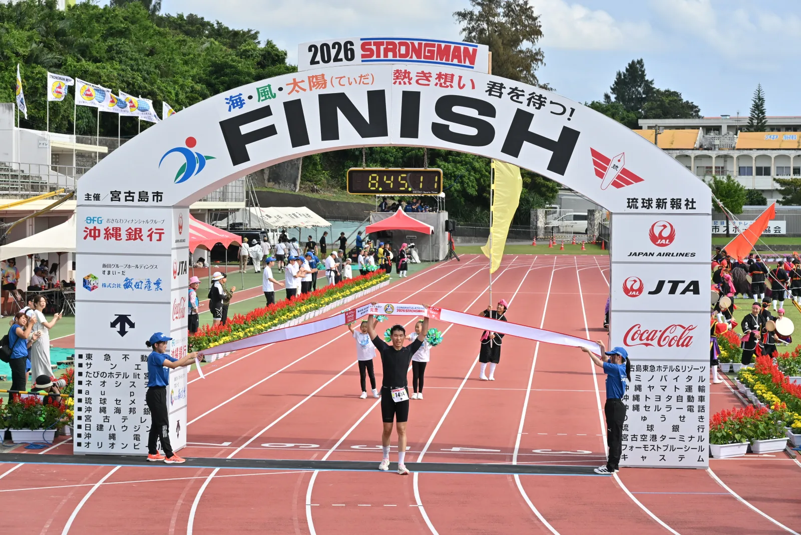
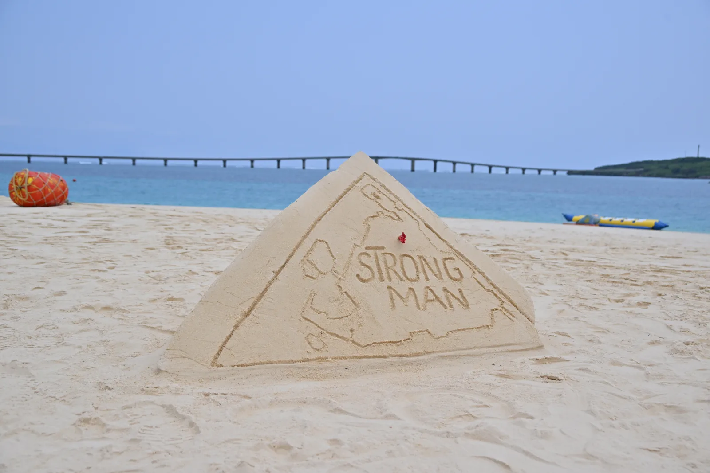
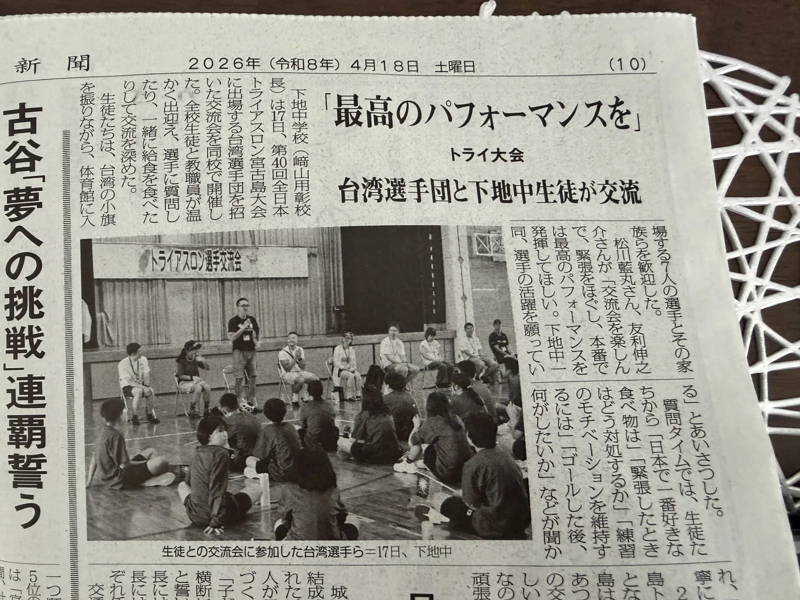
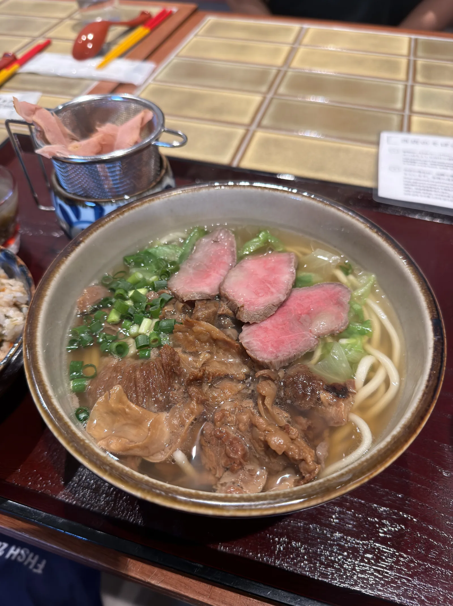
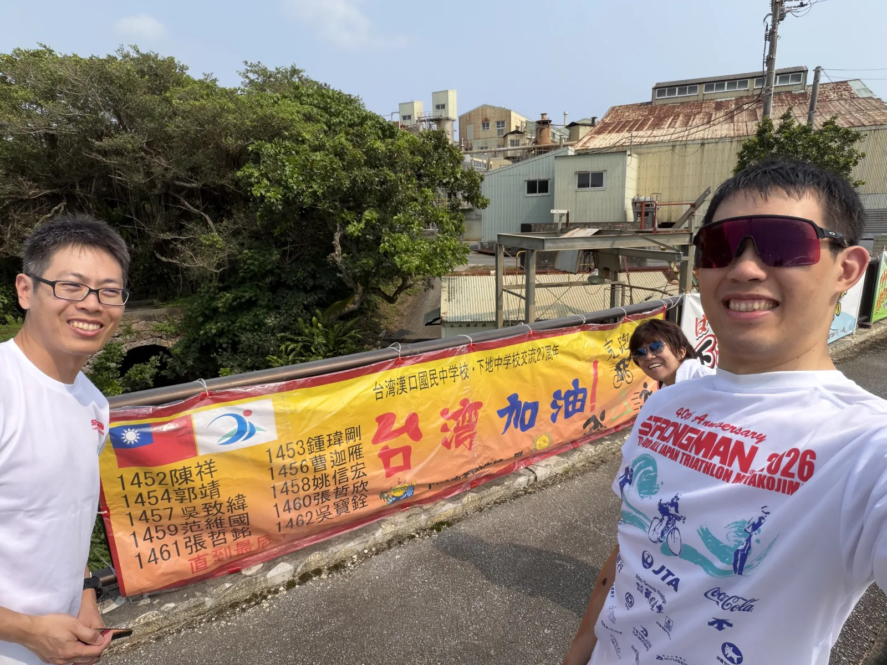
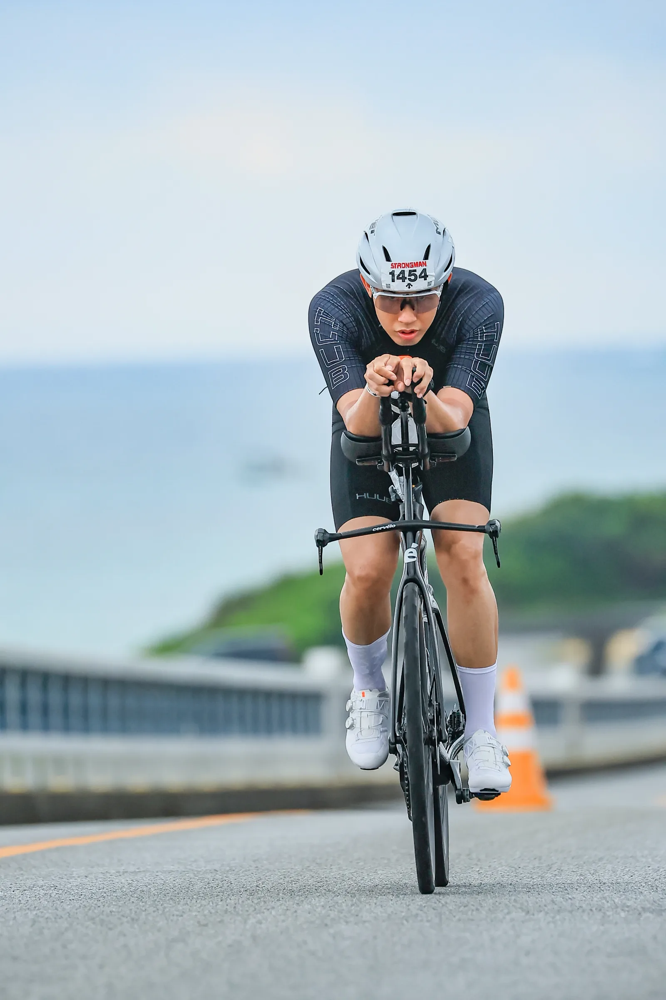
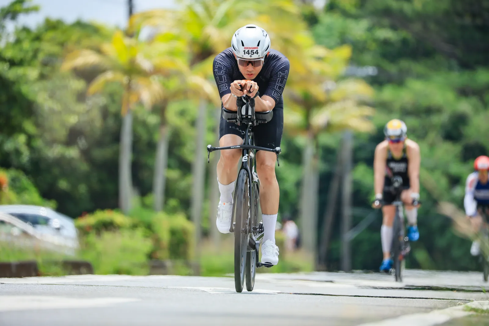
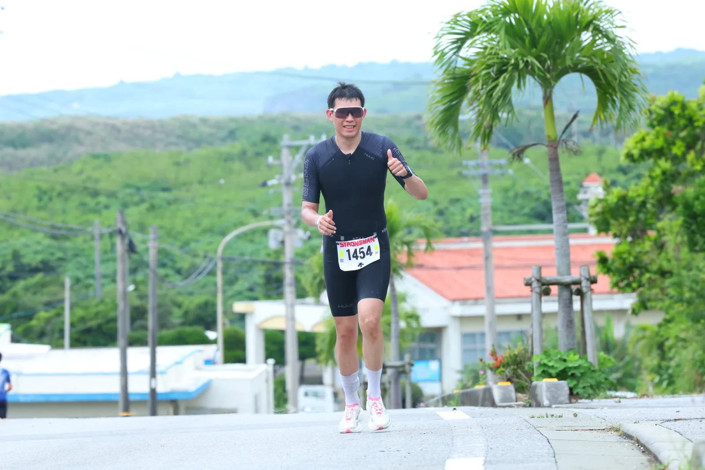
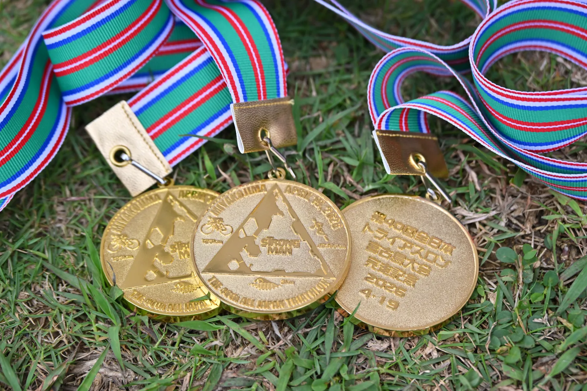
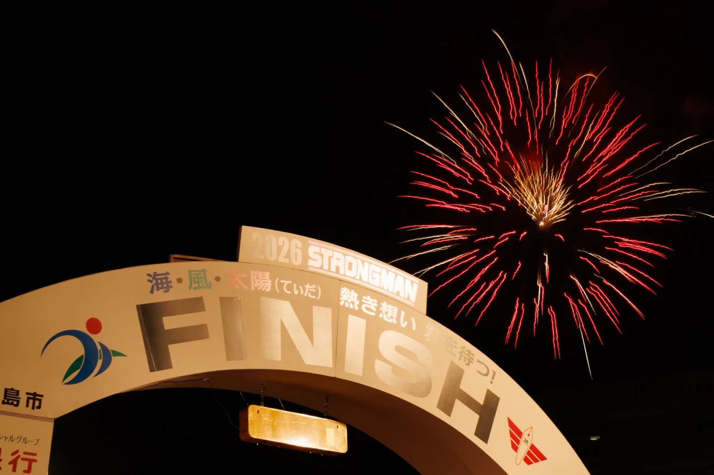

> **官方成績：8:45:09 | 總排名第 101 位**
> 游泳 57:27（含 T1 前段跑步）· T1 6:13 · 自行車 3:41:06 · T2 3:57 · 跑步 3:56:26

賽前寫了 [2026 宮古島三鐵賽前紀錄](../2026-miyakojima-pre-race/)，把目標與策略都記下來。這篇是賽後回顧，把實際執行狀況跟賽前預期做個對照。

---

## 比賽介紹

全日本トライアスロン宮古島大會（全日本鐵人三項宮古島大賽，[官方網站](https://tri-miyako.com/)）是日本歷史最悠久的長距離鐵人三項賽事之一，2026 年辦的是第 40 屆。比賽每年四月在沖繩縣宮古島市舉行，名額約 1,510 人，是整個島上的年度盛事，也是許多日本鐵人的夢想賽事。

**賽事距離：**

| 項目 | 距離 | 關門時間 |
|------|------|---------|
| 游泳 | 3 km | 1 小時 50 分 |
| 自行車 | 123 km | 視地點而定 |
| 跑步 | 42.195 km | 視地點而定 |
| 總關門 | — | 13 小時 |

游泳在宮古島最著名的[與那霸前濱海灘](https://www.miyakojima-kanko.com/spots/yonahama-beach/)出發，出水後沿著海岸跑步進 T1。自行車賽道繞行宮古島並延伸到池間島，沿途風景蠻壯觀的，特別是池間大橋路段。跑步沿縣道 78 號往東平安名崎方向折返，是一段相當曬、相當磨人的路段。

比賽早上七點出發，衝線時還會有當地小朋友，工作人員拿著旗幟跟著跑，相當歡樂，這是宮古島比賽獨有的氣氛，也是很多人每年回來的理由之一。

---

## 報名方式

報名通常在每年 **10 月 1 日至 31 日**受理，透過 [MSPO ENTRY](https://www.mspo.jp/) 平台完成。報名費 60,000 日圓。由於名額有限，若報名人數超過上限會進行抽籤，結果通常在 **11 月下旬**以 email 通知。

**報名資格：**

- 賽事當天年齡 19–65 歲
- 曾完成 51.5km 以上的鐵人三項（含游泳 1.5km 以上）
- 游泳 1.5km 需在 40 分鐘內完成的紀錄（部分情況要求）

---

## 交通

我是從東京搭 ANA 直飛宮古島，自行車可以隨機托運，算是相對方便的選擇。台灣的話可以從台中或桃園搭星宇航空直飛下地島，兩島之間有伊良部大橋連接，開車約 20 分鐘可以到宮古島市區。

島上交通不太方便，建議還是租車會比較輕鬆。沒有車的話，靠腳踏車或計程車在比賽週間也不是不行，只是會比較麻煩。

---

## 賽前

比賽前兩天，住在宮古島的吳小姐每年都會為台灣選手安排一個蠻特別的行程，到下地中學做文化交流。那所學校本身就跟台灣的國中有長期交流活動，對台灣選手的到來也蠻熱情的。跟學生互動、聊天，某種程度上讓整個賽前的心情輕鬆了不少，跟能量滿點的小朋友交流其實蠻有趣的。這也是宮古島比賽的一部分魅力，不只是比賽本身，而是整個島上的氛圍。站在出發線上也可以明顯感受到，這場比賽是島上每年最重要的年度活動。

文化交流活動後來也上了當地的報紙，標題是「最高のパフォーマンスを」——願大家拿出最好的表現。島上對這場比賽的重視程度，從媒體報導的篇幅也看得出來。

賽前幾天也跑去吃了道地的宮古そば。湯頭清爽、麵條有嚼勁，搭上幾片宮古和牛，入口即化，是島上蠻有名的一碗麵。

交流活動之外，下地中學的學生還做了一條加油布條，把這次所有台灣選手的號碼跟名字都寫上去，比賽當天就掛在自行車賽道旁幫忙加油。賽前去場勘自行車路線的時候特別繞過去看了一下，順便合影留念。一個日本離島的學校願意為一群素不相識的外國選手做到這個程度，這也是宮古島這場比賽讓人覺得特別的地方之一。

---

## 天氣

天氣預報說早上會下小雨，但實際上全程沒有遇到雨。自行車有部分路段地面偏濕，控車要稍微小心一點。跑步到中段開始太陽出來，氣溫開始上升，不過風吹過來還算涼爽。整體比起去年的酷熱好很多，CORE Sensor 的 HSI 也都沒有特別高。

---

## 游泳（手錶 54:25 | 官方 57:27 含 T1 前跑 | avg HR 164 | max HR 185）

今年的出發浪感覺比去年大一些，一下水就是一片混戰。第一圈確實亂，被撞到、踢到都是常有的事，基本上整圈在打打殺殺中完成。第二圈明顯順很多，找到自己的位置、跟在別人後面 drafting 之後節奏才穩下來。

最終游泳時間跟去年差不多，GPS 距離大約 2.9km，第二圈有點游歪，往折返點反方向游了一段才修正回來。出水後心率還是偏高——峰值 185 bpm，出水後也沒有立刻降下來。於是從出水點到 T1 的這段路，我決定半走半跑，讓心率先降一點再說。

今年游泳的 DNF 人數超過 100 人，比往年多不少，應該跟浪況確實比較差有關。

---

## T1（官方 6:13）

T1 遇到一個小插曲：轉換空間比較擠，我的車前輪被旁邊那台車的踏板卡住，花了一點時間才把車拔出來。其實寄車的時候就有預感可能會發生這個問題，所以沒有慌，冷靜慢慢把車拿出來，沒有造成太大的時間損失。

---

## 自行車（官方 3:41:06 | 123km | 161.5W | avg HR 155 | 爬升 976m）

騎車路線上上下下小丘陵地形，沒有什麼長爬坡，總爬升接近 1000m。

功率目標設在 162W 左右，實際跑出來 161.5W，算是完全命中。策略是開頭稍微保守，先觀察身體狀況再說，這點做到了。

補給這次蠻複雜的。出發時車上放了兩瓶 750ml、各 135g 碳水的水壺，結果騎車途中發現其中一瓶空了。賽後檢查水壺好像沒什麼問題，不確定是哪裡漏的，之後要再查清楚。這瓶等於白準備了。當下快速盤算了一下補給策略，還好有多帶能量膠，碳水還是可以維持在 80–90g/hr 的水準，但水分就需要靠補給站了。賽前沒有特別練過邊騎邊拿補給，實際執行起來其實沒有想像中難。

實際在車上吃到的補給：

- Maurten 固體膠 × 3（40g/個）= 120g
- 碳水炸彈 × 1（42g）
- Maurten 含咖啡因款（100mg 咖啡因 + 25g 碳水）× 1，另外掉了一包咖啡因膠，沒撿
- 調配碳水飲料一瓶（135g）

合計約 322g 碳水，3:41 的騎乘時間換算大約 88g/hr。漏掉的那瓶水額外從補給站拿了幾瓶來補液，大概補回了 750ml 左右的流失量。

整段騎乘感覺還算順，心率維持在 155 左右，沒有什麼特別需要救火的時刻。

---

## T2（官方 3:57）

T2 換鞋出發，把補給塞進三鐵衣時沒放好，掉出來撿了一下花了點時間，不過整體沒有太大狀況。

---

## 跑步（官方 3:56:26 | 5:37/km | avg HR 155 | max HR 170）

跑步整體路線上上下下，爬升約 320m。

出了 T2 右小腿有點緊，跑了 3–4km 之後慢慢沒那個感覺了，前半段節奏還過得去。

真正開始感到人生很難是在 18–20km 的區間。心率沒有特別高，呼吸也沒有很喘，但四頭肌就是感覺撐不住步伐的力道，沒辦法再出力，尤其是下坡有夠痛苦。過了 25km 之後腿後肌也開始有疲勞的跡象。在某個補給站噴了一下 Salonpas，稍微有感，但配速還是繼續往下掉。最後 3km 使盡力氣稍微提速了一些，撐到終點。

最終跑步 3:56，差一點就破 4 小時。

補給：

- Maurten 固體膠 × 4（40g/個）= 160g
- 碳水炸彈 × 2（42g/個）= 84g
- Maurten 含咖啡因款（100mg 咖啡因 + 25g 碳水）× 3 = 75g 碳水 + 300mg 咖啡因
- 原本有準備一瓶 500ml 60g 碳水飲，拿到後喝了一口味道怪怪的，就沒繼續喝

合計約 319g 碳水，加上補給站喝的運動飲料，估計每小時大約 80g 碳水。補給站基本上每站都會停，有海綿可以淋冰水還不錯。全程胃部都沒有不適，感覺其實還可以再吃更多。

---

## 成績總覽

| 項目 | 官方時間 | 數據 |
|------|----------|------|
| 游泳（含 T1 前跑） | 57:27 | avg HR 164 / max HR 185 |
| T1 | 6:13 | |
| 自行車 | 3:41:06 | 161.5W / avg HR 155 / 123km / 爬升 976m |
| T2 | 3:57 | |
| 跑步 | 3:56:26 | 5:37/km avg / avg HR 155 |
| **總計** | **8:45:09** | **總排名第 101 位** |

騎車補給：約 322g 碳水（~88g/hr）
跑步補給：約 319g 碳水（~80g/hr）

---

## 賽後反思

8:45:09，恰好落在賽前設定的 8:30–9:00 目標區間正中間，算是達標。今年天氣比去年涼很多，這對整體表現有幫助，不然跑步段可能會更慘。

有幾個地方還需要繼續改進。游泳出水後心率偏高，這影響了 T1 的節奏；騎車補給的水壺漏水，下次不能靠運氣，賽前要先檢查。跑步後半段的肌肉耐力明顯不足，尤其是四頭和腿後，這部分還需要更多的長跑和特定肌力訓練。

整體來說訓練量還有很大的空間。游泳幾乎沒有進步，自行車的部分倒是蠻有感的，可以持續精進。跑步的瓶頸不在心肺，而是在肌肉耐力，這是下個週期訓練的主要方向。

---

## 煙火

宮古島三鐵有一個傳統：最後關門時，終點會施放煙火。我完賽的時間大約下午三點多，沒能看到煙火，等朋友結束後就離開吃晚餐休息了，真的很累啊。

---

## 下場比賽

夏季以訓練為主，下場比賽目前預定是 10/2 的 [99T](https://99tri.com.tw/)，也是我 4 年前第一次參加的比賽。還沒報名，也還在研究其他選項。99T 的自行車路段騎的是封路的有料道路，非常好騎，113 距離的目標是 4:30。
