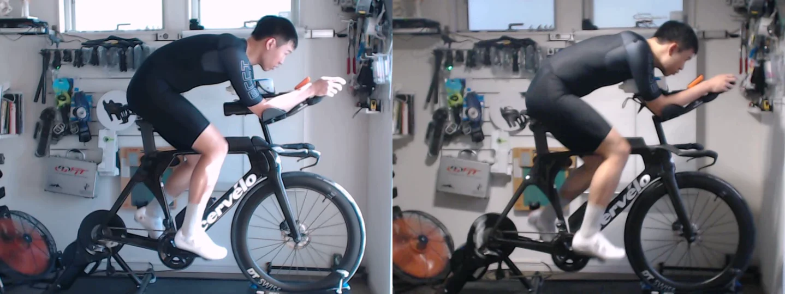

買 Cervelo P5 前後在台灣都做過 Bike Fit，距離上次已經過了一年，由於自己也常常微調一些小設定，所以決定重新找個專業的 bike fitter 重新做一次確認。最後透過 [Triathlon in Tokyo 的網站](https://www.triathlonintokyo.org/bike)找到會講英文的[橫濱的 Sun Merit Bike Fit Studio](https://bikefitting.jp/)。

Fitter Makito Fushimi 的資歷蠻完整的：IBFI Level 4、Retül Master Level，曾任 Retül 官方講師，也有多年支援 UCI 職業公路車隊的經驗，長期服務競技鐵人三項選手。整個 session 約三到四小時。

---

## Fit 前的問題描述

去之前我跟 Makito 說的主要需求是：在長時間騎乘（5–6 小時）下，找到空力（aero）、舒適度、輸出功率三者之間的平衡。目前的狀況是騎到 3–4 小時後肩頸開始不舒服，坐墊也有不適感。

---

## Fit 的流程

先錄影觀察騎乘狀況，讓 Makito 在不預設數字的前提下看清楚目前的問題。這個步驟刻意不用 Retül capture，是為了避免過早被數字綁住，忽略其他細節。評估之後，主要的結論是：**座墊太高，整體騎乘姿勢（position）可以再往前推**。

接著進入身體評估：柔軟度、核心肌力（core strength）、上半身肌力（upper body strength）、髖關節活動範圍等。然後是反覆調整的循環：騎一段、觀察、調整、再騎。最後定位、做 Retül 3D motion capture，輸出報告，數字才在這時候拿來對比，也會解釋各項數字的意義。

---

## 身體評估：才發現股四頭肌（quad）很緊

評估裡有一個我之前不知道的：湯瑪士測試（Thomas Test）測出右側股四頭肌靈活度是偏差的，備注「Right Quad is very tight」。這在鐵人三項車（TT bike）的騎乘姿勢下是個問題，因為激進的空力姿勢（aggressive position）讓髖屈肌長時間在縮短位置工作，右側股四頭肌又緊，會影響踩踏效率和舒適度。

其他方面：核心肌力和上半身肌力都是尚可（adequate），整體在可以做激進的空力姿勢的範圍內。

---

## Before vs After：數字怎麼變

| 測量項目 | Before | After | 變化 |
|---|---|---|---|
| Saddle Height | 763 mm | 740 mm | −23 mm |
| Saddle Setback | −26 mm | −1 mm | +25 mm |
| Arm Pad Drop | −38 mm | 0 mm | +38 mm |
| Arm Pad Stack BB | 710 mm | 729 mm | +19 mm |
| Handlebar Reach | 528 mm | 504 mm | −24 mm |
| 有效座管角（Eff. Seat Tube Angle） | 79° | 80° | +1° |

最主要的兩個調整：座墊降了 23 mm（確認了之前太高的問題），同時整體騎乘姿勢往前推——座墊 setback 從 −26 mm 移到 −1 mm，前臂墊升高、水平距離縮短。

從照片直接看得出差異：調整後的背部角度明顯更平，頭部更低，頭部往背部的轉換更平滑，空力姿勢比之前扎實很多。

這個騎乘姿勢已經是目前硬體能推到的最前位置，座墊和把手區（cockpit）都到了極限。如果之後換零件，有效座管角還有繼續往前的空間，這次 80° 是受限於現有設備的結果。

---

## 三個細節調整

### 右腳墊了 3 mm 腿長補償墊片

測量發現右腳比左腳短，在右鞋卡踏下方加了 3 mm 的墊片補償。不處理的話騎乘時骨盆會歪斜、左右出力不均。

### 左鞋加了楔形墊片（Verus wedge）

左腳前腳掌有自然的傾斜角度（forefoot angulation）。加了墊片之後，楔形的一邊厚、一邊薄，讓踏板接觸面配合腳的自然角度，減少膝蓋的側向壓力。

### 兩隻腳的卡踏都往後移了

---

## 卡踏往後移這件事

Makito 為兩隻鞋都加了 FORM 卡踏後移延伸板（FORM Cleat Extender Plate），讓卡踏位置往後移。

他的說法是：卡踏往後移可以減少小腿的使用量，讓小腿在騎乘段保持比較新鮮的狀態，對之後的跑步有幫助。

**力學原理：** 如上圖，傳統卡踏位置對齊第一蹠骨頭，踝關節到卡踏的槓桿臂較長，小腿肌肉（腓腸肌和比目魚肌）就需要出更多力來穩定腳踝。把卡踏往後移約 10–20 mm、縮短槓桿臂，小腿的負擔下降，踩踏的動力主要由股四頭肌和臀肌承擔——這兩塊肌肉更大、更耐操，跑步時同樣用得到。小腿和阿基里斯腱在這個設定下更像穩定器，而不是主要出力來源。此外，腳踝槓桿縮短之後，騎乘時腳尖向下的傾向會減少，正面投影面積縮小，對空力也有一點幫助。

**科學研究怎麼說：** Millour et al.（2020）在模擬短距離鐵人三項條件下測試，後置卡踏讓跑步能耗下降約 5.9%、腓腸肌內側在跑步段的啟動量減少 25%，在穩定功率騎乘下效果明顯。Evans et al.（MDPI Sensors, 2021）在戶外實際路況下測試，後置卡踏讓騎完之後跑步的自覺費力程度（RPE）顯著下降，效果量（effect size）達 0.9。另有 2025 年的生物力學研究（SportRxiv）發現後置卡踏顯著降低阿基里斯腱壓力，對長期腱傷預防也有意義。

不過有一個地方要注意：Millour et al. 同一研究也發現，在衝刺段（>100% 最大有氧功率）使用後置卡踏時，小腿、股外側肌、腿後肌的啟動量反而升高了。換句話說，對鐵人三項的長距離穩定功率騎乘，後置卡踏的好處比較清楚；如果騎乘有大量衝刺或站姿爬坡，效益就比較複雜，但鐵人三項幾乎都是長時間穩定功率輸出，比較沒有影響。

Joe Friel（Triathlon Training Bible 作者）從 2007 年就倡議這個設定；Daniela Ryf 和 Jan Frodeno 也在用後置卡踏。對標準三孔卡踏的鞋，可以用 FORM Cleat Extender Plate 或 PatroCleats 這類延伸板。要做到更後面的中足（mid-foot）位置，就需要額外鑽孔的鞋或鐵人三項專用鞋。

---

## 實際驗證：霞ヶ浦 + 北浦 180 km

Fit 完之後去霞ヶ浦和北浦騎了一趟，180 km，大概六小時。

體感上其實有差：相同輸出下感覺速度比之前快，空力感明顯。雖然沒有做風洞測試，但從 before/after 的側面照就直接看得出騎乘姿勢更空力了，不需要數據就能判斷。肩頸在騎完後仍然有一些不適，但對鐵人三項車的長距離騎乘來說這算正常現象，而且比 refit 之前改善了。之前那種到了 3–4 小時後肩頸和坐墊就開始明顯變不舒服的情況沒有出現。

---

## 值不值得做

這次 refit 讓我確認了兩件事。

第一是座墊太高。降 23 mm 聽起來不多，但坐高直接影響髖角、踩踏效率和長時間騎乘的坐墊舒適度。我原本的設定讓骨盆在踩踏時需要過度左右搖擺補償，這很可能就是 3–4 小時後坐墊不適的主因。

第二是湯瑪士測試找出的右側股四頭肌問題。這個問題直接限制了騎乘姿勢能做多激進，但我之前完全不知道，只調數字是繞路。這方面的靈活度還需要再加強，現在幾乎每天睡前都會做一點拉伸，希望之後能改善。

TT Bike Fit 和一般公路車 Bike Fit 是不同的東西，考慮的因素不一樣。如果你有一台鐵人三項車但還沒做過 TT 專門的 fit，蠻值得去做一次看看的。

---

## Reference

- Sun Merit Bike Fit Studio: https://bikefitting.jp
- Millour et al. (2020), *Journal of Science and Cycling*: https://www.jsc-journal.com/index.php/JSC/article/view/521
- Evans et al. (2021), *MDPI Sensors*: https://www.mdpi.com/1424-8220/21/17/5899
- SportRxiv (2025), Achilles tendon strain & cleat position: https://sportrxiv.org/index.php/server/preprint/view/562
- Joe Friel on cleat position (2007): https://www.trainingbible.com/joesblog/2007/01/cleat-position.html
- Triathlete.com, *Midsole Cleat Placement*: https://www.triathlete.com/gear/bike/midsole-cleat-placement/
