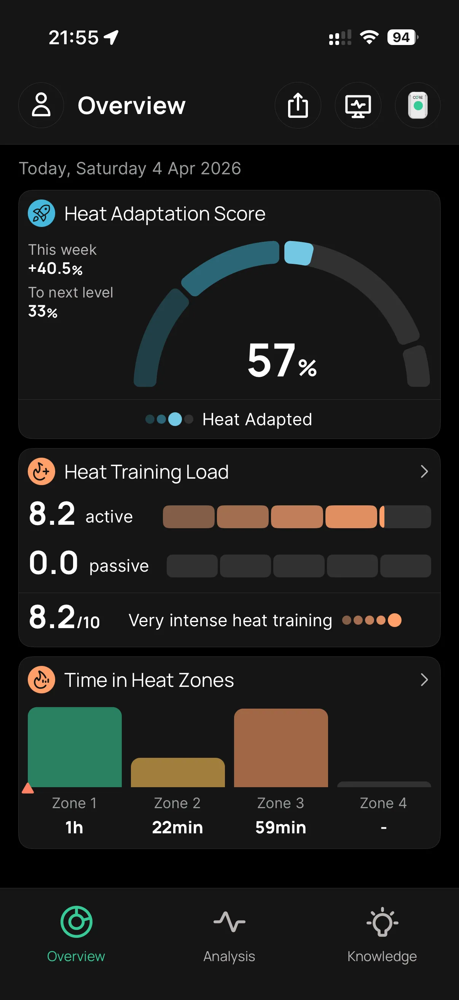
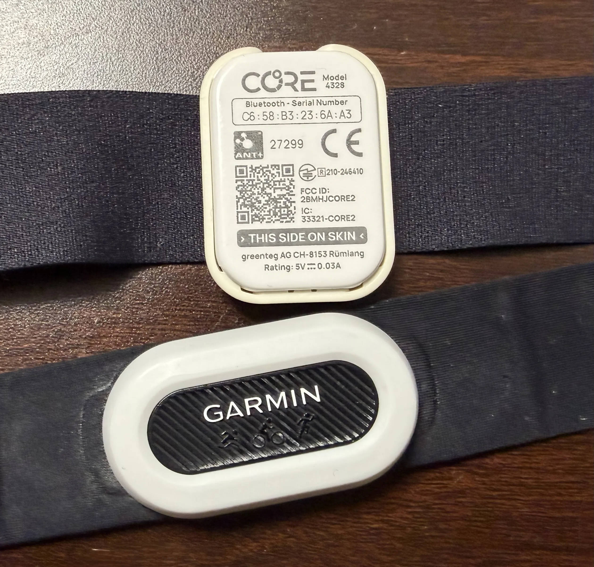
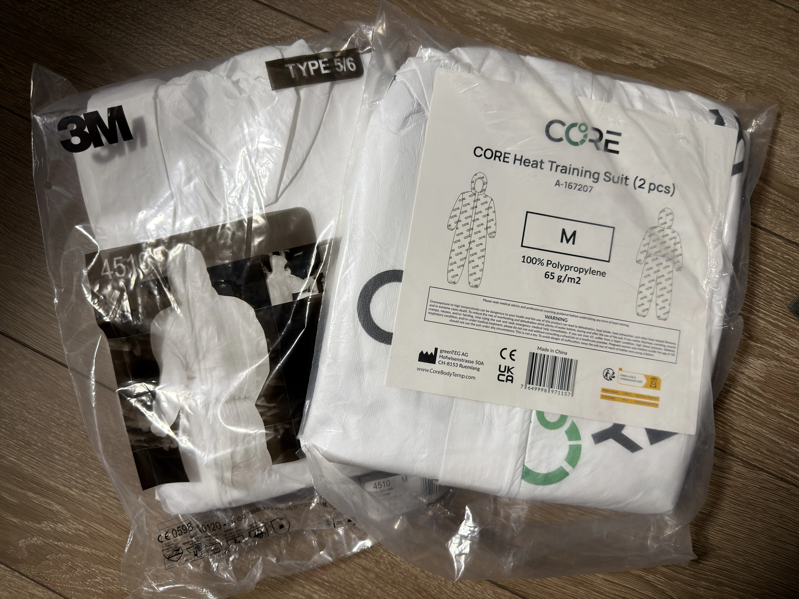
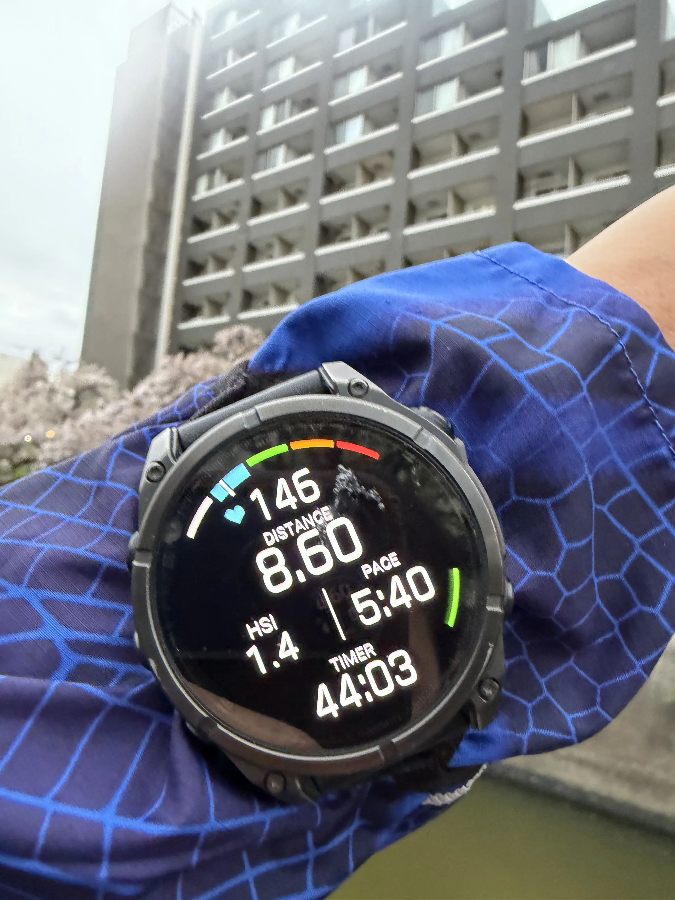

CORE sensor 買回來已經一段時間了，夏天訓練時會開著監控核心溫度，主要是確認有沒有過熱、需不需要強制休息。但這次宮古島會是第一次把它帶進比賽實戰用。

宮古島是四月底的沖繩，海島氣候加上濕度，白天最高可能到 27–30°C。就算比賽時段的實際氣溫（早上出發）可能落在 20–25°C 左右，和東京現在的訓練環境差距還是很明顯。東京現在氣溫大概 10–20°C，穿著一般的訓練裝備根本碰不到什麼熱壓力，如果不刻意準備，到了那邊才開始讓身體適應，基本上已經來不及。

於是這幾週開始認真做熱適應訓練。這篇把相關的研究背景、裝備和我目前的實際做法都整理一下。

---

## 什麼是熱適應訓練

熱適應訓練（Heat Acclimatization / Heat Acclimation）的核心概念很簡單：透過反覆暴露在熱環境下，讓身體主動產生生理上的適應，而不是等到比賽當天才硬撐。

這個過程主要會觸發幾個生理變化：

**血漿量增加**：研究顯示熱適應後血漿量平均增加 10–12%[[1]](#ref-1)。血漿量增加代表在相同心跳數下能輸送更多血液，同時也能維持汗水的供給量，讓散熱效率維持更久。

**出汗效率大幅提升**：出汗起始點提前（更早開始流汗），出汗量也顯著上升，部分研究數據顯示可比未適應前多出近三倍[[1]](#ref-1)。這對高溫下維持核心溫度非常關鍵。

**核心溫度下降**：在相同的運動強度下，核心溫度大約可以降低 0.27–0.28°C[[2]](#ref-2)。聽起來很小，但在接近極限的鐵人賽況下，這個差距是真實的緩衝空間。

**心率降低**：心率降低代表心臟不需要那麼努力工作就能維持相同的輸出，留下更多空間應對後段的疲勞。

這些適應效果不是比賽當天突然出現的，需要累積訓練才能產生。

---

## 研究怎麼說：幾週才夠？

**適應期大約 10–14 天**：最主要的生理適應在這個窗口內基本完成。每次有效訓練時間建議 45–60 分鐘，每週做 5 次、連續兩週是研究中常見的協議。如果時間不夠，至少做 6 次也有一定效益[[3]](#ref-3)。

**效益最快第 4–5 次後出現**：不需要等滿兩週才開始有感，但要最大化效益還是要撐到 10 次以上。

**適應效果會消退**：這點很多人忽略。停止熱訓後第 2 週，心率適應已消退約 35%、核心溫度適應約消退 6%；到第 3 週大概有 75% 的效益都退掉了[[4]](#ref-4)。所以不是比賽前一個月就做完然後等——**建議在比賽前 2–3 週開始，比賽前 3–4 天結束收操**，讓身體帶著最完整的適應狀態上場。

好消息是重新適應的速度比消退快很多。10 天適應 + 12 天空窗，只需要 2 天就能恢復大部分效益[[4]](#ref-4)。

---

## 為什麼用 CORE 感測器

熱適應訓練的一個核心問題是：你怎麼知道自己「夠熱了」？靠感覺不夠準確。穿著厚厚的訓練衣感覺很熱，不代表核心溫度真的進入適應區間；反過來也成立——有時候核心溫度已經偏高了，主觀感受還沒到達警覺程度。

CORE sensor 穿戴在胸帶上，即時監控核心溫度與 **Heat Strain Index（HSI）**。HSI 是結合核心溫度與皮膚溫度的綜合指標，數值 0–10，量化身體當下的散熱壓力，訊號可以直接傳到 Garmin 或 Wahoo。

CORE 官方建議熱適應訓練的目標落在 **Zone 3 HSI（3–6.9）、持續 45–60 分鐘**[[3]](#ref-3)。我自己的做法是抓最高 HSI 大約 5，時間 45–60 分鐘；停止訓練後不急著脫裝備，因為核心溫度和 HSI 會繼續維持一段時間的高值，這段時間也有持續的適應效果。

用途大概分三個：

1. **訓練時**：確認有沒有進入足夠的熱壓力區間，避免過度或不足
2. **追蹤適應進度**：隨著訓練累積，同樣的環境下 HSI 上升速度應該會逐漸變慢——這是身體真正適應的訊號
3. **比賽當天**：根據 HSI 即時調整配速和補給策略，不靠感覺撐，靠數據決策

值得誠實說一句：CORE sensor 的準確度有一篇 peer-reviewed 的驗證研究提出質疑，約 50% 的量測點超過了研究設定的有效閾值[[5]](#ref-5)。所以把它當作「絕對準確的核心溫度計」不太合適，但作為追蹤訓練進度的相對指標，以及比賽時的即時參考，仍然有實用價值。用它建立趨勢感知，比追求絕對數字更重要。

另外 Garmin 手錶本身也有內建熱適應指標，但它是根據 GPS 與配對手機的天氣資訊計算，並非直接量測核心或皮膚溫度，準確度上又差了不少，可以當作參考就好，不太能依賴它來指導熱適應訓練。

---

## 實際裝備：要怎麼製造熱環境

光是在東京的室溫騎台車或跑步不夠熱，需要主動「製造」一個熱環境。目前用兩個方案：

**CORE Heat Training Suit**

[CORE 官方的訓練服](https://corebodytemp.com/products/core-suit)，100% Polypropylene，布重 65 g/m²，專門為熱適應訓練設計，材質密合、保熱效果明確。尺寸我 177cm 穿 M，官方說 M 適合到 180cm，實際穿起來覺得蠻大的，S 可能更合身（S 建議到 172cm，我大概在兩者交界）。

**3M™ 工作防護衣 4510**

這件是意外發現的。最初 CORE suit 的包裹沒收到，臨時去找替代方案買了這件工業用防護衣。後來發現效果很接近——材質同樣是 Polypropylene，布重 47 g/m²，比 CORE suit 的 65 g/m² 輕薄一些，但實際訓練中保熱效果差不多，價格也親民很多，算是 CP 值高的替代選項。

拿這件去戶外跑步，路人用很奇怪的眼神看是一定的。某種程度上也是熱適應訓練的一環——習慣不在乎就好。

---

## 訓練的實際感受

隨著訓練累積，同樣的裝備下 HSI 上升速度變慢了，這是身體適應的訊號，但也代表如果還想維持足夠的熱壓力，就得繼續穿更多衣服。室內騎訓練台到後面我會在 training suit 外面再套長袖車衣加外套，強迫讓 HSI 上到目標區間。

戶外跑步的感受不太一樣。汗水更容易被風帶走，熱壓力相對難維持，但跑步累積熱量的速度也比較快。

訓練幾次之後，出汗反應明顯變得更快、更多，這個主觀感受的變化蠻明顯的。

如果你在台灣，平常戶外訓練其實就已經在自然累積熱適應了，現在的氣溫在外訓練就有差不多的效果，不一定需要特別加碼。東京目前的狀況沒辦法這樣，所以才需要刻意製造環境。

---

## 注意事項

- **核心溫度目標區間**：38.5–39.5°C，避免超過 40°C。超過這個範圍就不是「適應」而是「傷害」。
- **補水要比平常多**：出汗率增加，水分需求跟著上升，不要等到口渴再喝。
- **停止訓練的訊號**：HSI 異常飆高、頭暈、心率持續超出預期高位，這些情況要立刻停下來。
- **時機**：比賽前 2–3 週開始，比賽前 3–4 天收操。

---

## 小結

熱適應訓練不是什麼神祕的訓練法，背後的生理機制有大量研究支持。對在東京準備宮古島比賽的我來說，這是目前最務實的備戰方式。CORE sensor 在這個過程中扮演的角色是讓訓練可以被量化、被追蹤，而不只是「感覺有流很多汗」。

比賽結束後再回來補一篇實戰心得。

---

## References

[1] Racinais, S. et al. (2019). Physiological Responses to Heat Acclimation: A Systematic Review and Meta-Analysis of Randomized Controlled Trials. *Sports Medicine*. https://pmc.ncbi.nlm.nih.gov/articles/PMC6543994/

[2] Goosey-Tolfrey, V. et al. (2019). Mixed Active and Passive, Heart Rate-Controlled Heat Acclimation Is Effective for Paralympic and Able-Bodied Triathletes. *Frontiers in Physiology*. https://pmc.ncbi.nlm.nih.gov/articles/PMC6763681/

[3] CORE. Building Heat Training into Triathlon Training. *CORE Help Center*. https://help.corebodytemp.com/en/articles/10447170-building-heat-training-into-triathlon-training

[4] Moran, D. et al. (2018). Heat Acclimation Decay and Re-Induction: A Systematic Review and Meta-Analysis. *Sports Medicine*. https://pmc.ncbi.nlm.nih.gov/articles/PMC5775394/

[5] Niederer, D. et al. (2021). Reliability and Validity of the CORE Sensor to Assess Core Body Temperature during Cycling Exercise. *Sensors*. https://pmc.ncbi.nlm.nih.gov/articles/PMC8434645/
