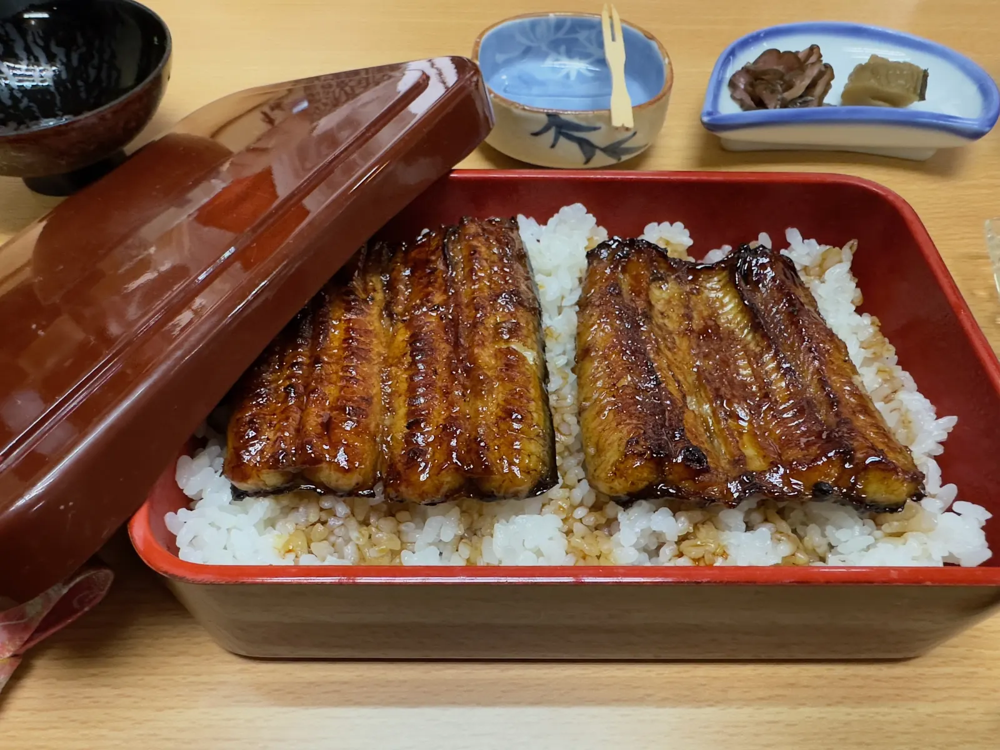
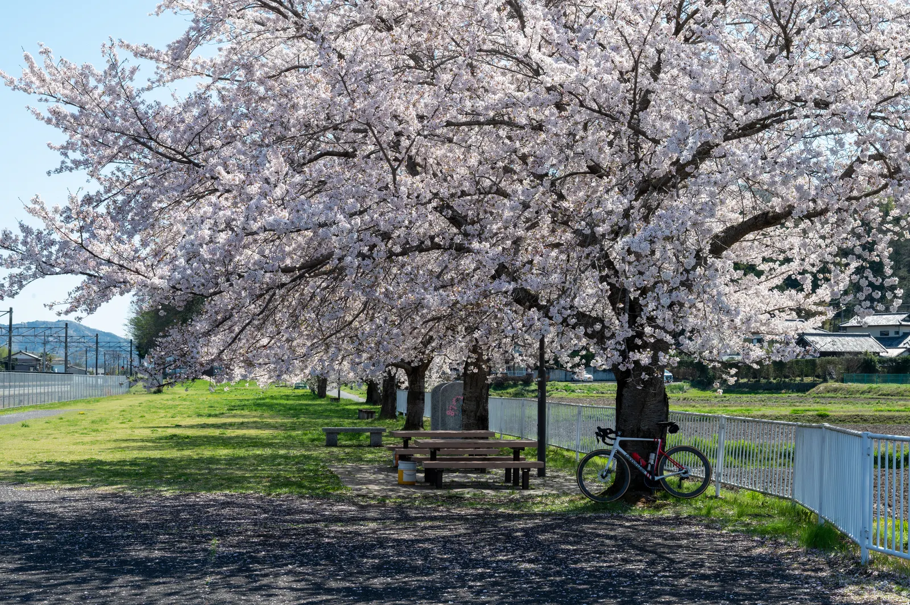

其實已經有點忘記是什麼時候第一次知道霞ヶ浦這條路線了，但會一直回來騎，主要的原因只有一個：**這是東京近郊最適合練 TT 的地方**。

關東圈想找一條能夠長距離維持穩定功率、又不用一直停紅綠燈、不用閃車流的路線並不容易。荒川跟多摩川雖然近，但人真的太多——前陣子才有朋友在荒川為了閃小朋友摔車，多摩川蠻多路段也很窄，要趴上休息把用 TT 姿勢穩定踩功率其實挺危險的。

霞ヶ浦環湖一圈大約 125 公里、累積爬升趨近於零，沿途車流又少，幾乎是為計時賽訓練量身打造的場地。緊鄰的つくば霞ヶ浦りんりんロード 則是純自行車道，雖然路口多、路面也比較窄，沒有那麼適合 TT，但風景優美，櫻花季更是必去。

本篇會介紹從東京出發到這兩條路線的完整資訊，包含交通、路線分段、補給、以及不同需求的組合建議。

## 路線總覽

整個區域可以拆成兩條相互銜接的路線：

| 路線 | 距離 | 路面類型 | 主要用途 |
|------|------|----------|----------|
| 霞ヶ浦環湖（完整一圈） | 約 125 km | 與汽車道共用，但車流極少 | TT、長距離耐力訓練 |
| 霞ヶ浦大橋切過去（縮短版） | 約 90 km | 同上 | 訓練時間有限時的短版 |
| 霞ヶ浦 + 北浦（東側湖泊延伸一起繞） | 約 180 km | 同上 | 超長距離耐力訓練 |
| つくば霞ヶ浦りんりんロード（土浦 ↔ 岩瀬，單程） | 約 40 km | 純自行車道，路口較多 | 觀光、巡航、櫻花季賞景 |

霞ヶ浦本身是日本第二大湖，位於茨城縣。兩條路線都以土浦市為主要起點。

把霞ヶ浦環湖跟りんりんロード 串起來的「つくば霞ヶ浦りんりんロード」其實是日本國土交通省指定的「[ナショナルサイクルルート](https://www.mlit.go.jp/road/bicycleuse/good-cycle-japan/national_cycle_route/)（國家級自行車路線）」全國六條之一，跟しまなみ海道、琵琶湖一周（ビワイチ）、太平洋岸自転車道、トカプチ 400、富山湾岸並列，算是日本官方認證最值得騎一次的長距離路線之一。

出典：[サイクリングいばらき（茨城県）](https://cycling.pref.ibaraki.jp/ringring/)。實際騎行路線於文章末附上 Garmin 與 Strava 連結。

## 交通方式：從東京怎麼去

最簡單的方式是搭 JR 常磐線特急到土浦站，從上野出發大概 45 分鐘左右。帶輪行袋的話直接放在車廂後方就好，特急有指定席比較舒服。

**週末特別推薦：常磐線サイクルトレイン**

如果是六日去，可以利用 JR 東日本水戶支社營運的「常磐線サイクルトレイン」。這是上野 ↔ 土浦間每週六日固定運行的 4 班專用車次，**自行車不用拆、不用裝輪行袋直接牽上車就好**，對於只是來回一日訓練的人非常方便。

| 方向 | 上野發 | 土浦著 |
|------|--------|--------|
| 下行（去程） | 7:02 / 7:53 | 8:06 / 9:08 |
| 上行（回程） | 18:11 / 18:33 | 17:00 / 17:28 |

每節車廂限 5 台、整列車最多 10 台，需要事前預約（免費）。詳細資訊與預約方式可參考 [JR 東日本官方頁面](https://www.jreast.co.jp/mito/jobancycletrain/)。

**自駕**

走常磐自動車道從土浦北 IC 下交流道，停在「りんりんポート土浦」是最方便的選擇。那邊有停車場、廁所、淋浴間，也有公路車租借（含電動車選項）。如果是輕裝想當天試騎，租一台來騎也蠻不錯。

土浦站本身就是 りんりんロード 的起點，從車站出來銜接路線非常順暢，這一點對於從東京過來的人來說友善度很高。

## 路線分段一：霞ヶ浦環湖

這是來霞ヶ浦的主菜。從 りんりんポート土浦 出發，沿著湖岸順時針或逆時針都可以，完整一圈約 125 公里。

**主要分段（逆時針方向，大部分人都這樣騎）：**

我自己習慣用沿途的補給點當作分段標記，這樣在路上比較好抓配速與心理節奏：

- 土浦 → セブン-イレブン 稲敷古渡店（南岸西半段，約 30 km）
- → 潮來（南岸東半段，約 20 km）
- → 道の駅たまつくり（東岸北上至玉造，約 21 km）
- → 大橋另一端（繞過北側湖灣到霞ヶ浦大橋西側，約 30 km）
- → 回土浦（北/西岸收尾，約 24 km）

合計約 125 km。沿途的 7-11 稲敷古渡店 與 道の駅たまつくり 是兩個主要的補給節點，記住這幾個點之間的里程，騎起來會踏實很多。

**潮來中午吃飯推薦：割烹 清水屋**

如果出發時間抓得剛好、中午前後騎到潮來附近，可以順道去[「割烹 清水屋」](https://www.kappo-shimizuya.com/)（[Google Maps](https://maps.app.goo.gl/tbXMdyfkcoLpzBvm8)）吃個飯。這間是當地的老字號和食店，**鰻魚蠻好吃的**，做為長距離騎乘中段的補給點很適合——一份鰻魚飯下肚、休息一下，下半場才有體力繼續。

**路面與車流：**

環湖的自行車道大部分其實是劃在一般道路上、跟汽車道共用，但車流真的非常少。我自己騎過幾次下來的觀察，路上看到的多半是釣客的車停在湖邊，整體騎乘體驗很單純，可以專心踩功率。

風是這條路線最大的變數。霞ヶ浦完全沒有遮蔽，風大的時候會騎得很難受，側風跟逆風段都很痛苦。建議出發前看一下風向，順時針或逆時針的選擇可以根據風向調整，把逆風放在前半段精神好的時候。

**TT 姿勢長騎練習**

這條路線也是我拿來做 TT 姿勢長距離訓練的不二首選。125 km 平路、車流少、補給點分布均勻，剛好是一天能吃完的耐力訓練量。維持心率/功率在 Z2，騎完一圈大約 4–4.5 小時，回到土浦剛好可以洗澡吃飯搭車回東京。如果之後要備戰長距離鐵人，這個路線是最容易把基礎有氧量堆起來的地方。

**縮短版：霞ヶ浦大橋切過去**

如果時間不夠或想拆短一點，可以從土浦出發騎到霞ヶ浦大橋直接切過湖到對岸，回程走另一側回土浦，這樣大約 90 公里。對於想做長間歇，或是練 113 鐵人但又不想吃滿整圈的人來說，這個版本很實用。

**想加里程：繞去北浦**

如果 125 公里還不夠，霞ヶ浦東側其實還連著一個叫北浦的湖泊，繞進去一起跑兩個湖加起來大約 180 公里。整體仍然是平路，適合做超長距離耐力訓練。

## 路線分段二：つくば霞ヶ浦りんりんロード

這條路線是舊 JR 筑波線廢線改建的自行車道，從土浦一路通到岩瀬，單程約 40 公里。整段是純自行車專用道，沒有汽車進入。

跟環湖路線比起來，りんりんロード 雖然紅綠燈不多，但是沿途與一般道路的交叉路口比較多，雖然路口的車流通常不多還是要注意。路面寬度比環湖路段稍窄一些，但其實也沒到很窄，整體還是蠻好騎。不過因為這些路口的關係，它沒有那麼適合維持穩定功率練 TT。**它的價值是另一個方向——騎公路車慢慢晃真的蠻美的**。沿途保留了不少舊車站遺跡，像舊筑波駅、舊真壁駅都改成休憩點，環境維護得不錯。背景還有筑波山的視角變化，櫻花季更是整段都是花海。

**進階：中途切去爬筑波山**

如果是想練爬坡的話，可以從 りんりんロード 中段切出去爬筑波山再接回來。筑波山是關東圈很經典的爬坡訓練點，這樣一天就能同時做平路與爬坡，路線彈性很高。

## 補給、廁所、緊急狀況

霞ヶ浦環湖路線上的便利商店分布還算均勻，主要是 7-11 與 FamilyMart，平均每 15–20 公里就會有一間。其中我自己最常用的兩個補給點：

- **セブン-イレブン 稲敷古渡店**：南岸的關鍵節點，從土浦逆時針出發騎到這邊大約 30 km，剛好是補水補糖的好位置
- **道の駅たまつくり**：環湖中段、霞ヶ浦大橋東側，有完整的餐飲與廁所，幾乎是必停點
- **道の駅しもつま**：偏 りんりんロード 北側，適合 りんりんロード 那一天利用

公廁的部分，沿湖每隔一段都有公園可以利用，りんりんロード 上的舊車站幾乎都保留了公廁。收訊全程基本沒問題，緊急狀況可以直接 Google Maps 找最近的車站或修車店。

## 路線組合建議

根據過去幾次的實際使用，可以歸納成兩種推薦方式：

**一日訓練路線：霞ヶ浦環湖**

這是 Z2 long ride、TT 與長距離訓練的標準組合。早上從土浦出發，騎完一圈 125 公里大約傍晚可以回到車站。如果還有體力或想吃滿距離，可以繞去北浦多加 50 公里。整天下來都是平路，可以拿來堆有氧基礎、測 FTP 或做長間歇。

**兩日觀光路線：霞ヶ浦環湖 + りんりんロード**

第一天環湖、第二天 りんりんロード 來回（或單向加搭電車回程）。這樣兼顧訓練與觀光，櫻花季去的話 りんりんロード 那一天會很值得。土浦過夜的部分推薦下面這間。

## 住宿推薦：星野リゾート BEB5 土浦

土浦過夜如果是帶著公路車來的話，**BEB5 土浦**幾乎是首選。它就直接設在土浦站旁的 PLAYatre TSUCHIURA 自行車主題複合設施內，從車站走過去不用幾分鐘。

最大的優勢是這間飯店本身是設計給單車旅客住的：

- 車可以直接牽進房間，不用擔心放外面或寄車庫
- 大廳就有專業的維修工具與打氣站
- 同棟樓內就有自行車店、租車店、餐廳

我自己住過幾次，房型乾淨、價格合理，當你結束一天 125 公里之後想直接洗澡躺平的時候，這個地理位置真的太方便。隔天早上不用拆裝車就可以直接上路。

## 季節與注意事項

最舒服的月份是 4–5 月（櫻花到新綠）以及 10–11 月（涼爽乾燥）。

夏天濕度高，沿途又沒有遮蔽，要特別注意中暑與補水節奏。サイクルトレイン 抵達土浦差不多 8 點到 9 點，這個時段在夏天基本上已經 25°C 起跳，務必把水帶夠、補給節奏抓好。冬天的湖風會比想像中強，多帶一件擋風層比較保險。

颱風或大雨之後要特別注意：路段上可能有落葉或樹枝，部分低窪處也可能積水。出發前最好查一下官方的路線狀況公告，避免騎到一半才發現某段封閉。

## 實際騎乘路線

下面是我自己常用的兩條 GPS 路線檔，可以直接匯入 Garmin 或 Wahoo：

- **霞ヶ浦環湖一圈 125 km（Garmin Connect）**：<https://connect.garmin.com/modern/course/458003577>
- **つくば霞ヶ浦りんりんロード（Strava Routes）**：<https://www.strava.com/routes/26753121>

## 結語

關東圈想找一條能放心練 TT 的路線並不多，霞ヶ浦幾乎是首選。一天就能跑完一圈 125 公里平路、車流又少、交通也算方便，對於有鐵人三項或計時賽訓練需求的人來說是非常實用的選擇。

如果只是想悠閒地騎一天賞景，那就把目標放在 りんりんロード，櫻花季來超美的，極力推薦。

## Reference

- [サイクリングいばらき – つくば霞ヶ浦りんりんロード（茨城縣官方）](https://cycling.pref.ibaraki.jp/ringring/) — 官方路線地圖、補給點、最新狀況公告
- [GOOD CYCLE JAPAN – つくば霞ヶ浦りんりんロード（國土交通省）](https://www.mlit.go.jp/road/bicycleuse/good-cycle-japan/national_cycle_route/tsukuba.html) — 國家級指定 Cycle Route 簡介
- [常磐線サイクルトレイン（JR 東日本水戸支社）](https://www.jreast.co.jp/mito/jobancycletrain/) — 自行車不拆裝直接上車的週末專用列車
- [星野リゾート BEB5 土浦](https://hoshinoresorts.com/ja/hotels/beb5tsuchiura/) — 土浦站旁的自行車主題飯店
- [PLAYatre TSUCHIURA](https://playatre.com/) — 土浦站內的自行車複合設施（含 BEB5、租車、車店）
- [割烹 清水屋](https://www.kappo-shimizuya.com/) — 潮來在地老字號和食店，環湖中段補給的選擇
