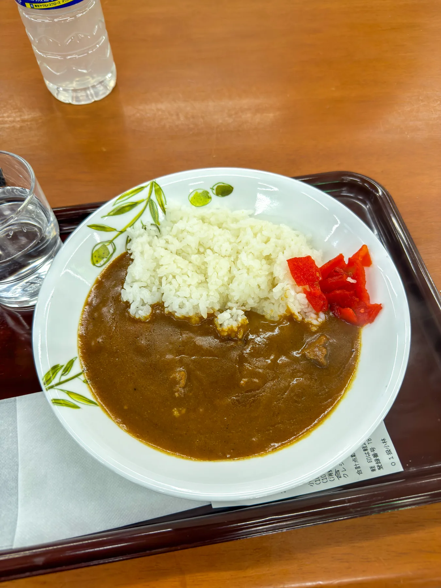

霞ヶ浦是我練平路 TT 最常回去的地方，但只練平路是不夠的。關東圈想找一段扎實的爬坡，東京西邊的奧多摩其實藏了一條很經典的路線，那就是 **都民の森**。

都民の森本身是位在奧多摩周遊道路上的一座森林公園，沿著周遊道路爬上去，終點的風張峠是**東京都內海拔最高的鋪裝公路**（也是東京都一般道路的最高點），大約 1,146 公尺。一路上有一段沒有紅綠燈的山路可以穩定踩功率，又能當天從都心往返，是東京近郊很受歡迎的爬坡點。

本篇會介紹這條路線的分段、爬坡數據、補給與注意事項，並給台灣的車友一個難度上的對照，比較好抓這條路大概是什麼等級。

## 路線總覽

都民の森可以從兩側上山。大部分日本車友走的是「表」側，從武藏五日市沿檜原街道一路爬上來；我自己則是走「裏」側，從青梅站出發、繞到奧多摩湖那邊再爬周遊道路上去。下面先以我這次的青梅路線為主整理：

| 路段 | 距離 | 路面類型 | 主要用途 |
|------|------|----------|----------|
| 青梅站 → 奧多摩湖 | 約 25 km | 沿青梅街道（R411）一般道，有紅綠燈 | 暖身、接駁 |
| 奧多摩湖 → 風張峠（奧多摩周遊道路） | 約 11 km | 山區一般道，全段無號誌 | 重點爬坡 |
| 風張峠 → 都民の森 | 約 1 km | 周遊道路，小起伏 | 折返點、休息補給 |
| 都民の森 → 檜原村 → 武藏五日市 | 約 33 km | 周遊道路下坡＋檜原街道 | 下山 |
| 武藏五日市 → 青梅站（翻二ツ塚峠） | 約 18 km | 一般道，回程有短爬坡 | 收尾、注意保留體力 |

整條路線最高點是風張峠，海拔約 1,146 公尺。都民の森的森林館停車場稍微低一點，大約 1,000 公尺出頭。從青梅站出發、爬上風張峠再下山一圈，差不多就是 88 公里、累積爬升 1,400 公尺左右的一日行程。

奧多摩周遊道路最受車友歡迎的地方，是它有一段完全沒有紅綠燈的山路，可以一路穩定地踩功率不被打斷。另外周遊道路有閘門管制，而且兩端時段不同：我走的奧多摩湖（川野）側夏季（4～9 月）8:00～19:00、冬季（10～3 月）9:00～18:00 才開放，所以從湖那側上山不能太早出發，會被擋在閘門外；檜原側的都民の森～九頭龍橋區間則是全年 5:00～21:00。白天正常時段騎大致沒問題，只是早上要算好川野閘門的開放時間。

完整的 GPS 路線檔於文末附上 Garmin 連結，可以直接匯入碼錶。

## 難度對照：大概是什麼等級的爬坡

奧多摩這一帶的距離跟標高，光看數字台灣車友可能比較沒概念，這邊抓一個熟悉的點來對照。

從武藏五日市（表側）到都民の森，全程約 33 公里，其中真正的爬坡段大約 21 公里、標高差 750 公尺；因為前段沿著溪谷緩緩上升，整體平均坡度偏緩，是關東圈公認最親民的爬坡之一。

我自己走的裏側，也就是從奧多摩湖沿周遊道路爬上風張峠這段，比較像「把爬坡濃縮起來」的版本。這段正好是東京ヒルクライム OKUTAMA 比賽用的賽段，官方數據約 12 公里、爬升 590 公尺（我自己碼錶記的大約 11 公里、540 公尺，差在起終點抓的位置不同）。以官方賽段來看，這個爬升量跟巴拉卡公路幾乎一樣，巴拉卡從三芝端起登大約 10 公里、爬升 580～620 公尺，差別在於這段距離長一點、平均坡度緩一些（約 4～5%，巴拉卡則接近 6%）。

所以簡單講，如果你騎得動巴拉卡，都民の森這段爬坡完全在守備範圍內，只是要有「再長一點、但更緩」的心理準備。真正比較硬的反而是前後的接駁距離跟整天累積的爬升，而不是單一段坡的陡度。

## 兩種上山方式：武藏五日市（表）vs 青梅（裏）

如同前面提到的，都民の森有兩個常見的起登點。

**武藏五日市（表側）**是主流。從武藏五日市站沿著檜原街道往西，經過檜原村、數馬，接上周遊道路後爬到都民の森，這是大部分攻略跟比賽用的正面路線，補給點也比較多：武藏五日市站周邊有便利商店，檜原街道沿線到檜原村一帶也還有幾間，再往數馬深處就幾乎沒了，進山前記得補滿。如果你是第一次來、想跟著最多人走的路線，從這裡上最單純。

**青梅（裏側）**則是我自己習慣的走法。老實說一開始也沒什麼特別理由，純粹是第一次去的時候就從青梅站出發，沿青梅街道（R411）經過御嶽、奧多摩湖，再從湖那一側爬周遊道路上風張峠，後來就一直照這個路線騎了。這條路的好處是前段沿著多摩川溪谷風景不錯，奧多摩湖也很漂亮；缺點是補給點比表側更稀疏，要自己抓好節奏。

兩側上山各有特色：表側（武藏五日市 → 都民の森）距離長、坡度緩，全程約 33 公里、爬坡段約 21 公里、標高差 750 公尺，補給也比較多；裏側（奧多摩湖 → 風張峠）短一些但更集中，約 11 公里、爬升 540 公尺，沿途有奧多摩湖的湖景。看你想從哪個車站進、想看什麼風景來選就好。

## 交通方式：怎麼到起點

不管從青梅還是武藏五日市出發，都是搭 JR 過去，記得用輪行袋把車打包好（JR 規定自行車一定要裝袋才能上車）。

**到青梅站（我走的裏側）**：青梅站在 JR 青梅線上。從都心過來，搭 JR 中央線快速到立川，再轉青梅線到青梅，從新宿大約 75 分鐘。週末與假日還有直達的「ホリデー快速おくたま号」，從新宿一車到青梅、不用轉乘，帶車的話蠻方便的。

**到武藏五日市站（主流的表側）**：武藏五日市站在 JR 五日市線上。從都心搭中央線到拝島，再轉五日市線到武藏五日市，從新宿大約 70 分鐘。以前有直達的「ホリデー快速あきがわ号」，不過 2023 年已經停駛，現在固定要在拝島轉一次車。

## 路線分段

以下以我走的青梅路線分段說明。

### 青梅站 → 奧多摩湖（暖身）

從青梅站沿青梅街道（R411）往西北方向走，會先經過御嶽、古里、奧多摩站，一路沿著多摩川溪谷上行。這段有紅綠燈也有一些車流，整體是緩上坡夾雜小起伏，配速不用急，當暖身把腿打開就好。過了奧多摩站再往前就會看到奧多摩湖（小河內水庫，也就是文章開頭那張照片的湖景），湖景很開闊，適合在這裡停一下、補給整理，準備上山。

### 奧多摩湖 → 風張峠（重點爬坡）

從奧多摩湖沿著湖岸接上奧多摩周遊道路的閘門，就正式進入爬坡段。這段的數據大致如下：

| 項目 | 數值 |
|------|------|
| 距離 | 約 11 km |
| 平均坡度 | 約 4.8% |
| 標高差 | 約 540 m |

坡度整體不算陡，但中後段會經過月夜見第一、第二駐車場一帶連續的之字彎，越往上視野越開闊，天氣好的時候可以看到奧多摩湖在腳下。這段全程沒有紅綠燈，是這條路線最適合穩定輸出的區間。看到風張峠的路標，就代表爬到全線最高點了。

### 風張峠 → 都民の森 → 下山

過了風張峠再往檜原方向前進約 1 公里，就會抵達都民の森。這裡有森林館、餐廳、賣店跟廁所，也設了很多單車架，是這條路線上最完整的休息與補給點。很多來練車的人會在這裡折返或休息，吃個東西、拍張照再下山。

下山的部分從都民の森沿周遊道路一路下滑，接上檜原街道經過數馬、檜原村，回到武藏五日市一帶。下坡彎道多，路面也跟汽車共用，務必控制速度。

如果你跟我一樣是從青梅出發、最後要繞回青梅站，這裡要特別提醒：**回程不是一路平路或下坡**。從五日市往青梅會翻過二ツ塚峠，大約 5 公里、爬升 240 公尺，坡度不算誇張，但都騎了一整天，腿也差不多掛了，這段收尾的小坡其實蠻有感的。如果是夏天，騎到這邊通常也接近中午過後，正好是一天氣溫最高的時段，又熱又累，這段會更難受。所以在風張峠不要把腿力全部用盡，留一點力氣回家，不然這一兩個回程坡會騎得有點狼狽。

## 補給與注意事項

這條路線最需要提前規劃的就是補給。奧多摩周遊道路上幾乎沒有便利商店，**進山前一定要在青梅或奧多摩站一帶把水跟食物補滿**。山上唯一像樣的補給就是都民の森的森林館（餐廳、賣店、自販機），錯過就要撐到下山。賣店的咖哩飯是經典選擇，爬完一段山吃一盤剛剛好。

除了補給，還有幾點要注意：

山谷天黑得早、山區路燈又少，沒有夜騎打算的話最好早點出發、早點下山。沿途會經過幾個隧道（青梅街道沿多摩川那段跟周遊道路上都有），裡面光線昏暗，可以的話帶個後燈，讓後方來車更容易看到你，會安全一些。

這一帶是**熊的出沒區**，奧多摩町與檜原村都會發布熊出沒情報，盡量不要單獨在清晨或傍晚的偏僻路段久留。不過假日車流量大，真的遇到熊的機率其實很低，反倒比較常看到猴子在路旁看你辛苦爬坡。

周遊道路下坡彎多、又跟汽車共用，假日重機與車流都不少，路肩不寬，**下坡務必控速、不要越過對向車道**。風張峠海拔超過 1,100 公尺，冬季會積雪結冰；連續雨量過大時周遊道路也會封閉，出發前記得查一下路況。

最後，這條路線中途撤退點不多，補胎工具跟備胎一定要帶齊。

## 最佳季節

最舒服的季節是 4～6 月（新綠）跟 10～11 月（紅葉），奧多摩的紅葉季時，周遊道路沿線會很美，下坡時會涼記得帶件擋風層。夏天山下出發時已經很熱，但爬到一千公尺左右會涼不少。

梅雨季或颱風後路面可能有落石、落葉與積水，山區又容易起霧，出發前查一下路況跟天氣再決定。

## 實際騎乘路線

完整的 GPS 路線檔可以直接匯入 Garmin 或 Wahoo：

- **青梅站 → 都民の森（奧多摩周遊道路）一日往返（Garmin Connect）**：<https://connect.garmin.com/modern/course/126057158>

## 結語

霞ヶ浦適合練平路，都民の森則是東京近郊很方便的爬坡選擇。一天就能往返、爬上東京都內海拔最高的鋪裝路，終點還有森林公園可以休息，無論想練爬坡、累積長距離爬升，或單純想騎一趟有目標感的路線都很適合。如果你對東京近郊的平路 TT 路線也有興趣，可以參考我之前寫的[霞ヶ浦＋りんりんロード 路線介紹](../kasumigaura-rinrin-road-cycling-route/)，兩條路線剛好一平一山，搭配起來很完整。

要記得的就是補給點稀疏、周遊道路有夜間封閉時間，把水帶夠、燈帶齊、補胎工具準備好，再看好閘門開放時間，剩下的就交給腿了。

## Reference

- [奥多摩周遊道路（東京都建設局西多摩建設事務所）](https://www.kensetsu.metro.tokyo.lg.jp/jimusho/nishiken/okutama-hp) — 官方通行時間、封閉情報與路況公告
- [都民の森（東京都檜原都民の森）](https://www.hinohara-mori.jp/) — 森林館、餐廳與設施資訊
- [東京ヒルクライムシリーズ（東京ヒルクライム実行委員会）](http://www.kfctriathlon.com/html/event_bike.html) — 都民の森（HINOHARA）與風張峠（OKUTAMA）爬坡賽段資訊
- [單車攻略｜巴拉卡公路解析（velodash Magazine）](https://blog.velodash.co/2020/08/12/balaka/) — 巴拉卡公路距離、坡度與爬升數據對照
