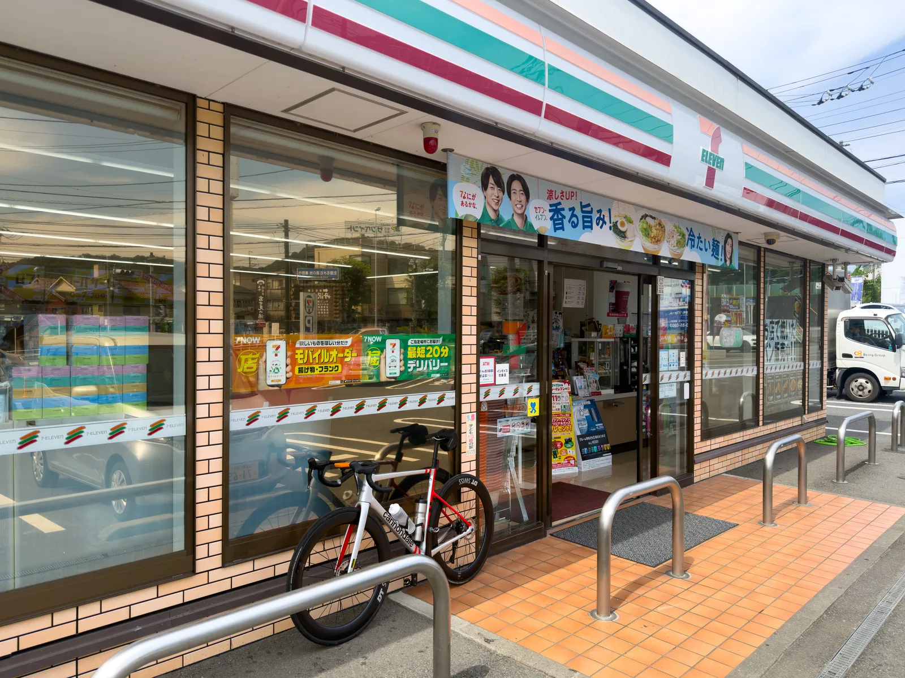
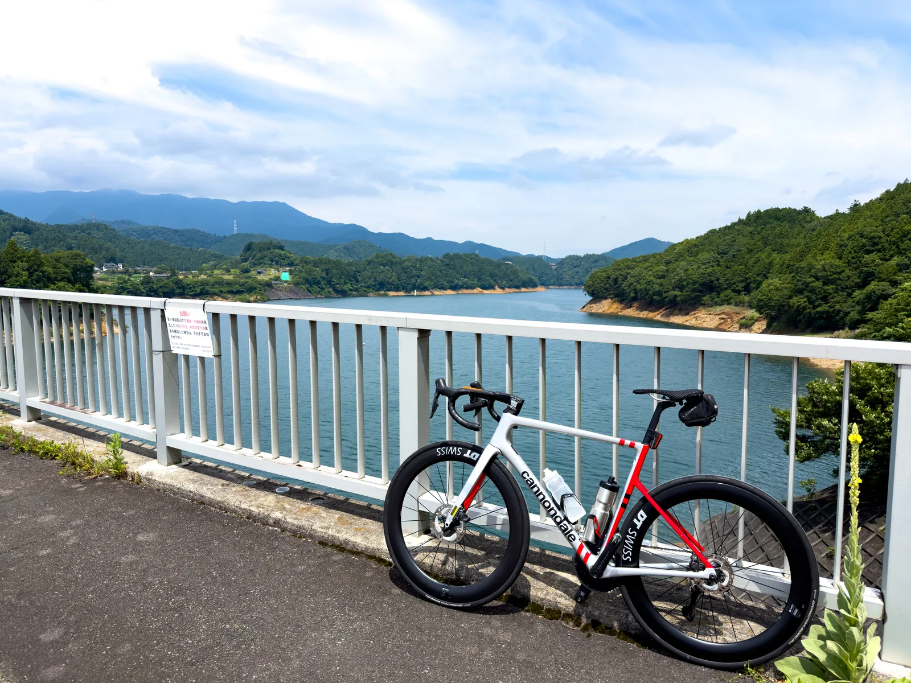
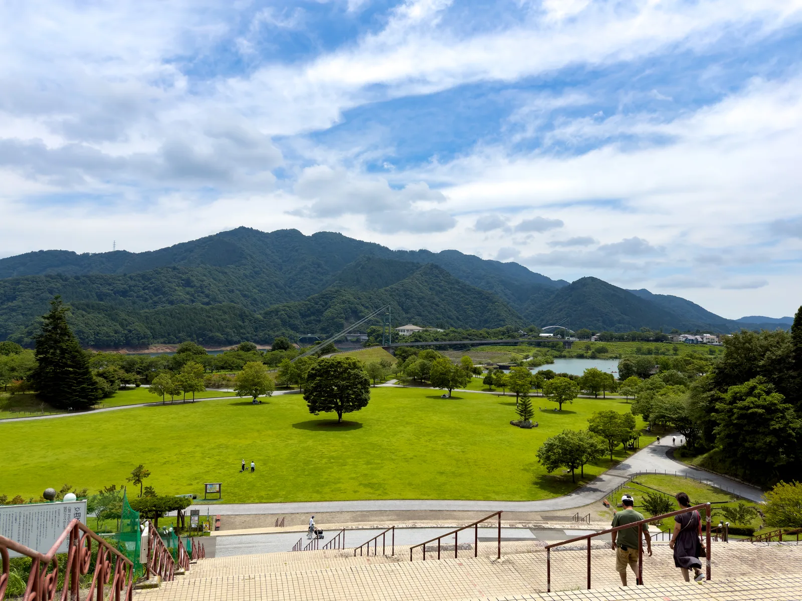

寫完[都民の森](../tomin-no-mori-cycling-route/)之後，這次來介紹另一個關東車友一定聽過的爬坡點：**ヤビツ峠**。ヤビツ峠位在神奈川丹沢山區，標高 761 公尺，是關東 hill climb 的聖地之一，很多車手會固定來這裡做爬坡計時。從我家出發的話，到秦野站的輪行時間比去都民の森還短一點，於是就找了一天來爬看看，結果一爬就是三趟。

本篇會介紹表裏兩側的路線分段、爬坡數據、補給與注意事項，一樣給台灣的車友一個跟巴拉卡公路的難度對照。

## 路線總覽

ヤビツ峠一樣分成兩側：從秦野側（名古木交差点）上山的**表ヤビツ**，跟從宮ヶ瀬湖側上山的**裏ヤビツ**。兩側的性格差蠻多的：

| 路線 | 距離 | 標高差 | 平均坡度 | 特徵 |
|------|------|--------|----------|------|
| 表ヤビツ（名古木 → 峠） | 約 11.8 km | 約 670 m | 約 5.9% | 前段後穩定爬坡，計時經典路段 |
| 裏ヤビツ（宮ヶ瀬湖 → 峠） | 約 17.8 km | 約 477 m | 上坡段約 4.9% | 距離長但緩，路幅窄、沿溪谷 |

我這次的騎法是：秦野站起登爬表側 → 下裏側到宮ヶ瀬湖 → 從裏側爬回峠 → 再下滑表側到鳥居附近 → 爬第三趟回峠 → 在レストハウス吃咖哩收工。一天下來把表裏兩側都走過一遍，累積爬升大約 1,700 公尺。

完整的 GPS 路線檔於文末附上 Strava 連結，可以直接匯入碼錶。

## 難度對照：比都民の森更像巴拉卡

上次介紹都民の森時，我說裏側的爬升量跟巴拉卡差不多、但坡度更緩。ヤビツ峠的表側則是又更像了：11.8 公里、爬升 670 公尺、平均 5.9%，跟巴拉卡（約 10 公里、爬升 580～620 公尺、平均近 6%）幾乎是同一個規格，只是距離再長一點。如果你在巴拉卡騎得順，表ヤビツ基本上就是同一種坡，連體感都很接近。

表側還有一個很棒的特點：**前段雖然有幾個短下坡，通過前兩個號誌後大部分時間都在爬坡**。不像有些山路爬一段掉一段，這裡過了前段後基本上可以一路穩定輸出到峠，一趟的時間大概落在一小時上下（依實力而定），拿來練 Z3–Z4 的閾值前後強度剛剛好，這也是為什麼這麼多人來這裡做爬坡測驗。

## 交通方式：怎麼到起點

起點是小田急小田原線的**秦野站**。從新宿搭小田急的快速急行過來大約 70 分鐘，記得用輪行袋把車打包好。出站後往名古木交差点騎過去就是表側的起登點，距離很短，當暖身正好。

順帶一提，秦野站也有神奈中巴士直接開到ヤビツ峠（主要是給登山客用的），所以路上會遇到公車，這點後面注意事項會再提。

## 路線分段

### 名古木 → 蓑毛（前段，最陡）

表側的起登點就在名古木交差点，旁邊有一間 7-11，進山前可以在這裡把水跟運動飲料買齊，這也是上山前最後的便利商店。

從名古木交差点起登，前段到蓑毛巴士站一帶是整條路最陡的區間，有幾段會超過 10%。開爬後不久路邊會經過一座鳥居，蠻有辨識度的，第一次來可以拿來當進度參考點。這段還在民宅與農地之間，路幅普通，把節奏穩住就好，不用急著發力。

### 蓑毛 → 菜の花台 → ヤビツ峠（中後段）

過了蓑毛之後進入山區，坡度回到 5～6% 左右的穩定區間，剩下的就是專心踩。中後段幾乎全程都在樹蔭下，這是ヤビツ跟都民の森差最多的地方：**樹蔭多很多，夏天爬起來涼快不少**。都民の森爬到後段常常是曬著太陽踩，這裡就算七月來也還算舒服。

不過有一好沒兩好，ヤビツ的路面狀況比都民の森差一些，**沿路蠻多坑洞的**，特別是樹蔭下光線忽明忽暗，坑洞不好提前看到，下滑的時候要特別小心。另外蓑毛以上有幾段路幅比較窄，又有公車行駛，會車時記得靠邊減速。

途中的菜の花台有展望台跟廁所，是中途唯一像樣的休息點。再往上踩一段，看到ヤビツ峠的牌子就到頂了。

還有一個有趣的現象：這裡**跑者超多**，體感上比騎車的還多。ヤビツ的坡度穩定又全程柏油，很多跑者專門來這裡練上坡跑；至於越野跑跟登山的人，大多是搭公車直接上峠、或從大山那邊走過來，跟你在車道上遇到的是不同群人。爬坡爬到被跑者加油（或是互相苦笑）是這條路線的日常。

### 下滑裏側：宮ヶ瀬湖

從峠往北下滑就是裏ヤビツ，沿著布川、宮ヶ瀬方向一路下到宮ヶ瀬湖。裏側路幅更窄、沿途有湧水跟落葉，路面也一樣有坑，下滑不要貪快。下到湖邊視野會突然打開，宮ヶ瀬湖的湖景蠻漂亮的，湖畔的**宮ヶ瀬湖畔園地（Lakeside Park）**有廁所、自販機跟商店，是裏側最完整的休息補給點，要折返爬回峠的話在這裡把水補滿再上。

裏側爬回峠就是那 17.8 公里的緩坡，平均坡度緩很多，但距離長，當作節奏騎或恢復強度的爬坡剛剛好，跟表側一趟高強度搭配起來，這樣一天的訓練就很完整了。

## 補給與注意事項

### ヤビツ峠レストハウス

峠上的**ヤビツ峠レストハウス**是這條路線最主要的補給點，營業時間為平日 9:00～16:00、週末假日 8:30～16:30，**週三週四公休**（國定假日照常營業），出發前留意一下別撲空。

招牌是丹沢ロイヤルカレー，用秦野當地的豬肉跟蔬果做的。我是爬完第三趟才吃，肚子餓的時候真的吃什麼都好吃；不過**一份要價 1,650 日圓，以補給來說不便宜**，而且店內沒有提供免費的水，想裝水的話要自己買。預算有限的話，自己帶補給上山、把咖哩當成犒賞就好。

### 其他注意事項

如同前面提到的，起登點旁的 7-11 是進山前最後的便利商店，**水跟食物先在這裡補滿**。中途倒不是完全沒有補給：峠上有レストハウス，週末假日巴士站前的丹沢ホーム小賣店也有開，店內有飲料投幣機，也賣一些東西。真正完全沒有補給的是**裏側從峠下滑到宮ヶ瀬湖之前這段**，下裏側前記得把水帶夠。

到了湖邊的 Lakeside Park 吃的選擇就蠻多的，可以在那裡好好補一波，只是補完之後還是得爬回峠，別吃太撐。

路上有公車、登山客與大量跑者，特別是週末，**下滑務必控速**，窄路段不要越線過彎。加上前面提到的坑洞問題，下坡時注意力要放在路面上。

裏ヤビツ沿線有 3 個隧道，前後燈記得裝好；山區有些路段手機訊號不穩，GPS 路線最好先下載離線地圖。

冬季峠附近會結冰，大雨後路面常有落石與落葉，出發前查一下路況。中途撤退點不多，補胎工具跟備胎帶齊。

## 最佳季節

多虧樹蔭，這條路線夏天也騎得下去，算是關東近郊爬坡點裡少數的夏天選項。春天新綠跟秋天紅葉當然更舒服，冬天則要注意結冰，峠上氣溫比山下低不少，下滑記得帶擋風層。

## 實際騎乘路線

完整的 GPS 路線檔可以直接匯入碼錶：

- **秦野站 → ヤビツ峠 表裏往返（Strava Routes）**：<https://www.strava.com/routes/3510635578306958412>

## 結語

到這裡關東近郊的路線剛好湊成三種類型：[霞ヶ浦](../kasumigaura-rinrin-road-cycling-route/)練平路、[都民の森](../tomin-no-mori-cycling-route/)練長距離緩坡，ヤビツ峠則是最適合做強度的測驗坡。表側一趟一小時上下，前段過後是穩定的連續坡度，想知道自己爬坡實力在哪裡，來這裡踩一趟就知道了。

要記得的就是：路面坑洞多、窄路有公車、峠上的咖哩不便宜也沒有免費的水。把補給帶夠、下滑放慢，剩下的一樣交給腿。

## Reference

- [ヒルクライムのメッカ「ヤビツ峠」（秦野市公式）](https://www.city.hadano.kanagawa.jp/kanko/spot-shisetsu/2/1045.html): 路線與觀光資訊
- [ヤビツ峠（神奈川県）｜ヒルクライムリスト](https://hillclimblist.com/route/kanagawa_yabitsu/): 表ヤビツ距離、標高差與坡度數據
- [ヤビツ峠 裏側解説（青空ライド）](https://aozoraride.com/yabitsu/): 裏ヤビツ路線資訊
- [ヤビツ峠レストハウス（丹沢MON公式）](https://tanzawamon.jp/yabitsutouge-resthouse/): 營業時間與設施資訊
- [国民宿舎 丹沢ホーム ヤビツ峠売店（OMOTAN）](https://omotan-hadano.jp/gourmet/%E5%9B%BD%E6%B0%91%E5%AE%BF%E8%88%8E-%E4%B8%B9%E6%B2%A2%E3%83%9B%E3%83%BC%E3%83%A0%E3%83%A4%E3%83%93%E3%83%84%E5%B3%A0%E5%A3%B2%E5%BA%97/): 峠上小賣店與自販機資訊
- [單車攻略｜巴拉卡公路解析（velodash Magazine）](https://blog.velodash.co/2020/08/12/balaka/): 巴拉卡公路數據對照
